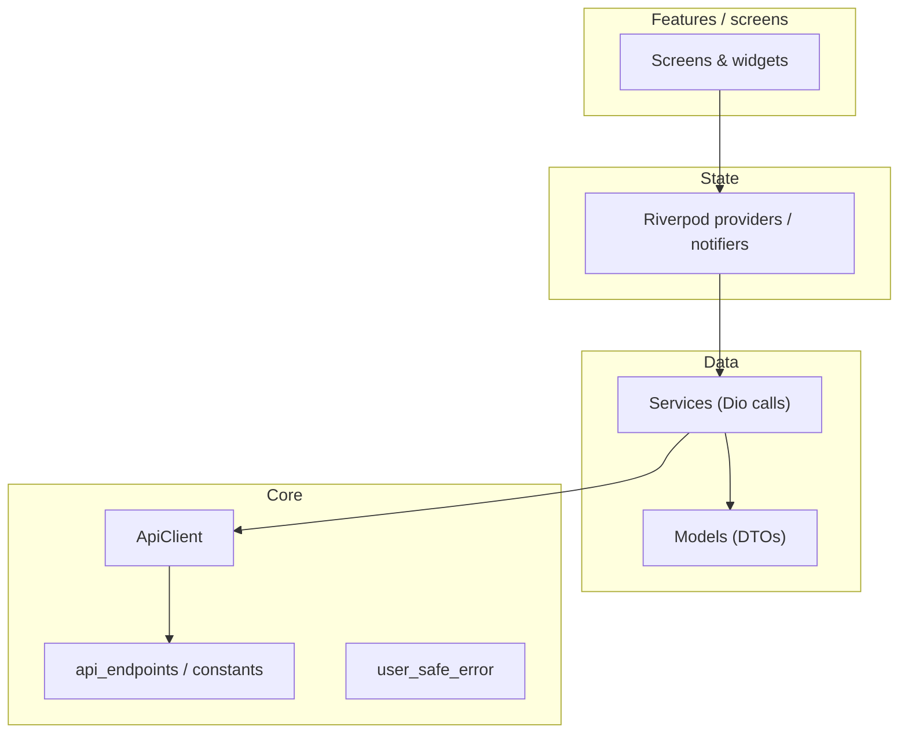

# Flutter client architecture refactor guide

This document complements [Screens refactor guide]({{ '/screens-refactor-guide/' | relative_url }}) (repo: `SCREENS_REFACTOR_GUIDE.md`). It covers **everything in `lib/` that is not “screens only”**: networking, services, Riverpod, models, shared UI utilities, routes, and how to test them.

**Audience:** Engineers changing data flow, API usage, or global app state.

**Non-goals:** Laravel/backend structure (see `backend/` and product docs separately).

---

## 1. How the layers stack

**Dependency rule:** `models` and `core` must not import `features` or `providers`. `services` depend on `core` + `models`. `providers` wire services to UI. `features` depend on `providers`, `core`, `models`, and `features/shared`.

---

## 2. Inventory (this repo)

| Area | Location | Examples |
|------|----------|----------|
| **API client** | `lib/core/network/api_client.dart` | `ApiClient`, shared `Dio` |
| **Endpoints / constants** | `lib/services/api_endpoints.dart`, `lib/core/constants/app_constants.dart` | Centralize paths and magic values |
| **User-visible errors** | `lib/core/ui/user_safe_error.dart` | Map exceptions → short messages |
| **Theme** | `lib/core/theme/` | `app_tokens.dart`, `app_theme.dart` |
| **Services** | `lib/services/` | `auth_service.dart`, `waste_request_service.dart`, `order_service.dart`, … |
| **Models** | `lib/models/` | `waste_request.dart`, `*.g.dart` generated |
| **Providers** | `lib/providers/` — import **`app_providers.dart`** (barrel) | Split files: `service_providers.dart`, `auth_providers.dart`, `notification_providers.dart`, `waste_request_providers.dart`, `job_providers.dart`, `marketplace_providers.dart`; barrel re-exports the same symbols as before |
| **Routes** | `lib/routes/app_router.dart` | `GoRouter` configuration |
| **Shared feature UI** | `lib/features/shared/` | `app_section_card.dart`, `center_state.dart` (barrel: `app_widgets.dart`), `info_row.dart`, `status_timeline_step.dart`, `notifications_screen.dart`, optional `shared.dart` |
| **Role screens** | `lib/features/{generator,recycler,collector,auth}/` | Per-screen files + barrels: `generator.dart`, `recycler.dart`, `collector.dart`, `auth.dart` (see screens guide) |

---

## 3. Services (`lib/services/`)

**Role:** One class per API domain; methods call `dio` with paths from `api_endpoints.dart` (or inline paths—prefer centralizing as you touch code).

**Refactor tactics:**

| Tactic | When |
|--------|------|
| **Keep methods small** | Each public method = one HTTP operation; avoid 200-line “do everything” methods. |
| **Return models, not `Map`** | Parse JSON in the service (or a dedicated mapper) and return typed models. |
| **Throw consistently** | Let `DioException` propagate or wrap with domain exceptions; **do not** show `SnackBar` inside services. |
| **Split files by domain** | If a service file grows past ~300 lines, split by sub-resource (e.g. listings vs orders) only when boundaries are clear. |

**Testing:** Prefer unit tests that mock `Dio` or inject a fake `BaseOptions`/adapter (see existing `test/` patterns).

---

## 4. Riverpod (`lib/providers/app_providers.dart`)

**Current pattern:** `Provider` for each `*Service`, `StateNotifier` / `AsyncNotifier` for session and feature state (e.g. `AuthNotifier`, waste requests).

**Refactor tactics:**

| Tactic | When |
|--------|------|
| **Split provider file** | When `app_providers.dart` becomes hard to navigate (e.g. `providers/auth_providers.dart`, `providers/waste_request_providers.dart`). Keep a small `providers.dart` barrel if the router/tests need fewer imports. |
| **Avoid circular imports** | Providers import services + models; services must **not** import providers. |
| **Narrow `ref.watch`** | In screens, watch specific providers or `select` to reduce rebuilds (optional perf pass). |

**Non-goals in a first refactor:** Changing provider **types** (e.g. `StateNotifier` → `Notifier`) unless you have a migration plan and tests.

---

## 5. Models (`lib/models/`)

**Role:** Data transfer objects, enums shared with UI.

**Refactor tactics:**

| Tactic | When |
|--------|------|
| **Keep serialization in one place** | `fromJson` / `json_serializable` in model files; avoid ad-hoc `Map` access in widgets. |
| **Regenerate after schema changes** | `dart run build_runner build` when `*.g.dart` is used. |
| **Split large files** | Rare; usually one main type per file is enough. |

---

## 6. Core networking & errors

| Piece | Guidance |
|-------|----------|
| **`ApiClient`** | Single place for base URL, timeouts, auth headers/interceptors. Refactors here affect all services—treat as high-risk; test with integration or manual smoke. |
| **`user_safe_error`** | Screens should use this for user-facing strings; services can throw raw `DioException` for the UI layer to map. |
| **`api_endpoints`** | When adding endpoints, add constants here to avoid duplicated string paths across services. |

---

## 7. Routes (`lib/routes/app_router.dart`)

**Role:** Declares paths and which widget builds for each route.

**Refactor tactics:** After splitting screen files ([SCREENS_REFACTOR_GUIDE](./SCREENS_REFACTOR_GUIDE.md)), update imports only; avoid putting business logic in the router (keep redirects/auth guards minimal and readable).

---

## 8. Shared feature widgets (`lib/features/shared/`)

**Role:** Cross-role widgets (`AppSectionCard`, `CenterState`, etc.).

**Refactor tactics:** Move duplicated row/timeline/card UI from role screens into `shared/` when **two** features need it; otherwise keep widgets next to the screen (per screens guide).

---

## 9. Tests (`test/`)

| Layer | What to test |
|-------|----------------|
| **Services** | Request shape, parsing success/error paths (mock Dio). |
| **Notifiers** | State transitions when mocking services. |
| **Widgets** | Extracted dumb widgets (`InfoRow`, cards) with `testWidgets`. |
| **Integration** | Optional; smoke critical flows after large refactors. |

---

## 10. Phased order (client-wide)

1. **Core** — Document `ApiClient` behavior; avoid drive-by changes.  
2. **Models + services** — Typed responses; thin service methods.  
3. **Providers** — Split file only when `app_providers.dart` hurts velocity.  
4. **Screens** — Follow [Screens refactor guide]({{ '/screens-refactor-guide/' | relative_url }}).  
5. **Error UX** — Unify SnackBar/dialog copy via `user_safe_error` + small helpers.

---

## 11. Summary

| Layer | Primary refactor levers |
|-------|-------------------------|
| **Services** | Domain-sized classes, no UI, typed returns |
| **Providers** | Split large files; clear service wiring |
| **Models** | JSON in one place; regenerate codegen |
| **Core** | One `ApiClient`; shared endpoints and error mapping |
| **Screens** | See screens guide |

Together with the screens guide, this covers **all major `lib/` code paths** beyond individual screen files.
