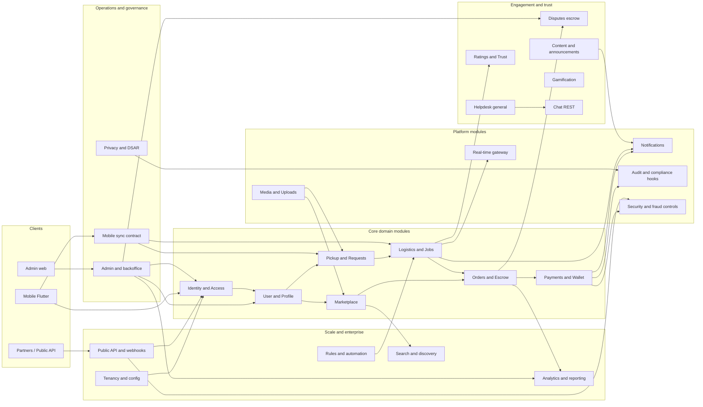

# Waste Bridge — Backend modular architecture

This document describes the **planned Laravel backend** as a set of **independent subsystems (modules)**. Each module owns a **bounded context**: specific routes, application services, domain rules, and persistence. The goal is **scalability** and **loose coupling** so you can keep a **modular monolith** today and **extract services** later without rewriting business logic.

**Related docs:** [`API_DOCUMENTATION.md`](./API_DOCUMENTATION.md) (HTTP contract; repo — full spec not on this site), [Database Structure]({{ '/database-structure/' | relative_url }}) (tables), [System Documentation]({{ '/documentation/' | relative_url }}) (product), [Implementation Plan]({{ '/implementation/' | relative_url }}) (phases). The repo today is **Flutter + mock API**; this file is the **backend blueprint**.

This map includes **core transactional modules**, **platform and governance** slices (admin, privacy, security/fraud, ops observability), **mobile sync** hooks for offline-first clients, and **expansion** contexts aligned with [System Documentation]({{ '/documentation/' | relative_url }}) §20–§32.

---

## 1. Design principles

| Principle | What it means in practice |
|-----------|---------------------------|
| **Bounded contexts** | A module **owns** its tables and state transitions; other modules interact via **public application services**, **domain events**, or **stable HTTP APIs**—not by reaching into foreign models arbitrarily. |
| **Modular monolith first** | One deployable Laravel app; code grouped under **`app/Modules/<Name>/`** (or Composer path repos) with **no upward dependencies** from shared kernel into feature modules. |
| **API as contract** | External and mobile clients depend on **`/api/v1/...`** only; internal modules may use **synchronous calls** (in-process) or **async** (queues) behind interfaces. |
| **Events at boundaries** | State changes publish **`SomethingHappened` events** (e.g. `JobCompleted`, `PaymentSettled`) so Notifications, Analytics, Webhooks, and Real-time stay **decoupled**. |
| **Idempotency & queues** | Money, assignment, and provider callbacks are **idempotent**; heavy work uses **priority vs background** queues ([Implementation Plan]({{ '/implementation/' | relative_url }}) **0.8**). |
| **Tenant-ready** | Where [Database Structure]({{ '/database-structure/' | relative_url }}) includes `tenant_id`, modules **scope queries** through a tenant resolver (even if single-tenant MVP). |

---

## 2. High-level map



**Reading order for implementation:** Foundation → IAM → User/Profile → Marketplace + Pickup + Jobs → Orders + Payments → Notifications → (Disputes, Ratings, Gamification, Chat, Analytics, Tenancy)—then **Admin backoffice** and **Privacy/DSAR** as soon as KYC and production ops matter; **Mobile sync** when offline-first hardens; **Search**, **Content**, **Helpdesk**, **Public API**, **Rules** per phase—aligned with [Implementation Plan]({{ '/implementation/' | relative_url }}) phases **1–12** and expansion rows.

---

## 3. Suggested Laravel layout (one repo)

Keep **one** `routes/api.php` (or `routes/api_v1.php`) that **includes** route files per module. Controllers stay thin; **services** hold orchestration; **actions/jobs** for single-purpose work.

```
Resources/
  Modules/
    IdentityAccess/
      Http/Controllers/...
      Routes/api.php
      Services/...
      Policies/...
      Events/...
    UserProfile/
    Marketplace/
    PickupRequests/
    LogisticsJobs/
    OrdersEscrow/
    PaymentsWallet/
    MediaUploads/
    Notifications/
    RealtimeGateway/
    DisputesSupport/
    RatingsTrust/
    Gamification/
    Chat/
    AnalyticsReporting/
    TenancyConfig/
    PublicIntegrations/
    RulesAutomation/
    AdminOperations/
    PrivacyCompliance/
    MobileSync/
    SearchDiscovery/
    ContentAnnouncements/
    HelpdeskSupport/
    SecurityFraud/
  Shared/
    Kernel/Exceptions, Envelope, Pagination
    Contracts/   # interfaces implemented by modules
```

**Shared kernel** (`app/Shared/`): HTTP **success envelope** ([`API_DOCUMENTATION.md`](./API_DOCUMENTATION.md) §2.1), global exception rendering, base policies, **no** feature-specific models.

**Cross-module rule:** `Modules/A` may depend on **`Contracts`** published by `Modules/B`, not on `B`’s internal `Eloquent` models—until you accept tighter coupling inside the monolith (pragmatic MVP). Stricter boundaries matter most around **Payments**, **Wallet**, and **Orders**.

---

## 4. Module reference (subsystem specs)

Each subsection follows the same template: **Responsibility**, **Owns (data)**, **HTTP surface (v1)**, **Internal building blocks**, **Emits/consumes**, **Queues**, **Depends on**. **§4.18–§4.24** are **platform and governance** slices (admin, privacy, mobile sync, fraud, search, content, helpdesk); **§4.25–§4.26** are integrations and automation; **§4.27** lists **expansion-only** bounded contexts.

---

### 4.1 Foundation and HTTP platform

**Responsibility:** API versioning, global middleware stack, route model binding for `public_id`, CORS, baseline rate limits, **health/readiness** ([`API_DOCUMENTATION.md`](./API_DOCUMENTATION.md) §12), and **operational baseline** so production behavior matches [`API_DOCUMENTATION.md`](./API_DOCUMENTATION.md) §20 (scale-ready practices): structured **request correlation** (request ID), **logging** (JSON-friendly, no secrets), optional **metrics** hooks (latency, queue depth signals), and **maintenance mode** responses for clients. **Feature flags** may be read from config or DB in services; **flag resolution** can live in Shared kernel or Tenancy module—Foundation documents the **contract** (consistent error shape when a feature is off).

**Owns:** No domain tables; optional `api_request_logs` (ops).

**HTTP surface:**

| Method | Path | Notes |
|--------|------|--------|
| `GET` | `/health` | Liveness |
| `GET` | `/ready` | DB/cache checks (optional) |

**Internal building blocks:** `bootstrap/app.php` middleware order; `App\Shared` response envelope; exception → JSON mapper ([§10](./API_DOCUMENTATION.md#10-error-handling-recommended)); alignment with **§12 Operational platform** (timeouts, graceful degradation) and **§20.6** (SLO-oriented instrumentation where you adopt APM).

**Queues:** None by default.

**Depends on:** Infra only.

---

### 4.2 Identity and Access (IAM)

**Responsibility:** Register, login, JWT access + refresh, logout, token revocation, **RBAC** ([System Documentation]({{ '/documentation/' | relative_url }}) §2, §10), rate limits on auth ([§12](./API_DOCUMENTATION.md#12-operational-platform)).

**Owns:** `personal_access_tokens` / Sanctum or Passport tables; refresh token store if used; optional `oauth_clients` for future partner OAuth ([Implementation Plan]({{ '/implementation/' | relative_url }}) **26.5**).

**HTTP surface (canonical v1):**

| Method | Path | Notes |
|--------|------|--------|
| `POST` | `/auth/register` | |
| `POST` | `/auth/login` | |
| `POST` | `/auth/refresh` | |
| `POST` | `/auth/logout` | |
| `POST` | `/auth/otp/request` | Phase 2 ([Implementation Plan]({{ '/implementation/' | relative_url }}) **2.6**) |
| `POST` | `/auth/otp/verify` | |

**Internal building blocks:** `AuthController`, `TokenService`, `JwtGuard` config, middleware `auth:sanctum` / `jwt`, `EnsureRole` middleware mapping roles. **Naming:** product copy uses **household** ([System Documentation]({{ '/documentation/' | relative_url }}) §2); API/internal role **`generator`** is the same bounded context—document enums and OpenAPI so client and backend stay aligned.

**Emits:** `UserRegistered`, `UserAuthenticated` (for analytics/CRM later).

**Queues:** Optional async for welcome email; OTP SMS via Notifications module.

**Depends on:** Foundation. **No** dependency on Marketplace/Jobs.

---

### 4.3 User and profile

**Responsibility:** User CRUD for self-service, **KYC** submit/list/status ([Database Structure]({{ '/database-structure/' | relative_url }}) §4), **referral codes**, locale (`en`/`sw`), subscription tier fields on user ([`API_DOCUMENTATION.md`](./API_DOCUMENTATION.md) §6 `AppUser`).

**Owns:** `users` (profile slice), `kyc_submissions` (per your migrations), referral link tables from plan **1.7**.

**HTTP surface (illustrative):**

| Method | Path | Notes |
|--------|------|--------|
| `GET` | `/user/me` | Current user |
| `PATCH` | `/user/me` | Profile |
| `POST` | `/user/kyc` | Multipart; uses Media module |
| `GET` | `/user/kyc` | My submissions / status |

**Internal building blocks:** `UserController`, `KycService`, `ReferralService`, policies **own resource or admin**.

**Emits:** `KycSubmitted`, `KycStatusChanged`.

**Queues:** Virus scan job after KYC upload (if policy).

**Depends on:** IAM, Media uploads.

---

### 4.4 Media and uploads

**Responsibility:** **Presigned URLs** or `POST /uploads`, validation (size, MIME), storage abstraction (S3-compatible), optional malware scan ([`API_DOCUMENTATION.md`](./API_DOCUMENTATION.md) §11).

**Owns:** `media_assets` or blob metadata table (optional).

**HTTP surface:**

| Method | Path | Notes |
|--------|------|--------|
| `POST` | `/uploads` or `/uploads/presign` | §11 options A/B |

**Internal building blocks:** `UploadController`, `StorageDriver`, `ValidateUpload`.

**Emits:** `FileStored` (uri, owner).

**Queues:** Scan, thumbnail generation.

**Depends on:** IAM (who can upload).

---

### 4.5 Marketplace (listings and discovery)

**Responsibility:** **Waste listings** feed: filters (type, price, distance), sort, pagination ([System Documentation]({{ '/documentation/' | relative_url }}) §3; [`API_DOCUMENTATION.md`](./API_DOCUMENTATION.md) §8.2–8.3). Listing modes: fixed price MVP; **auction, counter-offers, bulk contracts** later ([Implementation Plan]({{ '/implementation/' | relative_url }}) **3.2**)—model those as **separate tables or sub-states** (`offers`, `auctions`) owned here or behind **Search and discovery** (§4.22) read models so they do not collide with **`orders`** escrow semantics.

**Owns:** `waste_listings` ([Database Structure]({{ '/database-structure/' | relative_url }}) §2.4).

**HTTP surface:**

| Method | Path | Notes |
|--------|------|--------|
| `GET` | `/marketplace` or `/listings` | Feed |
| `GET` | `/listings/{id}` | Detail |
| `POST` | `/listings` or `/waste/create` | Create (alias per §8) |
| `PATCH` | `/listings/{id}` | Owner updates |

**Internal building blocks:** `ListingController`, `MarketplaceQueryService`, geo filters (coordinate with **Logistics** live location vs **Geo** expansion module—§4.7, §4.27). **Full-text / ranked search** (Postgres FTS, Meilisearch, etc.) is **§4.22**; Marketplace remains **source of truth** for listing rows.

**Emits:** `ListingCreated`, `ListingPublished`, `ListingFilled`.

**Queues:** Search index updates (if extracted); see §4.22.

**Depends on:** IAM, Media.

---

### 4.6 Pickup and requests

**Responsibility:** **Operational pickup requests** (`WasteRequest` in client)—create, list, cancel, link to listing if needed. **Distinct** from commercial `orders` ([Database Structure]({{ '/database-structure/' | relative_url }}) §3).

**Owns:** `pickup_requests` (and related columns per migrations).

**HTTP surface (align with [§4](./API_DOCUMENTATION.md#4-endpoints-used-by-the-flutter-app-today)):**

| Method | Path | Notes |
|--------|------|--------|
| `GET` | `/requests` | Generator/collector views filtered by role |
| `POST` | `/requests` | Create pickup |
| `GET` | `/requests/{id}` | |
| `PATCH` | `/requests/{id}` | Cancel / limited updates |

**Internal building blocks:** `PickupRequestController`, `RequestStatusPolicy`, state machine per [`API_DOCUMENTATION.md`](./API_DOCUMENTATION.md) §16 `RequestStatus`.

**Emits:** `PickupRequestCreated`, `PickupRequestCancelled`.

**Queues:** Matching hints (optional).

**Depends on:** IAM, Marketplace (optional FK to listing).

---

### 4.7 Logistics and jobs

**Responsibility:** **Jobs** for collectors: list open jobs, **accept**, progress **`JobStatus`** (open → accepted → arrived → picked → delivered) ([§16](./API_DOCUMENTATION.md#16-state-transition-rules)), **proof** (photos, GPS) ([Implementation Plan]({{ '/implementation/' | relative_url }}) **5**). Replace overloaded `POST /api/update-status` with **resource-specific** routes ([§18](./API_DOCUMENTATION.md#18-target-v1-routes-replace-multiplexed-update-status)). **Live map / tracking** ([System Documentation]({{ '/documentation/' | relative_url }}) §12): **location samples** (GPS points or throttled streams) are owned here for **operational** truth—**retention**, **rate limits**, and **anonymization** policies belong with this module until a dedicated **Geo** expansion (§4.27) provides fences, service areas, and geocoding caches; then Logistics **calls** Geo services rather than duplicating rules.

**Owns:** `jobs`, proof attachments (or references to `media_assets`), optional `job_location_updates` or time-series strategy per product needs.

**HTTP surface:**

| Method | Path | Notes |
|--------|------|--------|
| `GET` | `/jobs` | Role-scoped |
| `POST` | `/jobs/{id}/accept` | Idempotent |
| `PATCH` | `/jobs/{id}/status` | Or fine-grained: `/arrive`, `/pick`, `/deliver` |
| `POST` | `/jobs/{id}/proof` | Links upload URLs |
| `POST` | `/jobs/{id}/location` | Optional: batched GPS updates for live tracking |

**Internal building blocks:** `JobController`, `AssignmentService`, `JobStateMachine`, policies (only assigned collector).

**Emits:** `JobAccepted`, `JobStatusChanged`, `JobCompleted` → consumed by Orders, Wallet, Notifications, Real-time.

**Queues:** Route optimization (background), assignment rules.

**Depends on:** IAM, Pickup requests, Media.

---

### 4.8 Orders and escrow (commercial)

**Responsibility:** **Marketplace orders** lifecycle: `created` → `accepted` → `in_transit` → `delivered` → `completed` / `cancelled` / `disputed` ([System Documentation]({{ '/documentation/' | relative_url }}) §40.1). **Escrow** amounts and status fields ([Database Structure]({{ '/database-structure/' | relative_url }}) §2.5). Coordinates with **Jobs** but does not duplicate operational state. **Receipts and compliance artifacts** ([Implementation Plan]({{ '/implementation/' | relative_url }}) **1.7**, [System Documentation]({{ '/documentation/' | relative_url }}) §44): store `receipt_id`, `receipt_issued_at`, and links to **Media** or immutable PDF blobs—**tax or regulatory** formatting may stay here or in a thin **Documents** table owned by this module.

**Owns:** `orders`, optional `order_line_items`, optional receipt/document metadata columns or `order_documents`.

**HTTP surface (illustrative):**

| Method | Path | Notes |
|--------|------|--------|
| `POST` | `/orders` | From listing / offer |
| `GET` | `/orders/{id}` | |
| `PATCH` | `/orders/{id}` | Admin/system transitions |
| `GET` | `/orders/{id}/receipt` | Optional: PDF or JSON receipt |

**Internal building blocks:** `OrderController`, `OrderService`, `EscrowPolicy`, linkage to `pickup_request_id` / `job_id`.

**Emits:** `OrderCreated`, `OrderDelivered`, `OrderDisputed`, `EscrowReleased`.

**Queues:** Escrow settlement jobs.

**Depends on:** IAM, Marketplace, Logistics (completion signals), Payments.

---

### 4.9 Payments and wallet

**Responsibility:** **Wallet** balance + **append-only ledger** ([Database Structure]({{ '/database-structure/' | relative_url }}) §2.3), **PSP webhooks** (M-Pesa, etc.) with **signature verification** and **idempotency** ([`API_DOCUMENTATION.md`](./API_DOCUMENTATION.md) §12–13), **escrow** capture/release, **commissions**, payouts ([System Documentation]({{ '/documentation/' | relative_url }}) §11).

**Owns:** `wallets`, `wallet_ledger_entries`, payment intent tables as you add them.

**HTTP surface:**

| Method | Path | Notes |
|--------|------|--------|
| `GET` | `/user/wallet` | Balance + summary ([§8.7](./API_DOCUMENTATION.md#87-get-apiv1userwallet)) |
| `GET` | `/user/wallet/transactions` | Paginated ledger |
| `POST` | `/payments/initiate` | Idempotency-Key |
| `POST` | `/webhooks/payments/{provider}` | Inbound PSP—not partner API |

**Internal building blocks:** `WalletService` (single writer for balance + ledger), `PaymentOrchestrator`, `LedgerPosting`, `IdempotencyStore`.

**Emits:** `PaymentCaptured`, `PaymentFailed`, `LedgerPosted`.

**Queues:** **Priority** for webhook processing; **retries** with backoff; reconciliation jobs **background**.

**Depends on:** IAM, Orders (for escrow amounts). **Treated as core financial boundary**—keep interface narrow. **Fraud signals** (velocity, unusual patterns) are coordinated with **Security and fraud** (§4.21)—Payments remains the **ledger and PSP** authority; rules do not bypass `WalletService`.

---

### 4.10 Notifications

**Responsibility:** Persist **in-app** notifications; **mark read**; fan-out to **FCM**, **SMS**, **email** ([System Documentation]({{ '/documentation/' | relative_url }}) §14; [Implementation Plan]({{ '/implementation/' | relative_url }}) **7**).

**Owns:** `notifications` table ([Database Structure]({{ '/database-structure/' | relative_url }}) §7).

**HTTP surface:**

| Method | Path | Notes |
|--------|------|--------|
| `GET` | `/notifications` | |
| `PATCH` | `/notifications/{id}` | Read state |
| `POST` | `/notifications/read-all` | Optional |

**Internal building blocks:** `NotificationController`, `NotificationDispatcher`, channel adapters (mail, SMS, push).

**Consumes:** Domain events from Jobs, Orders, Wallet, Disputes.

**Queues:** All outbound channels; retry policies.

**Depends on:** IAM (recipient), user locale for templates ([§42]({{ '/documentation/' | relative_url }}#42-localization-english--kiswahili)).

---

### 4.11 Real-time gateway

**Responsibility:** Bridge HTTP state changes to **WebSockets / Laravel Echo / Pusher / Firebase** ([System Documentation]({{ '/documentation/' | relative_url }}) §9). Channel authorization (user can only subscribe to own jobs/orders).

**Owns:** No mandatory extra tables; optional presence/session.

**HTTP surface:** Often **none** beyond Echo auth endpoint `POST /broadcasting/auth`.

**Internal building blocks:** Event subscribers translating `JobStatusChanged` → `broadcast`.

**Depends on:** IAM for channel auth; Jobs/Orders events.

---

### 4.12 Chat (REST MVP)

**Responsibility:** **Threads** tied to job or order; list/post messages; authz for participants + support ([Implementation Plan]({{ '/implementation/' | relative_url }}) **6.4**).

**Owns:** `chat_threads`, `chat_messages` (per your migrations).

**HTTP surface:** `GET/POST /threads/{id}/messages` (illustrative).

**Internal building blocks:** `ChatController`, `ChatPolicy`.

**Emits:** `MessageSent` → Notifications + Real-time.

**Queues:** Push notifications.

**Depends on:** IAM, Jobs/Orders.

---

### 4.13 Disputes and escrow resolution

**Responsibility:** Open **escrow/commercial dispute** on request/order, evidence, admin resolution, ties to escrow refund/release ([System Documentation]({{ '/documentation/' | relative_url }}) §25; [Implementation Plan]({{ '/implementation/' | relative_url }}) **11**). **Distinct from** general **helpdesk** tickets (§4.24): disputes are **money- and SLA-tied**; helpdesk is **how-to, account, and non-escrow** issues unless escalated.

**Owns:** `disputes`, evidence refs.

**HTTP surface:**

| Method | Path | Notes |
|--------|------|--------|
| `POST` | `/requests/{id}/dispute` | |
| `POST` | `/requests/{id}/dispute/resolve` | Admin |

**Internal building blocks:** `DisputeController`, `DisputeWorkflowService`.

**Emits:** `DisputeOpened`, `DisputeResolved` → Wallet, Notifications.

**Queues:** SLA timers (background).

**Depends on:** IAM, Pickup/Orders, Chat (evidence links), Wallet.

---

### 4.14 Ratings and trust

**Responsibility:** Post-completion **ratings**; aggregates for matching ([Implementation Plan]({{ '/implementation/' | relative_url }}) **5.5**).

**Owns:** `ratings` (per **1.7**).

**HTTP surface:** `POST /jobs/{id}/rating`, `GET /users/{id}/ratings` (illustrative).

**Internal building blocks:** `RatingService`, abuse reporting hooks.

**Depends on:** IAM, Jobs (terminal state only).

---

### 4.15 Gamification and referrals

**Responsibility:** Points, badges, leaderboards; **referral** redemption with **idempotent** rewards ([Implementation Plan]({{ '/implementation/' | relative_url }}) **10**).

**Owns:** `gamification_*`, referral tables.

**Internal building blocks:** `PointsEngine`, `ReferralRedemptionService`.

**Emits:** `PointsAwarded` → optional Wallet credits.

**Queues:** Fraud checks (background).

**Depends on:** IAM, Wallet (if rewards are monetary).

---

### 4.16 Analytics and reporting

**Responsibility:** **Metrics** for admin and ops ([System Documentation]({{ '/documentation/' | relative_url }}) §13); near–real-time ops counters ([Implementation Plan]({{ '/implementation/' | relative_url }}) **8.3**). Prefer **read models** or **aggregates** so OLTP stays fast; warehouse later ([§34]({{ '/documentation/' | relative_url }}#34-data-warehouse--big-data)).

**Owns:** Materialized views or `analytics_events` (optional).

**HTTP surface:** `/admin/metrics/...` (auth: admin), or internal only.

**Consumes:** Domain events (async projection).

**Queues:** ETL **background** ([Implementation Plan]({{ '/implementation/' | relative_url }}) **29**).

**Depends on:** IAM (admin), read access to other modules’ DB (or replicated store).

---

### 4.17 Tenancy and platform config

**Responsibility:** **Multi-tenant** isolation, super-admin, per-tenant pricing and waste categories ([System Documentation]({{ '/documentation/' | relative_url }}) §20; [Implementation Plan]({{ '/implementation/' | relative_url }}) **17**).

**Owns:** `tenants`, config tables.

**HTTP surface:** Super-admin CRUD; runtime **config GET** for clients if needed.

**Internal building blocks:** `TenantResolver` middleware, global scopes on `tenant_id`.

**Depends on:** IAM; touches **all** modules that store `tenant_id`.

---

### 4.18 Admin and backoffice operations

**Responsibility:** **Admin-facing APIs** and orchestration for operations that are not self-serve user flows: user **suspend/ban**, **role overrides** (within policy), **KYC review** (approve/reject beyond submit—coordinates with User module data), **flags/moderation**, manual **order/job** interventions, and read-heavy **audit** views for support ([System Documentation]({{ '/documentation/' | relative_url }}) §5, §20, §46; [Implementation Plan]({{ '/implementation/' | relative_url }}) admin web). Complements **Analytics** (metrics) and **Tenancy** (super-admin); day-to-day ops often land here or in a **Filament/Nova/custom** UI calling these routes.

**Owns:** Optional `admin_actions`, `moderation_flags`, or reuse `kyc_submissions` with status transitions **only** through this module’s policies.

**HTTP surface (illustrative; all `auth:admin` or service role):**

| Method | Path | Notes |
|--------|------|--------|
| `GET` | `/admin/users` | Paginated, filters |
| `PATCH` | `/admin/users/{id}` | Status, role (policy-bound) |
| `POST` | `/admin/kyc/{id}/review` | Approve / reject |
| `GET` | `/admin/audit` | Sensitive action log (ties to §4.1 logging) |

**Internal building blocks:** `AdminUserController`, `KycReviewService`, strict **policies** and **activity logging** ([Implementation Plan]({{ '/implementation/' | relative_url }}) **2.4**).

**Emits:** `KycStatusChanged` (from review), `UserSuspended`, etc.

**Queues:** Optional async for bulk actions.

**Depends on:** IAM, User/Profile, Analytics (read), Disputes, Orders/Jobs as needed.

---

### 4.19 Privacy, legal, and data subject rights

**Responsibility:** **DSAR** flows: export, delete/anonymize, and **consent** records where required ([System Documentation]({{ '/documentation/' | relative_url }}) §18). **Retention** policies coordinated with Wallet/KYC/Media (cannot delete ledger rows arbitrarily—**legal hold** and **anonymization** strategies). This module **orchestrates** cross-module work via jobs and events; it does not own every table.

**Owns:** `data_subject_requests`, `consent_records` (optional), processing register metadata if you formalize it.

**HTTP surface (user-facing + admin):**

| Method | Path | Notes |
|--------|------|--------|
| `POST` | `/user/privacy/export` | Start async export |
| `POST` | `/user/privacy/delete-request` | Start delete/anonymize pipeline |
| `GET` | `/admin/privacy/requests` | Queue for ops |

**Internal building blocks:** `PrivacyOrchestrator`, **idempotent** handlers per aggregate (User, Orders, Media, Notifications).

**Consumes:** Audit signals; **emits** `DataExportReady`, `UserAnonymized`.

**Queues:** **Background** export zip assembly, cascading deletes with **ordering** (Payments last / never for ledger).

**Depends on:** IAM, all modules that store PII (via **contracts** or pragmatic cross-module commands in monolith).

---

### 4.20 Mobile sync and offline contract

**Responsibility:** Backend support for **offline-first** and **conflict-aware** clients ([System Documentation]({{ '/documentation/' | relative_url }}) §21; [Implementation Plan]({{ '/implementation/' | relative_url }}) **18**): **per-resource versions** or **sync cursors**, **idempotent** replay of queued client actions, optional **device registration** for push and abuse limits. Not a replacement for domain rules in Pickup/Jobs/Payments—those modules **enforce** state; this module defines **how clients submit** retried commands safely.

**Owns:** Optional `devices`, `sync_state` or `user_sync_cursors` (minimal).

**HTTP surface (illustrative):**

| Method | Path | Notes |
|--------|------|--------|
| `POST` | `/sync/devices` | Register FCM + device id |
| `GET` | `/sync/changes` | Delta since cursor (optional) |
| `POST` | `/sync/apply` | Batched idempotent ops (or fold into existing `PATCH` with `If-Match` / version) |

**Internal building blocks:** `SyncController`, version headers on existing resources ([`API_DOCUMENTATION.md`](./API_DOCUMENTATION.md) §20.3 idempotency alignment).

**Emits:** None mandatory; may emit `SyncConflict` for observability.

**Queues:** None unless export-style batch sync.

**Depends on:** IAM; coordinates with Pickup, Jobs, Orders.

---

### 4.21 Security and fraud controls

**Responsibility:** **Cross-cutting controls** that are not authentication: **velocity limits** (login, payments, partner API), **risk scoring** hooks, **partner abuse** detection for Public API ([System Documentation]({{ '/documentation/' | relative_url }}) §10, §33). **Does not** replace IAM or Payments—provides **shared services** and **middleware** that those modules call. WAF/edge remains infra; **application-level** rules live here or in **Rules** (§4.26) for configurability.

**Owns:** Optional `risk_events`, `blocked_identifiers` (hashed).

**HTTP surface:** Mostly internal; optional `POST /internal/risk/report` for async ML later.

**Internal building blocks:** `FraudScoringService`, integration points for **Gamification** referral fraud and **Payments** holds.

**Consumes:** `PaymentFailed`, `PartnerWebhookFailed`, login failures.

**Queues:** **Background** aggregation and list updates.

**Depends on:** IAM, Payments (signals), Public API (partner traffic).

---

### 4.22 Search and discovery

**Responsibility:** **Full-text and ranked** listing discovery (Postgres FTS, Meilisearch, OpenSearch, etc.) so Marketplace OLTP stays lean ([`API_DOCUMENTATION.md`](./API_DOCUMENTATION.md) §20.1, §20.5). **Read model** updated asynchronously from `ListingCreated` / `ListingPublished`. **Saved searches** and **facets** can live here or in Marketplace with **clear ownership** of the search index.

**Owns:** Search index (external or `search_documents` projection); optional `saved_searches`.

**HTTP surface:**

| Method | Path | Notes |
|--------|------|--------|
| `GET` | `/search/listings` | Query + pagination |
| `GET` | `/search/suggestions` | Autocomplete (optional) |

**Internal building blocks:** `SearchController`, index sync **listeners**.

**Consumes:** Marketplace listing events.

**Queues:** Index **background** workers.

**Depends on:** IAM (auth for personalized ranking later), Marketplace (source rows).

---

### 4.23 Platform content and announcements

**Responsibility:** **Admin-authored** announcements, education snippets, optional **FAQ** or **CMS-lite** blocks per locale (`en`/`sw`) ([System Documentation]({{ '/documentation/' | relative_url }}) §38, §43, §46). **Fan-out** to clients via existing **Notifications** or **config** payloads—this module **owns** content lifecycle, not transport.

**Owns:** `content_blocks`, `announcements`, or flat files in DB with `published_at`, `locale`, `tenant_id`.

**HTTP surface:**

| Method | Path | Notes |
|--------|------|--------|
| `GET` | `/content/announcements` | Active for app version + locale |
| `GET` | `/admin/content/...` | CRUD (via Admin module auth) |

**Internal building blocks:** `ContentController`, publishing workflow.

**Emits:** `AnnouncementPublished` → Notifications (optional broadcast).

**Queues:** None required.

**Depends on:** IAM, Tenancy (per-tenant copy), Admin (authoring).

---

### 4.24 Helpdesk and general support

**Responsibility:** **Non-escrow** support: how-to, account issues, **tickets** with SLA distinct from **Disputes** (§4.13). Escalation path: ticket **links** to `order_id` / `job_id` / chat thread without duplicating escrow logic ([System Documentation]({{ '/documentation/' | relative_url }}) §25 vs general support). Optional **first-line** integration with external helpdesk later.

**Owns:** `support_tickets`, `ticket_messages` (or integrate third-party id mapping).

**HTTP surface:**

| Method | Path | Notes |
|--------|------|--------|
| `POST` | `/support/tickets` | Create |
| `GET` | `/support/tickets` | List mine |
| `GET` | `/support/tickets/{id}` | Thread |

**Internal building blocks:** `TicketController`, `TicketPolicy`, escalation to Disputes module.

**Emits:** `TicketCreated` → Notifications.

**Queues:** SLA reminders **background**.

**Depends on:** IAM, Chat (optional link), Admin (queue view).

---

### 4.25 Public API and partner integrations

**Responsibility:** **API keys**, scopes, **outbound webhooks** to partners, **sandbox** ([`API_DOCUMENTATION.md`](./API_DOCUMENTATION.md) §13; [Database Structure]({{ '/database-structure/' | relative_url }}) partner tables). Distinct from **PSP** webhooks (Payments module). **Developer self-service** (key issuance, webhook URLs, **sandbox reset**) coordinates with [Implementation Plan]({{ '/implementation/' | relative_url }}) **0.10**, **26.5**—may share UI with Admin or Tenancy.

**Owns:** `api_clients`, `api_keys`, `webhook_deliveries`.

**HTTP surface:** Partner-facing routes under e.g. `/partner/v1/...` or scoped **`/api/v1` with key auth**.

**Internal building blocks:** `PartnerAuthMiddleware`, `WebhookSigner`, `WebhookDispatcher` (retry/backoff).

**Consumes:** Business events (job completed, payment settled).

**Queues:** **Outbound webhook** workers (**background**).

**Depends on:** IAM (service accounts), core domain events.

---

### 4.26 Rules and automation engine

**Responsibility:** **Auto-assign** collectors, auto-pricing suggestions, auto-notify on transitions ([System Documentation]({{ '/documentation/' | relative_url }}) §26; [Implementation Plan]({{ '/implementation/' | relative_url }}) **12**).

**Owns:** `automation_rules`, execution logs.

**Internal building blocks:** `RuleEvaluator`, `AssignmentEngine` (calls Logistics module services).

**Queues:** Rule execution **priority** when user-visible latency matters.

**Depends on:** Logistics, Notifications, optional Analytics.

---

### 4.27 Expansion modules (shallow coupling)

Implement as **separate module folders** from day one so they do not entangle core tables.

| Module | Doc | Responsibility |
|--------|-----|------------------|
| **Inventory and storage** | [§22]({{ '/documentation/' | relative_url }}#22-inventory--storage-system) | Depots, stock movements |
| **Subscriptions** | [§23]({{ '/documentation/' | relative_url }}#23-subscription-system) | Billing cycles, **entitlements** (feature flags, limits), **renewal webhooks**; coordinates with **User** tier fields and **Payments** for billing—not duplicate wallet ledger |
| **Community and social** | [§24]({{ '/documentation/' | relative_url }}#24-community--social-features) | Groups, feeds, social proof; **events** into Notifications and Analytics—avoid hot-path coupling to Marketplace writes |
| **IoT and smart bins** | [§27]({{ '/documentation/' | relative_url }}#27-iot--smart-bin-integration) | Device ingress, telemetry |
| **Carbon / ESG** | [§28]({{ '/documentation/' | relative_url }}#28-carbon-credit--esg-tracking) | Impact accounting |
| **B2B enterprise** | [§29]({{ '/documentation/' | relative_url }}#29-enterprise--b2b-module) | Contracts, SLAs |
| **ML pipeline** | [§30]({{ '/documentation/' | relative_url }}#30-machine-learning-pipeline) | Async inference jobs |
| **Geo / geofencing** | [§32]({{ '/documentation/' | relative_url }}#32-geo-fencing--location-intelligence) | Service areas, geocoding cache, **fences**—**Logistics** (§4.7) consumes this for rules, not duplicate location policy |

Each should expose **integration points** (events + small service interfaces) to **Marketplace**, **Logistics**, or **Analytics** rather than direct cross-domain SQL.

---

## 5. Cross-cutting assignment: middleware and policies

| Concern | Where it lives |
|---------|----------------|
| **Authentication** | IAM module middleware |
| **Role + ownership** | Laravel **Policies** per module (`JobPolicy`, `OrderPolicy`, …) per [`API_DOCUMENTATION.md`](./API_DOCUMENTATION.md) §17 |
| **Admin / ops actions** | **Admin and backoffice** (§4.18) — separate policies from end-user; super-admin vs tenant-admin via **Tenancy** (§4.17) |
| **Privacy / DSAR** | **Privacy and data subject rights** (§4.19) orchestrates; domain modules implement **delete/export** hooks |
| **Fraud / velocity / abuse** | **Security and fraud** (§4.21); **Rules** (§4.26) for configurable automation; **Payments** remains ledger authority |
| **Rate limiting** | Foundation + per-route groups ([§12](./API_DOCUMENTATION.md#12-operational-platform)) |
| **Idempotency** | Middleware or service decorator on **Payments**, **Pickup create**, **Job accept**; **Mobile sync** (§4.20) aligns replay |
| **Audit log** | [Implementation Plan]({{ '/implementation/' | relative_url }}) **2.4** — subscribe to sensitive commands or use observer; **Foundation** (§4.1) for correlation IDs |
| **Feature flags** | Config or DB; checked in services ([Implementation Plan]({{ '/implementation/' | relative_url }}) **14.10**); **Subscriptions entitlements** (§4.27) when product-tier drives flags |

---

## 6. Event bus (loose coupling pattern)

**Publish** from aggregates when state commits:

- `OrdersEscrow` publishes `OrderDelivered`.
- `PaymentsWallet` subscribes to release escrow or capture funds (or `OrdersEscrow` calls `PaymentService::releaseEscrow()` via interface—choose one style; **events** scale better for Notifications and Webhooks).

**Subscribe** without coupling publishers to subscribers:

| Subscriber | Typical events |
|------------|----------------|
| Notifications | `JobAccepted`, `PaymentCaptured`, `DisputeOpened`, `TicketCreated`, `AnnouncementPublished` |
| Real-time | `JobStatusChanged`, `MessageSent` |
| Public integrations | `OrderCompleted`, `PaymentSettled` |
| Analytics | All (async) |
| Search index | `ListingCreated`, `ListingPublished`, `ListingFilled` |
| Privacy / audit | `UserAnonymized`, `DataExportReady` (ops), sensitive admin actions |
| Security / fraud | `PaymentFailed`, auth failures (via listener), partner rate anomalies |

Use Laravel **events + listeners** or a **message bus** package; keep handlers **idempotent** where duplicates are possible.

---

## 7. Route index (canonical v1 — consolidate aliases)

Your Flutter app still uses legacy paths like `/api/login` ([`lib/services/api_endpoints.dart`](../lib/services/api_endpoints.dart)). Backend should implement **`/api/v1/...`** as canonical and **alias** legacy paths until mobile migrates ([`API_DOCUMENTATION.md`](./API_DOCUMENTATION.md) §1.1, §9).

**Single table view (non-exhaustive; extend per OpenAPI):**

| Module | Example v1 routes |
|--------|-------------------|
| IAM | `/auth/*` |
| User profile | `/user/*`, `/user/kyc` |
| Privacy | `/user/privacy/*` |
| Media | `/uploads`, `/uploads/presign` |
| Marketplace | `/marketplace`, `/listings` |
| Search | `/search/listings`, `/search/suggestions` |
| Pickup | `/requests` |
| Logistics | `/jobs`, `/jobs/{id}/accept`, `/jobs/{id}/status`, `/jobs/{id}/location` |
| Orders | `/orders`, `/orders/{id}/receipt` |
| Payments | `/user/wallet`, `/user/wallet/transactions`, `/payments/initiate`, `/webhooks/payments/{provider}` |
| Notifications | `/notifications` |
| Disputes | `/requests/{id}/dispute` |
| Helpdesk | `/support/tickets` |
| Content | `/content/announcements` |
| Mobile sync | `/sync/devices`, `/sync/changes`, `/sync/apply` |
| Admin | `/admin/users`, `/admin/kyc/{id}/review`, `/admin/audit`, `/admin/privacy/requests`, `/admin/content/*` |
| Public API | `/partner/...`, webhooks out |

---

## 8. Evolution: from monolith to services

1. **Phase A — Modular monolith:** strict folders, events, **no** cyclic composer deps.
2. **Phase B — Extract read-heavy paths:** Analytics DB replica, optional **read API** service.
3. **Phase C — Extract hot pipes:** Real-time server, **webhook worker** pool, **ML** workers ([System Documentation]({{ '/documentation/' | relative_url }}) §36).
4. **Phase D — Shared contracts:** **Protobuf/OpenAPI** for any out-of-process call; same domain events over a **queue** (Redis/Rabbit/SQS).

---

## 9. Maintenance

- When you add an endpoint, update **[`API_DOCUMENTATION.md`](./API_DOCUMENTATION.md)** and **`openapi`** ([§14](./API_DOCUMENTATION.md#14-machine-readable-contract-openapi)).
- When you add tables, update **[Database Structure]({{ '/database-structure/' | relative_url }})**.
- When you change phase scope, align **[Implementation Plan]({{ '/implementation/' | relative_url }})**.
- When you add a **module** or **bounded context**, extend this file’s **§4** and the **§7** route index; keep **§4.27** for expansion-only contexts.

This document should remain the **map of subsystems**; detailed request/response bodies stay in the API reference.
