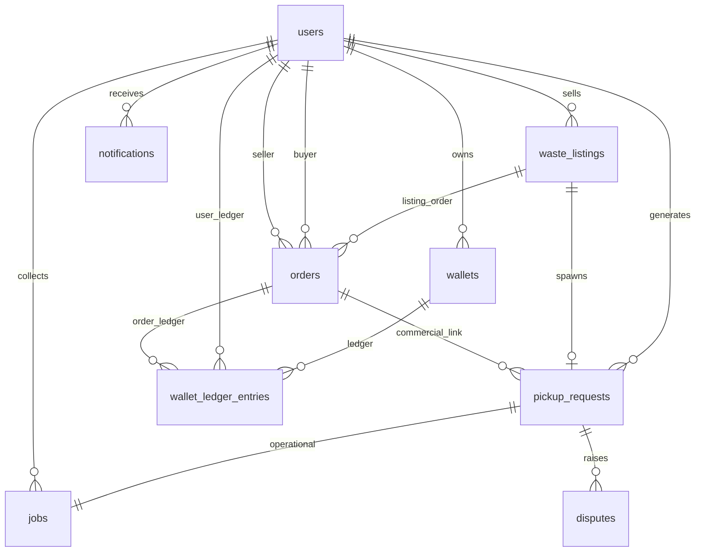

# Waste Bridge — Database structure (canonical)

This document is the **single canonical database structure reference** for Waste Bridge. It merges the former **Database Reference** and **Database Documentation (Full Specification)** into one place.

It describes the **target relational model** for the **Laravel** backend. The canonical spec below is synthesized from:

- [System Documentation]({{ '/documentation/' | relative_url }}) (product §8 and expansion §§20–39); repo file `DOCUMENTATION.md`
- [`API_DOCUMENTATION.md`](./API_DOCUMENTATION.md) (JSON resources and enums)
- [Implementation Plan]({{ '/implementation/' | relative_url }}) (Phase 1+ migrations and domains); repo file `IMPLEMENTATION_PLAN.md`
- `lib/models/` in the repository (Flutter field names and types)

**Implementation status:** The repo includes a **Flutter** client and a **Laravel** API under `backend/` with **SQL migrations** implementing a growing subset of this schema (see migration files). Production DB target remains **MySQL** or **PostgreSQL** (or compatible); local dev may use **SQLite**. Column types below use **MySQL-style** names (`DECIMAL`, `DATETIME`); for PostgreSQL, use `NUMERIC`, `TIMESTAMPTZ`, `JSONB` where appropriate. **Never use floating point for money.**

**Conventions**

| Topic | Choice |
|--------|--------|
| **Table/column names** | `snake_case` in DB; JSON APIs use `camelCase` per Flutter |
| **Money** | `DECIMAL(14,2)` (or `NUMERIC(19,4)`); currency `KES` unless multi-currency later; alternatively **minor units** (`INTEGER` cents) with explicit currency column — pick one strategy per deployment |
| **IDs** | Internal `BIGINT UNSIGNED` PK; **public** string IDs (`public_id`, ULID/UUID) for API parity with Flutter |
| **Timestamps** | `created_at`, `updated_at`; lifecycle fields where needed |
| **Soft delete** | `deleted_at` on user-generated and legal-sensitive rows |
| **Multi-tenant** | `tenant_id` on applicable tables once [§20]({{ '/documentation/' | relative_url }}#20-super-admin--multi-tenant-architecture) ships |
| **Enums** | `VARCHAR` with app validation, or lookup tables (`waste_types`, …) for extensibility |
| **Optimistic locking** | Optional `version` (INT, default 0) on hot rows (`orders`, `pickup_requests`, `jobs`) if concurrent updates become an issue |

**Schema naming (cross-reference):** Some docs use alternate table names for the same concept: **`orders`** here = commercial/escrow order (also referred to as `marketplace_orders` elsewhere). **`wallet_ledger_entries`** = append-only wallet ledger (product doc “transactions”; some specs call this table **`transactions`**). **`entry_type`** aligns with API **`transaction_type`** (`credit` / `debit`).

---

## Table of contents

1. [Enumerations](#1-enumerations)
2. [Core transactional tables](#2-core-transactional-tables)
3. [Order vs job alignment](#3-order-vs-job-alignment)
4. [Trust, compliance, and security](#4-trust-compliance-and-security)
5. [Payments, escrow, and receipts](#5-payments-escrow-and-receipts)
6. [Disputes and support](#6-disputes-and-support)
7. [Notifications](#7-notifications)
8. [Real-time and chat (roadmap)](#8-real-time-and-chat-roadmap)
9. [Gamification and referrals](#9-gamification-and-referrals)
10. [Platform expansion (§20–39)](#10-platform-expansion-20--39)
11. [Indexing strategy](#11-indexing-strategy)
12. [Optimizations and operations](#12-optimizations-and-operations)
13. [Analytics and warehouse](#13-analytics-and-warehouse)
14. [Flutter model mapping](#14-flutter-model-mapping)
15. [Supplemental tables (extended specification)](#15-supplemental-tables-extended-specification)
16. [Entity relationship overview](#16-entity-relationship-overview)
17. [JSON ↔ column mapping (detail)](#17-json--column-mapping-detail)
18. [Referential integrity and constraints](#18-referential-integrity-and-constraints)
19. [Authentication and token storage (Laravel)](#19-authentication-and-token-storage-laravel)

---

## 1. Enumerations

Store values as **lowercase strings** matching the API (see [`API_DOCUMENTATION.md`](./API_DOCUMENTATION.md) §7).

| Domain | Values |
|--------|--------|
| **user_role** | `generator`, `collector`, `recycler` (reserve `admin`, `super_admin`) |
| **request_status** | `pending`, `accepted`, `pickedUp`, `completed`, `cancelled` |
| **job_status** | `open`, `accepted`, `arrived`, `picked`, `delivered` |
| **payment_status** | `unpaid`, `pending`, `paid` |
| **kyc_status** | `notSubmitted`, `pending`, `verified`, `rejected` |
| **wallet_entry_type** | `credit`, `debit` |
| **notification_type** | `pickupAssigned`, `collectorArriving`, `deliveryCompleted` (+ extend as needed) |
| **marketplace_order_status** | Align with [§40.1]({{ '/documentation/' | relative_url }}#401-order-state-machine-marketplace--escrow): `created`, `accepted`, `in_transit`, `delivered`, `completed`, `cancelled`, `disputed` (normalize naming in one migration) |

---

## 2. Core transactional tables

### 2.1 `users`

Product [§8]({{ '/documentation/' | relative_url }}#8-database-schema-detailed): `id`, `name`, `email`, `phone`, `role`, `wallet_balance`, `created_at`. **`AppUser`** adds KYC, verification, subscription, referral.

| Column | Type | Nullable | Notes |
|--------|------|----------|--------|
| `id` | BIGINT PK | NO | Surrogate |
| `public_id` | VARCHAR(36) | NO | UNIQUE; API identifier |
| `tenant_id` | BIGINT FK | YES | After multi-tenant; composite unique `(tenant_id, email)` when active |
| `name` | VARCHAR(255) | NO | |
| `email` | VARCHAR(255) | NO | UNIQUE |
| `phone` | VARCHAR(32) | YES | |
| `password` | VARCHAR(255) | NO | Hashed |
| `role` | VARCHAR(32) | NO | `user_role` |
| `kyc_status` | VARCHAR(32) | NO | Default `notSubmitted` |
| `is_verified` | BOOLEAN | NO | Default false |
| `subscription_plan` | VARCHAR(64) | NO | Default `Free` |
| `referral_code` | VARCHAR(32) | YES | UNIQUE when set |
| `referred_by_user_id` | BIGINT FK → users.id | YES | |
| `locale` | CHAR(5) | NO | `en` / `sw` [§42]({{ '/documentation/' | relative_url }}#42-localization-english--kiswahili) |
| `wallet_balance_cached` | DECIMAL(14,2) | NO | Optional denormalization; omit if balance only from `wallets` |
| `email_verified_at` | DATETIME | YES | |
| `created_at`, `updated_at` | DATETIME | NO | |
| `deleted_at` | DATETIME | YES | Soft delete |

**Indexes:** `UNIQUE(email)`, `UNIQUE(public_id)`, `UNIQUE(referral_code)` where not null, `INDEX(role)`, `INDEX(created_at)`.

---

### 2.2 `wallets`

| Column | Type | Notes |
|--------|------|--------|
| `id` | BIGINT PK | |
| `user_id` | BIGINT FK UNIQUE | One wallet per user (MVP) |
| `currency` | CHAR(3) | Default `KES` |
| `balance` | DECIMAL(14,2) | Must reconcile with ledger + escrow rules |
| `created_at`, `updated_at` | DATETIME | |

---

### 2.3 `wallet_ledger_entries`

Maps product table **`transactions`** [§8] and Flutter **`AppTransaction`** (financial/statement lines). **Append-only**; reversals = new rows.

| Column | Type | Nullable | Notes |
|--------|------|----------|--------|
| `id` | BIGINT PK | NO | |
| `public_id` | VARCHAR(36) | NO | UNIQUE |
| `wallet_id` | BIGINT FK | NO | |
| `user_id` | BIGINT FK | NO | Denormalized for reporting |
| `amount` | DECIMAL(14,2) | NO | Always positive; direction via `entry_type` |
| `entry_type` | VARCHAR(16) | NO | `credit` / `debit` |
| `status` | VARCHAR(24) | NO | e.g. `pending`, `posted`, `failed`, `reversed` |
| `category` | VARCHAR(48) | NO | e.g. `mpesa_deposit`, `escrow_hold`, `escrow_release`, `payout`, `commission`, `recycler_purchase` |
| `material` | VARCHAR(128) | YES | Recycler line item [§6.4 AppTransaction] |
| `quantity_kg` | DECIMAL(12,3) | YES | |
| `description` | TEXT | YES | |
| `balance_after` | DECIMAL(14,2) | YES | Running balance snapshot |
| `order_id` | BIGINT FK | YES | |
| `pickup_request_id` | BIGINT FK | YES | |
| `job_id` | BIGINT FK | YES | |
| `idempotency_key` | VARCHAR(64) | YES | Scoped uniqueness — see [§18](#18-referential-integrity-and-constraints) |
| `provider_reference` | VARCHAR(128) | YES | M-Pesa / PSP id |
| `created_at` | DATETIME | NO | |

**Indexes:** `(wallet_id, created_at DESC)`, `(user_id, created_at DESC)`, `(status)`. **Idempotency:** enforce `UNIQUE (wallet_id, idempotency_key)` where `idempotency_key` is not null (MySQL 8+ functional / partial index; PostgreSQL partial UNIQUE), or `UNIQUE (provider, idempotency_key)` if a `provider` column is added for PSP-scoped keys.

---

### 2.4 `waste_listings`

[§8]({{ '/documentation/' | relative_url }}#8-database-schema-detailed): `id`, `user_id`, `type`, `quantity`, `price`, `location`, `status`.

| Column | Type | Nullable | Notes |
|--------|------|----------|--------|
| `id` | BIGINT PK | NO | |
| `public_id` | VARCHAR(36) | NO | UNIQUE |
| `user_id` | BIGINT FK | NO | Seller |
| `waste_type` | VARCHAR(64) | NO | |
| `quantity_kg` | DECIMAL(12,3) | NO | |
| `unit_price_per_kg` | DECIMAL(14,2) | YES | |
| `total_price` | DECIMAL(14,2) | YES | |
| `location_text` | VARCHAR(512) | NO | |
| `latitude` | DECIMAL(10,7) | YES | Feed filters §3 |
| `longitude` | DECIMAL(10,7) | YES | |
| `status` | VARCHAR(32) | NO | e.g. `draft`, `active`, `filled`, `cancelled` |
| `listing_mode` | VARCHAR(32) | NO | `fixed_price`; later `auction`, `bulk_contract` [§46] |
| `created_at`, `updated_at` | DATETIME | NO | |
| `deleted_at` | DATETIME | YES | |

**Indexes:** `(status, created_at DESC)`, `(user_id)`, `(waste_type, status)`.

---

### 2.5 `orders` (commercial / escrow)

[§3]({{ '/documentation/' | relative_url }}#3-full-marketplace-system-core), [§40.1]({{ '/documentation/' | relative_url }}#401-order-state-machine-marketplace--escrow), [IMPLEMENTATION 1.3]({{ '/implementation/' | relative_url }}). **Commercial** lifecycle separate from operational pickup/job.

| Column | Type | Nullable | Notes |
|--------|------|----------|--------|
| `id` | BIGINT PK | NO | |
| `public_id` | VARCHAR(36) | NO | UNIQUE |
| `tenant_id` | BIGINT FK | YES | Post–multi-tenant |
| `buyer_user_id` | BIGINT FK | YES | Recycler |
| `seller_user_id` | BIGINT FK | NO | Household |
| `listing_id` | BIGINT FK | YES | |
| `status` | VARCHAR(32) | NO | `marketplace_order_status` |
| `subtotal_amount` | DECIMAL(14,2) | YES | Line items / pre-fee goods total |
| `platform_fee_amount` | DECIMAL(14,2) | YES | Platform commission; may be derived from ledger only in MVP |
| `tax_amount` | DECIMAL(14,2) | YES | If/when tax is modeled explicitly |
| `escrow_amount` | DECIMAL(14,2) | YES | Amount held in escrow (often aligns with buyer obligation) |
| `escrow_status` | VARCHAR(24) | YES | `none`, `held`, `released`, `refunded` |
| `currency` | CHAR(3) | NO | `KES` |
| `created_at`, `updated_at` | DATETIME | NO | |

**Indexes:** `(buyer_user_id, status)`, `(seller_user_id, status)`, `(status, created_at DESC)`.

**Fees and splits:** Platform commission, tax, and payouts may be recorded only as **`wallet_ledger_entries`** (`category` = `commission`, etc.) in early releases; add `subtotal_amount` / `platform_fee_amount` / `tax_amount` when reporting needs fixed columns. Optional line-level detail: [§2.5.1](#251-order_line_items-optional).

#### 2.5.1 order_line_items (optional)

Use when marketplace orders need **itemized** pricing beyond a single listing link.

| Column | Type | Nullable | Notes |
|--------|------|----------|--------|
| `id` | BIGINT PK | NO | |
| `order_id` | BIGINT FK | NO | → `orders.id` |
| `listing_id` | BIGINT FK | YES | → `waste_listings.id` |
| `description` | VARCHAR(255) | YES | Snapshot label |
| `quantity_kg` | DECIMAL(12,3) | NO | |
| `unit_price_per_kg` | DECIMAL(14,2) | YES | |
| `line_total` | DECIMAL(14,2) | NO | |

**Indexes:** `(order_id)`.

---

### 2.6 `pickup_requests`

Maps **`WasteRequest`** ([API §6.1](./API_DOCUMENTATION.md#61-wasterequest)). Operational pickup record.

| Column | Type | Nullable | Notes |
|--------|------|----------|--------|
| `id` | BIGINT PK | NO | |
| `public_id` | VARCHAR(36) | NO | UNIQUE; API `id` |
| `generator_user_id` | BIGINT FK | NO | |
| `listing_id` | BIGINT FK | YES | |
| `order_id` | BIGINT FK | YES | Link to commercial order |
| `assigned_collector_user_id` | BIGINT FK | YES | |
| `waste_type` | VARCHAR(64) | NO | |
| `quantity_kg` | DECIMAL(12,3) | NO | |
| `location` | VARCHAR(512) | NO | |
| `latitude` | DECIMAL(10,7) | YES | |
| `longitude` | DECIMAL(10,7) | YES | |
| `status` | VARCHAR(32) | NO | `request_status` |
| `created_at` | DATETIME | NO | |
| `accepted_at` | DATETIME | YES | |
| `picked_up_at` | DATETIME | YES | |
| `completed_at` | DATETIME | YES | |
| `cancelled_at` | DATETIME | YES | |
| `scheduled_at` | DATETIME | YES | |
| `rescheduled_at` | DATETIME | YES | |
| `suggested_collector_name` | VARCHAR(255) | YES | UI hint |
| `estimated_eta_minutes` | INT | YES | |
| `distance_km` | DECIMAL(10,3) | YES | |
| `unit_price_per_kg` | DECIMAL(14,2) | YES | |
| `total_amount` | DECIMAL(14,2) | YES | |
| `payment_status` | VARCHAR(16) | NO | Default `unpaid` |
| `before_pickup_photo_url` | VARCHAR(1024) | YES | |
| `after_pickup_photo_url` | VARCHAR(1024) | YES | |
| `generator_rating` | DECIMAL(3,2) | YES | |
| `collector_rating` | DECIMAL(3,2) | YES | |
| `is_disputed` | BOOLEAN | NO | Default false |
| `dispute_reason` | TEXT | YES | |
| `receipt_id` | VARCHAR(64) | YES | [§44]({{ '/documentation/' | relative_url }}#44-trust-payments--engagement) |
| `receipt_issued_at` | DATETIME | YES | |
| `co2_saved_kg` | DECIMAL(12,4) | NO | Default 0 |
| `updated_at` | DATETIME | NO | |
| `deleted_at` | DATETIME | YES | |

**Indexes:** `(generator_user_id, created_at DESC)`, `(assigned_collector_user_id, status)`, `(status, created_at)`, `(order_id)`, FK indexes on `listing_id`.

**Note:** Prefer moving ratings to `ratings` table ([§4.2](#42-ratings)); keep nullable columns for backward compatibility or derive from aggregates.

---

### 2.7 `jobs` (Laravel: `pickup_jobs`)

Maps **`Job`** ([API §6.2](./API_DOCUMENTATION.md#62-job)). Operational collector work unit; links to `pickup_requests`. [§40.3]({{ '/documentation/' | relative_url }}#403-collector-job-alignment-client-app).

**Implementation note:** The reference Laravel app uses the physical table name **`pickup_jobs`** because Laravel’s default **`jobs`** table is reserved for the **queue worker** (`queue`, `payload`, `attempts`, …). API routes remain **`GET /api/v1/jobs`**; only the relational table name differs.

| Column | Type | Nullable | Notes |
|--------|------|----------|--------|
| `id` | BIGINT PK | NO | |
| `public_id` | VARCHAR(36) | NO | UNIQUE |
| `pickup_request_id` | BIGINT FK | NO | |
| `order_id` | BIGINT FK | YES | When tied to marketplace order |
| `collector_user_id` | BIGINT FK | YES | Set when accepted |
| `pickup_location` | VARCHAR(512) | NO | |
| `waste_type` | VARCHAR(64) | NO | |
| `quantity_kg` | DECIMAL(12,3) | NO | |
| `earning` | DECIMAL(14,2) | NO | Collector payout basis |
| `status` | VARCHAR(32) | NO | `job_status` |
| `created_at`, `updated_at` | DATETIME | NO | |

**Indexes:** `(collector_user_id, status)`, `(pickup_request_id)` UNIQUE (one active job per request, or business rule), `(status, created_at)`.

---

## 3. Order vs job alignment

| Concept | Table | Purpose |
|---------|--------|---------|
| **Order** | `orders` | Commercial state, escrow, buyer/seller |
| **Pickup request** | `pickup_requests` | Generator-facing lifecycle, pricing, proofs, ratings flags |
| **Job** | `jobs` | Collector pipeline: `open` → `accepted` → `arrived` → `picked` → `delivered` |

**Rules**

- `pickup_requests.order_id` links operational flow to **escrow** when the pickup is part of a marketplace sale.
- `jobs.order_id` optional denormalization for reporting.
- State mapping must be validated in application layer: marketplace [§40.1]({{ '/documentation/' | relative_url }}#401-order-state-machine-marketplace--escrow) vs request vs job ([§40.3]({{ '/documentation/' | relative_url }}#403-collector-job-alignment-client-app)).

**API / JSON (Job vs DB):** The Flutter **`Job`** model is minimal ([`API_DOCUMENTATION.md`](./API_DOCUMENTATION.md) §6.2). The API should still expose **`publicId`** (maps to `jobs.public_id`), **`requestId`** (→ `pickup_request_id`), and when the client adds fields: **`collectorUserId`** (→ `collector_user_id`), **`orderId`** (→ `order_id`), **`createdAt` / `updatedAt`**. Until the client ships those keys, the backend may omit them or return them for forward compatibility.

---

## 4. Trust, compliance, and security

### 4.1 `kyc_submissions`

[IMPLEMENTATION 1.7]({{ '/implementation/' | relative_url }}), [§43]({{ '/documentation/' | relative_url }}#43-mobile-near-term-roadmap-flutter) KYC UI.

| Column | Type | Notes |
|--------|------|--------|
| `id` | BIGINT PK | |
| `user_id` | BIGINT FK | |
| `status` | VARCHAR(32) | Align with `kyc_status` |
| `document_type` | VARCHAR(64) | |
| `storage_path` | VARCHAR(512) | Secure storage |
| `reviewed_by_user_id` | BIGINT FK | Admin |
| `reviewed_at` | DATETIME | |
| `rejection_reason` | TEXT | YES |
| `created_at`, `updated_at` | DATETIME | |

**Indexes:** `(user_id, created_at DESC)`, `(status)`.

**Multiple files:** One row per **submission attempt** or per **document** is acceptable. If users upload **several files in one review cycle**, prefer **`kyc_documents`** ([§15.9](#159-kyc_documents)) linked to a parent `kyc_submissions` row (or replace single `storage_path` with child rows only).

---

### 4.2 `ratings`

[IMPLEMENTATION 1.7]({{ '/implementation/' | relative_url }}), [§5.5]({{ '/implementation/' | relative_url }}) logistics.

| Column | Type | Notes |
|--------|------|--------|
| `id` | BIGINT PK | |
| `pickup_request_id` | BIGINT FK | |
| `job_id` | BIGINT FK | YES | |
| `rater_user_id` | BIGINT FK | |
| `ratee_user_id` | BIGINT FK | |
| `score` | DECIMAL(3,2) | |
| `comment` | TEXT | YES | |
| `created_at` | DATETIME | |

**Indexes:** `(ratee_user_id, created_at)`, UNIQUE `(pickup_request_id, rater_user_id)` to prevent duplicates.

---

### 4.3 Referrals — canonical MVP vs normalized

[IMPLEMENTATION 1.7]({{ '/implementation/' | relative_url }}), [§10.5]({{ '/implementation/' | relative_url }}).

| Strategy | Use when |
|----------|----------|
| **Canonical MVP (Option A)** | **`users.referral_code`**, **`users.referred_by_user_id`**, reward lines on **`wallet_ledger_entries`** — sufficient for simple refer-a-friend and reporting. |
| **Normalized (Option B)** | **`referrals`** + **`referral_redemptions`** ([§15.2](#152-referrals-normalized)) when you need caps, expiry, audit per code, or idempotent reward replay separate from `users`. |

**Indexes (Option B):** `(code_used, referee_user_id)` UNIQUE on redemptions.

---

### 4.4 `audit_logs`

[§10]({{ '/documentation/' | relative_url }}#10-security-architecture), [IMPLEMENTATION 2.4]({{ '/implementation/' | relative_url }}).

| Column | Type | Notes |
|--------|------|--------|
| `id` | BIGINT PK | |
| `actor_user_id` | BIGINT FK | YES | System jobs null |
| `action` | VARCHAR(64) | |
| `subject_type` | VARCHAR(128) | Polymorphic |
| `subject_id` | BIGINT | |
| `metadata` | JSON | |
| `ip_address` | VARCHAR(45) | YES | |
| `created_at` | DATETIME | |

**Indexes:** `(subject_type, subject_id, created_at DESC)`, `(actor_user_id, created_at DESC)`.

---

### 4.5 `otp_verifications` (optional)

[IMPLEMENTATION 2.6]({{ '/implementation/' | relative_url }}).

| Column | Type | Notes |
|--------|------|--------|
| `id` | BIGINT PK | |
| `email` or `phone` | VARCHAR | |
| `code_hash` | VARCHAR | |
| `expires_at` | DATETIME | |
| `consumed_at` | DATETIME | YES |
| `created_at` | DATETIME | |

**Indexes:** `(phone, created_at)` for throttling lookups.

---

## 5. Payments, escrow, and receipts

### 5.1 `payment_intents` / PSP events

[§11]({{ '/documentation/' | relative_url }}#11-payments--wallet), [IMPLEMENTATION 4.2]({{ '/implementation/' | relative_url }}).

| Column | Type | Notes |
|--------|------|--------|
| `id` | BIGINT PK | |
| `public_id` | VARCHAR(36) UNIQUE | |
| `user_id` | BIGINT FK | |
| `order_id` | BIGINT FK | YES | |
| `amount` | DECIMAL(14,2) | |
| `currency` | CHAR(3) | |
| `provider` | VARCHAR(32) | e.g. `mpesa` |
| `provider_checkout_id` | VARCHAR(128) | YES | |
| `status` | VARCHAR(32) | `created`, `pending`, `succeeded`, `failed` |
| `idempotency_key` | VARCHAR(64) | UNIQUE | |
| `raw_payload` | JSON | YES | Audit |
| `created_at`, `updated_at` | DATETIME | |

---

### 5.2 `escrow_holds` (optional normalized)

Tie to `orders.escrow_*` or split: `order_id`, `amount`, `status`, `released_at`, `ledger_release_entry_id`.

---

### 5.3 Receipts

[§44]({{ '/documentation/' | relative_url }}#44-trust-payments--engagement), [4.5]({{ '/implementation/' | relative_url }}): `receipt_id`, `receipt_issued_at` on `pickup_requests`; add `receipt_pdf_url` if stored.

---

## 6. Disputes and support

### 6.1 `disputes`

[§25]({{ '/documentation/' | relative_url }}#25-dispute--support-system), [IMPLEMENTATION 11]({{ '/implementation/' | relative_url }}).

| Column | Type | Notes |
|--------|------|--------|
| `id` | BIGINT PK | |
| `public_id` | VARCHAR(36) UNIQUE | |
| `pickup_request_id` | BIGINT FK | |
| `order_id` | BIGINT FK | YES | |
| `opened_by_user_id` | BIGINT FK | |
| `category` | VARCHAR(64) | no_show, wrong_material, quantity, payment, … |
| `status` | VARCHAR(32) | open, under_review, resolved, closed |
| `resolution` | TEXT | YES | |
| `resolved_by_user_id` | BIGINT FK | YES | |
| `resolved_at` | DATETIME | YES | |
| `created_at`, `updated_at` | DATETIME | |

**Indexes:** `(status, created_at)`, `(pickup_request_id)`.

---

### 6.2 `dispute_evidence`

| Column | Type | Notes |
|--------|------|--------|
| `id` | BIGINT PK | |
| `dispute_id` | BIGINT FK | |
| `storage_path` | VARCHAR(512) | |
| `kind` | VARCHAR(32) | photo, gps, chat_export |
| `created_at` | DATETIME | |

---

## 7. Notifications

### 7.1 `notifications`

[§8]({{ '/documentation/' | relative_url }}#8-database-schema-detailed), [§14]({{ '/documentation/' | relative_url }}#14-notifications), **`AppNotification`** [API §6.5](./API_DOCUMENTATION.md#65-appnotification-not-yet-called-over-http).

| Column | Type | Notes |
|--------|------|--------|
| `id` | BIGINT PK | |
| `public_id` | VARCHAR(36) UNIQUE | |
| `user_id` | BIGINT FK | |
| `title` | VARCHAR(255) | |
| `message` | TEXT | |
| `type` | VARCHAR(48) | `notification_type` |
| `read_at` | DATETIME | YES | |
| `created_at` | DATETIME | |

**Indexes:** `(user_id, created_at DESC)`, `(user_id, read_at)`.

---

### 7.2 Push / email outbox (optional)

`notification_outbox`: `channel`, `payload`, `status`, `sent_at` for queues [§35]({{ '/documentation/' | relative_url }}#35-performance-optimization-strategy).

---

## 8. Real-time and chat (roadmap)

### 8.1 `chat_threads`

[IMPLEMENTATION 6.4]({{ '/implementation/' | relative_url }}), [§43]({{ '/documentation/' | relative_url }}#43-mobile-near-term-roadmap-flutter).

| Column | Type | Notes |
|--------|------|--------|
| `id` | BIGINT PK | |
| `pickup_request_id` | BIGINT FK | YES | |
| `order_id` | BIGINT FK | YES | |
| `created_at` | DATETIME | |

### 8.2 `chat_messages`

| Column | Type | Notes |
|--------|------|--------|
| `id` | BIGINT PK | |
| `thread_id` | BIGINT FK | |
| `sender_user_id` | BIGINT FK | |
| `body` | TEXT | |
| `created_at` | DATETIME | |

**Indexes:** `(thread_id, id)` for pagination.

---

## 9. Gamification and referrals

### 9.1 `points_ledger` / `badges`

[§19]({{ '/documentation/' | relative_url }}#19-gamification), [IMPLEMENTATION 10]({{ '/implementation/' | relative_url }}).

- **`points_ledger`:** `user_id`, `delta`, `reason`, `source_type`, `source_id`, `created_at`.
- **`user_badges`:** `user_id`, `badge_code`, `earned_at`.

**Indexes:** `(user_id, created_at DESC)`.

---

## 10. Platform expansion (§20–39)

High-level tables to plan migrations when each phase lands; not all are required for MVP.

| Doc section | Tables (conceptual) |
|-------------|---------------------|
| **§20 Multi-tenant** | `tenants`, `tenant_settings` (pricing, categories, compliance) |
| **§21 Offline** | Mostly client queue; server: `sync_conflicts`, `client_mutation_id` on entities |
| **§22 Inventory** | `storage_locations`, `inventory_lots`, `inventory_movements` |
| **§23 Subscriptions** | `subscription_plans`, `subscriptions`, `subscription_invoices` |
| **§24 Community** | `groups`, `group_members`, `campaigns`, `campaign_participations` |
| **§25 Disputes** | Covered in [§6](#6-disputes-and-support) |
| **§26 Automation** | `automation_rules`, `rule_executions` |
| **§27 IoT** | `devices`, `device_readings`, `pickup_triggers` |
| **§28 ESG** | `impact_methodologies`, `impact_reports`, `carbon_attributions` |
| **§29 B2B** | `organizations`, `sites`, `contracts`, `invoices` |
| **§30 ML** | Feature store / batch tables — often **outside** OLTP |
| **§31 Public API** | `api_clients`, `api_keys`, `webhook_subscriptions`, `webhook_deliveries` |
| **§32 Geo** | `geo_zones` (polygon WKT or PostGIS), `zone_pricing_rules` |
| **§33 Fraud** | `risk_signals`, `user_risk_flags` |
| **§34 Warehouse** | Replica / lake — not primary OLTP schema |

---

## 11. Indexing strategy

| Pattern | Tables | Rationale |
|---------|--------|-----------|
| **Feed / marketplace** | `waste_listings` | `(status, created_at)`, type filters |
| **User history** | `pickup_requests`, `wallet_ledger_entries`, `notifications` | `(user_id, created_at DESC)` |
| **Assignment** | `jobs` | `(status)`, `(collector_user_id, status)` |
| **Financial reconciliation** | `wallet_ledger_entries`, `payment_intents` | `idempotency_key`, `provider_reference`, time range |
| **Admin** | `disputes`, `kyc_submissions` | `(status, created_at)` |
| **FKs** | All child tables | Index FK columns used in JOINs |
| **Geo (bounding box / nearby)** | `waste_listings`, `pickup_requests` | Composite `(latitude, longitude)` rarely optimal alone; **PostgreSQL:** GiST on `ll_to_earth` / PostGIS `GEOGRAPHY`; **MySQL 8:** `SPATIAL` POINT + `ST_Distance_Sphere` or app-level bbox filter on `(latitude, longitude)` with latitude/longitude range indexes |
| **Full-text search** | `waste_listings`, `users` (display) | Optional `FULLTEXT` (MySQL) or `tsvector` (PostgreSQL) on title/location fields when search ships |

**Additional practices:** Partial indexes where helpful (e.g. unread `notifications` where `read_at IS NULL`); keyset pagination covering indexes on list feeds (`created_at`, `id`); partition high-volume time-series (`location_pings`, `audit_logs`, ledger) when volume warrants; **read replicas** for reporting; **warehouse** for BI [§34]({{ '/documentation/' | relative_url }}#34-data-warehouse--big-data). Compliance: soft deletes on PII-heavy tables per [§18]({{ '/documentation/' | relative_url }}#18-legal--compliance).

---

## 12. Optimizations and operations

| Topic | Recommendation |
|--------|----------------|
| **Caching** | Redis for hot reads, config, marketplace slices [§35]({{ '/documentation/' | relative_url }}#35-performance-optimization-strategy) |
| **Queues** | Laravel queues for notifications, payouts, webhooks, heavy reports |
| **Images** | CDN URLs in `location` fields; separate `media_assets` if centralized |
| **Rate limiting** | At API layer [§10]({{ '/documentation/' | relative_url }}#10-security-architecture) |
| **Backups / HA** | [§17]({{ '/documentation/' | relative_url }}#17-devops--deployment) |
| **Migrations** | Backward-compatible deploys [IMPLEMENTATION 14.8]({{ '/implementation/' | relative_url }}) |

---

## 13. Analytics and warehouse

- **OLTP** tables above serve live operations.
- **§34** [Data warehouse]({{ '/documentation/' | relative_url }}#34-data-warehouse--big-data): ETL/ELT to analytics store; avoid heavy aggregates on primary DB.

---

## 14. Flutter model mapping

| Flutter model | Primary tables | Notes |
|---------------|----------------|--------|
| `AppUser` | `users` | Client omits `phone`, `locale`, `wallet_balance_cached` today; API may still return them for profile screens. |
| `WasteRequest` | `pickup_requests` | Join `orders`, `waste_listings`, `users` (collector) as needed for full API payloads. |
| `Job` | `jobs` | Client fields are a subset; DB has `order_id`, `collector_user_id`, `public_id`, timestamps — see [§3](#3-order-vs-job-alignment). |
| `AppTransaction` | `wallet_ledger_entries` | Ledger has more columns (`category`, `status`, FKs); map into API or extend the Flutter model later. |
| `AppNotification` | `notifications` | DB has `read_at`; **Flutter model has no `readAt` yet** — add when marking notifications read client-side. |
| — | `waste_listings` | **No `WasteListing` model in `lib/models/`** yet; marketplace UIs should add one when listing CRUD ships. Backend table remains canonical for seller inventory. |
| — | `orders` | **No dedicated Dart model** in-repo; represent via API DTOs / future `MarketplaceOrder` when the app implements marketplace flows. |

Enum strings must match [API_DOCUMENTATION.md §7](./API_DOCUMENTATION.md#7-enumerations).

---

## 15. Supplemental tables (extended specification)

Tables below appear in phased work or alternate normalizations; they complement §§2–9 where columns on core tables are not enough.

### 15.1 Order linking (alternative)

If you prefer explicit many-to-many instead of only `pickup_requests.order_id` / `jobs.order_id`:

| Column | Type | Notes |
|--------|------|--------|
| `marketplace_order_id` | BIGINT FK | → `orders.id` |
| `pickup_request_id` | BIGINT FK | |
| `job_id` | BIGINT FK | YES |

**Primary key:** `(marketplace_order_id, pickup_request_id)` or surrogate `id`.

### 15.2 Referrals (normalized)

| Table | Purpose |
|-------|---------|
| **`referrals`** | `id`, `referrer_user_id`, `code` (UNIQUE), `max_redemptions`, `expires_at` |
| **`referral_redemptions`** | `id`, `referral_id`, `referred_user_id`, `reward_ledger_entry_id` → `wallet_ledger_entries`, `idempotency_key` (UNIQUE) |

(§4.3 in this doc describes Option A on `users` vs Option B; these tables implement Option B.)

### 15.3 Payments configuration

| Table | Notes |
|-------|--------|
| **`payment_providers`** | `id`, `code` (e.g. `mpesa`), `config` JSON (no raw secrets — references only) |

### 15.4 Logistics and proof

| Table | Notes |
|-------|--------|
| **`collector_profiles`** | `user_id` PK/FK, `is_available`, `vehicle_type`, optional `current_lat` / `current_lng` |
| **`location_pings`** | `id`, `job_id` FK, point/geom, `recorded_at` — high volume; partition/index by time |
| **`proof_attachments`** | `id`, `pickup_request_id`, `kind` (`before`/`after`), `url`, `checksum`, `created_at` — normalizes photos beyond columns on `pickup_requests` |

### 15.5 Notifications delivery

| Table | Notes |
|-------|--------|
| **`push_devices`** | `id`, `user_id` FK, `fcm_token`, `platform`, `last_seen_at` — UNIQUE `(user_id, fcm_token)` |
| **`notification_templates`** | `key`, `locale`, `title`, `body` for localized copy [§42.3]({{ '/documentation/' | relative_url }}#423-laravel-api--content) |
| **`notification_outbox`** | Optional queue: `channel`, `payload`, `status`, `sent_at` [§35]({{ '/documentation/' | relative_url }}#35-performance-optimization-strategy) |

### 15.6 Payouts

| Table | Notes |
|-------|--------|
| **`withdrawals`** / **`payout_batches`** | Collector/recycler payouts and platform commission rules [§11]({{ '/documentation/' | relative_url }}#11-payments--wallet) |

### 15.7 Sessions and auth (framework)

See [§19](#19-authentication-and-token-storage-laravel) for the canonical Laravel target. Framework DDL (`sessions`, `password_reset_tokens`, Sanctum `personal_access_tokens`) is standard; not duplicated as full CREATE statements here.

### 15.8 Platform expansion (detailed stubs)

When phases in [§10](#10-platform-expansion-20--39) land, add concrete columns:

| Area | Tables (conceptual) |
|------|---------------------|
| **Tenants** | `tenants` (`slug`, `name`, `config` JSON), `tenant_settings` |
| **Offline sync** | `client_sync_queue` with `client_mutation_id` UNIQUE |
| **Inventory** | `storage_locations`, `inventory_lots`, `inventory_movements`, `inventory_balances` |
| **Subscriptions** | `subscription_plans`, `user_subscriptions`, invoices |
| **Community** | `community_groups`, `group_memberships`, `campaigns`, `campaign_participations` |
| **IoT** | `smart_bins`, `bin_pickup_triggers` |
| **ESG** | `esg_methodology_versions`, `esg_attributions` |
| **B2B** | `organizations`, `organization_users`, `bulk_contracts` |
| **Public API** | `api_clients`, `webhook_subscriptions`, `webhook_delivery_attempts` |
| **Geo** | `service_zones` (polygon / pricing rules JSON) |
| **Fraud** | `device_fingerprints`, `fraud_flags` |
| **Automation** | `automation_rules` (`rule_type`, `config` JSON, `priority`, `active`) |
| **ML** | Batch/warehouse tables — typically **outside** OLTP |

### 15.9 `kyc_documents`

Child rows when a single KYC case has **multiple uploads** (see [§4.1](#41-kyc_submissions)).

| Column | Type | Notes |
|--------|------|--------|
| `id` | BIGINT PK | |
| `kyc_submission_id` | BIGINT FK | → `kyc_submissions.id` |
| `document_type` | VARCHAR(64) | e.g. `national_id`, `proof_of_address` |
| `storage_path` | VARCHAR(512) | Secure storage |
| `created_at` | DATETIME | |

**Indexes:** `(kyc_submission_id)`.

---

## 16. Entity relationship overview

---

## 17. JSON ↔ column mapping (detail)

API responses use **camelCase** ([`API_DOCUMENTATION.md` §6](./API_DOCUMENTATION.md#6-shared-resource-schemas)); database columns use **snake_case`.

| JSON (Flutter / API) | Table.column |
|----------------------|----------------|
| `wasteType` | `pickup_requests.waste_type` |
| `quantityKg` | `quantity_kg` |
| `createdAt` | `created_at` |
| `beforePickupPhotoUrl` | `before_pickup_photo_url` |
| `paymentStatus` | `payment_status` |
| `isDisputed` | `is_disputed` |
| `receiptId` | `receipt_id` |
| `co2SavedKg` | `co2_saved_kg` |
| `requestId` (on Job) | `jobs.pickup_request_id` (expose as `requestId` in API) |
| `collectorUserId` | `jobs.collector_user_id` (recommended API field when exposing collector) |
| `orderId` | `jobs.order_id`, `pickup_requests.order_id` |
| `readAt` | `notifications.read_at` |
| `kycStatus` | `users.kyc_status` |
| `subscriptionPlan` | `users.subscription_plan` |
| `listingId` | `waste_listings.public_id` or internal id per API convention |
| `subtotalAmount` | `orders.subtotal_amount` |
| `platformFeeAmount` | `orders.platform_fee_amount` |
| `taxAmount` | `orders.tax_amount` |

Laravel API Resources or transformers should own this mapping.

---

## 18. Referential integrity and constraints

**Foreign keys:** Prefer explicit FK constraints in migrations. Common patterns:

| Relationship | ON DELETE | Notes |
|--------------|-----------|--------|
| Child row purely owned by parent (`order_line_items` → `orders`) | `CASCADE` | |
| `pickup_requests` → `orders` | `SET NULL` | If order removed, operational history may remain without commercial link |
| `jobs` → `pickup_requests` | `RESTRICT` or `CASCADE` | Choose by product rule: deleting a request may be forbidden if a job exists |
| `wallet_ledger_entries` | `RESTRICT` | Append-only; never delete parent rows in normal flows |
| `users` (referenced widely) | `RESTRICT` | Soft-delete users (`deleted_at`) instead of hard delete where possible |

**CHECK constraints (where supported):** Non-negative `amount` on ledger lines; `escrow_amount >= 0`; enum-like columns validated in app + optional DB CHECK for critical tables.

**Idempotency:** `wallet_ledger_entries`: unique composite as in [§2.3](#23-wallet_ledger_entries). `payment_intents`: keep global `UNIQUE (idempotency_key)` or scope by `user_id` per product rules.

**Concurrency:** Optional `version` column on `orders`, `pickup_requests`, `jobs` for optimistic locking; alternatively rely on `updated_at` comparison in the application layer.

---

## 19. Authentication and token storage (Laravel)

Aligned with [`API_DOCUMENTATION.md`](./API_DOCUMENTATION.md) §3 (Bearer access token, optional refresh).

| Mechanism | Storage | Notes |
|-----------|---------|--------|
| **Password hashing** | `users.password` | bcrypt/Argon2 per Laravel defaults |
| **API tokens (Sanctum)** | `personal_access_tokens` | Access tokens; store abilities/scopes as needed |
| **Refresh tokens** | Opaque refresh: dedicated table e.g. `refresh_tokens` (`id`, `user_id`, `token_hash`, `expires_at`, `revoked_at`) **or** Sanctum token rotation policy — pick one and document in API |
| **Session / web** | `sessions` | If cookie-based admin exists |
| **Password reset** | `password_reset_tokens` (Laravel default) or `password_resets` table name per version |
| **Email verification** | `email_verified_at` on `users` + signed URLs; optional `email_verification_tokens` if not using Laravel’s built-in flow only |
| **OTP** | [`otp_verifications`](#45-otp_verifications-optional) | SMS/email codes |

**Out of domain OLTP:** Laravel **`failed_jobs`**, **`job_batches`**, **`cache`** (if DB driver), **`migrations`** — provision via framework; not listed in §§2–9.

---

## Document history

| Version | Notes |
|---------|--------|
| 1.0 | Target schema from product docs, API contract, implementation plan, and Flutter models |
| 2.0 | Merged `DATABASE.md` and `DATABASE_DOCUMENTATION.md` into this single file; added §§15–17 (supplemental tables, ER diagram, JSON mapping detail) |
| 2.1 | Order economics columns + optional `order_line_items`; KYC `kyc_documents`; referral MVP canon; expanded indexes (geo/search); Flutter/API gaps; ER diagram; JSON mapping; §§18–19 integrity and auth |

For execution order, see [Implementation Plan]({{ '/implementation/' | relative_url }}) Phase 1 (repo: `IMPLEMENTATION_PLAN.md`).

For API shapes, see [`API_DOCUMENTATION.md`](./API_DOCUMENTATION.md). For product sections **1–47**, see [System Documentation]({{ '/documentation/' | relative_url }}) (repo: `DOCUMENTATION.md`).
