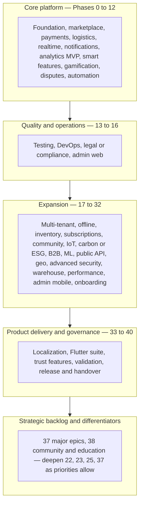

# Waste Bridge — Full Implementation Plan

This document turns [DOCUMENTATION.md](./DOCUMENTATION.md) into a **single ordered implementation path** from first engineering step to last. It follows **dependency order**: foundation → core transactional platform → real-time and comms → quality and compliance → scale and enterprise features → localization and product backlog → continuous governance.

**Scope:** Everything described in Sections 1–19 (core platform), 20–39 (expansion), 40–42 (order alignment, risk, localization), 43–47 (roadmap backlog), plus alignment with the **Appendix** (current Flutter prototype).

---

## Conventions

- **Backend** = Laravel REST API unless noted.
- **Client** = Flutter app (`c:\WASTE_BRIDGE`).
- **Parallel tracks:** Backend, Flutter, testing, security hardening, and documentation run **concurrently** where dependencies allow; release **gates** are explicit below.
- **Testing (§16)** starts in **Phase 1** (smoke/API tests for new endpoints), not only when **Phase 13** is “started” on the calendar.
- **Scale and enterprise readiness** are summarized in [Scale and enterprise readiness (cross-phase)](#scale-and-enterprise-readiness-cross-phase); individual phases add concrete steps without changing overall dependency order.
- **Enterprise completeness and roadmap horizons** (what is core vs expansion vs optional depth) are in [Enterprise completeness and roadmap horizons](#enterprise-completeness-and-roadmap-horizons-cross-phase).

---

## Parallel execution model (critical path)

The **numbered phase order** below is **dependency order** for the backend platform. **Do not** wait until **Phase 33** to integrate the Flutter app with a real API.

| Track | What runs in parallel | Depends on |
|-------|------------------------|------------|
| **Backend core** | Phases **0 → 12** (and **13–16** as below) | — |
| **Flutter integration** | **Phase 35.1** (env base URL, JWT, remove mock) as soon as **2.1** + **1.4** (auth + one protected route) exist; expand through **35.x** as endpoints ship | **1**, **2**, **ApiClient** |
| **Flutter UI** | **Phase 34** screens can ship **alongside** backend; use mocks or feature flags until endpoints exist | Product priority |
| **Localization** | **Phase 33** can overlap **Phase 34–35**; extract strings early | **33** glossary first is ideal |
| **Mobile platform** | **§35.3** deep links: platform config in **14.7** + **40.2** | **14**, **40** |

**Rule:** Any **Phase 35** item that needs an API (KYC, chat, ratings) requires the corresponding **backend row** in **Phase 1–6 / 10 / 11** before calling that client work “done.”

---

## Scale and enterprise readiness (cross-phase)

This layer does **not** replace numbered phases; it makes scaling, observability, and enterprise operations **explicit** so early choices (stateless API, queues, caching) align with later **Phase 17**, **29**, and **30** work.

### Where phases contribute

| Concern | Primary phases | Notes |
|--------|------------------|--------|
| Stateless API, queue categories, infra direction | **0**, **14**, **30** | JWT-friendly horizontal scaling; separate **priority** (latency-sensitive) vs **background** jobs. |
| Rate limits, peak-load targets, security edge | **2**, **28**, **26** | Document targets; partners get published limits and versioning. |
| Load/stress testing feeding tuning | **13**, **30** | Staging stress before major events; fix regressions before prod scale-up. |
| Dashboards, SLOs, health, feature flags | **14** | Real-time operational visibility; phased rollouts for risky features. |
| Multi-tenant isolation and regions | **17** | Isolation model + expansion without unnecessary downtime. |
| Analytics/warehouse at scale | **29** | ETL throughput, retention, avoid warehouse load on OLTP. |
| ML compute | **25** | Async/batch heavy work off the transactional path. |
| Release safety | **40** | Canary/phased rollout; API + client rollback; gates tied to **13**. |
| Developer onboarding at team growth | **32** | New engineers ramp with architecture and contracts. |

### Scale readiness checklist

Use this as a living table (update status as you implement). It complements the **risk register** (**0.4**).

| Area | Status | Next steps |
|------|--------|------------|
| API horizontal scaling | Planned | Stateless app servers; load balancer + multiple PHP/Laravel workers (**14**); autoscaling policy when traffic grows. |
| Database scaling | Planned | Read replicas first; partition/shard strategy aligned with **17** (tenant/region). |
| Redis / cache | Partial → target | Start single instance (**30**); move to cluster/high-availability when metrics warrant. |
| Queue throughput | Partial | Define priority vs background queues (**0.8**); benchmark concurrent jobs (**13.8**); watch depth alerts (**14.9**). |
| Observability | Partial | Dashboards: latency, job assignment throughput, payment success/failure (**14.9**). |
| Offline / mobile | Planned | **18**; stress large offline caches and sync in **13** where relevant. |
| Multi-tenant isolation | Planned | Document model in **17.5** (shared schema vs separate DB). |
| Edge / DDoS / secrets | Planned | **28.4–28.5**; encryption at rest for KYC and wallet-sensitive data. |

---

## Enterprise completeness and roadmap horizons (cross-phase)

Most “full enterprise” capabilities already have a home in numbered phases (e.g. **10**/**21** engagement, **22** IoT, **23** ESG, **25** ML, **28** fraud/WAF). This section gives a **visual roadmap**, a **theme → phase map** for anything still easy to miss, and **new rows below** only where the plan needed an explicit line item.

### Visual roadmap (core → expansion → optional depth)

### Theme map (enterprise-grade coverage)

| Theme | Already covered in phases | Added or tightened in this doc |
|------|---------------------------|--------------------------------|
| High availability and resilience | **14** (Docker, CI/CD, backups, **14.9** health) | **14.11** multi-region or DR, LB posture; **14.12** blue/green, migration checks in CI |
| API and partner ecosystem | **26**, **0.7**, **2.8** | **0.10** sandbox; **26.5** OAuth2 or key rotation, developer portal |
| Advanced analytics and reporting | **8**, **29**, **16.3**, **24.3** | **8.3** near–real-time ops metrics; **29.5** scheduled compliance or finance or ESG reports |
| AI and ML beyond MVP | **9**, **25**, **12**, **22** | **25.6** feedback loop and tie-in to classification or routing accuracy |
| Continuous security | **2**, **28**, **13** | **28.6** pen test cadence, optional bug bounty |
| Enterprise workflows | **11.5**, **20.2**, **24** | **24.4** bulk onboarding, contract SLAs, escalation |
| Offline and mobile resilience | **18**, **37.2**, **35.2** | **18.5** conflict merge rules, local notification queue when flaky |
| DevOps and automation | **14**, **40.6–40.7** | **14.12** (overlap with blue/green and CI migration checks) |
| Monitoring and observability | **14.6**, **14.9** | **14.13** business KPIs alongside technical SLOs |
| Governance and audit | **2.4**, **11**, **15**, **39.3** | **40.8** release governance and audit completeness for money or KYC paths |
| Community and engagement | **10**, **21**, **38** | No new row — use table for visibility |
| Future-ready IoT, ESG, partners | **22**, **23**, **26**, **47** | No new row — **37** and strategic priority pick depth |

---

## Phase 0 — Program setup and alignment

**Status:** **Complete** (see [`PROGRAM_SETUP.md`](./PROGRAM_SETUP.md), [`BUSINESS_MODEL.md`](./BUSINESS_MODEL.md), [`RISK_REGISTER.md`](./RISK_REGISTER.md), staging seeder, `backend/config/waste_bridge.php`, `backend/app/Modules/README.md`).

| Step | What to implement | Doc ref |
|------|-------------------|---------|
| 0.1 | Confirm product scope: Flutter client + Laravel API, API-driven boundaries, independent evolution of clients. | §1 |
| 0.2 | Define environments (dev / staging / prod), naming, secrets handling, and base URLs for API and assets. | §1, §17, Appendix A.8 |
| 0.3 | Establish **business model** artifacts for internal use: revenue streams (take rate, subscriptions, B2B, optional ads), cost assumptions, unit economics, growth narrative—so engineering choices match economics. | §39 |
| 0.4 | Create a **risk register** (owners, review cadence quarterly or per release); seed with mitigations from the doc (payments, connectivity, fraud, breach, regulatory, escrow disputes, key-person, environmental claims, scale, localization). | §41 |
| 0.5 | Plan **modular bounded contexts** in code (payments, marketplace, logistics, analytics) even if starting as a monolith—clear module folders and API boundaries. | §36 |
| 0.6 | **Staging seed data**: deterministic users, listings, and jobs for QA and demos (scripts or migrations); never enable in production. | §16, §17 |
| 0.7 | **API versioning policy** (doc): URL prefix (`/api/v1`) or version headers; how mobile clients pin versions; **deprecation** notice period. | §7 |
| 0.8 | **Scaling posture (design-time)**: **stateless** HTTP/API layer (no sticky sessions beyond what the platform requires); JWT aligns with horizontal scaling; document **queue categories**: **priority** (user-visible latency) vs **background** (reports, heavy async). | Scale |
| 0.9 | **Data/cache direction**: how the DB will scale first (**read replicas**), then **partitioning** (e.g. by tenant/region when **17** applies); Redis path **single instance → cluster/high availability** as load grows (**30**). | Scale, §17 |
| 0.10 | **Partner or developer sandbox**: isolated API base URL, synthetic data, key issuance; **reset** policy for demos and integrator testing (coordinates with **26.5**). | §7, Enterprise |

**Phase 0 deliverables in this repo:** [PROGRAM_SETUP.md](./PROGRAM_SETUP.md) (single index), [BUSINESS_MODEL.md](./BUSINESS_MODEL.md), [RISK_REGISTER.md](./RISK_REGISTER.md), [`backend/database/seeders/StagingSeeder.php`](../backend/database/seeders/StagingSeeder.php), [`backend/config/waste_bridge.php`](../backend/config/waste_bridge.php), [`backend/app/Modules/README.md`](../backend/app/Modules/README.md), plus [API_DOCUMENTATION.md](./API_DOCUMENTATION.md) §15 and [`backend/config/queue.php`](../backend/config/queue.php) (0.8).

---

## Phase 1 — Backend foundation: data model and API skeleton

| Step | What to implement | Doc ref |
|------|-------------------|---------|
| 1.1 | Laravel project bootstrap; REST structure; versioning/namespacing convention for `/api`. | §7 |
| 1.2 | Migrations for core tables: **users** (with role), **waste_listings**, **pickup_requests**, **transactions**, **wallets**, **notifications**; indexes, foreign keys, soft deletes where appropriate. | §8 |
| 1.3 | Extend schema for **order vs job**: commercial order ID linked to operational job/pickup pipeline (align Flutter job states with platform order states). | §40.3, Appendix |
| 1.4 | Implement representative endpoints (expand as needed): `POST /api/auth/register`, `POST /api/auth/login`, `GET /api/marketplace`, `POST /api/waste/create`, `POST /api/pickup/request`, `POST /api/pickup/accept`, `POST /api/payment/initiate`, `GET /api/user/wallet`. | §7 |
| 1.5 | Define enums and state machine for marketplace order lifecycle: `created` → `accepted` → `in transit` → `delivered` → `completed`, plus `cancelled`, `disputed`, and resolution paths. | §3, §40.1 |
| 1.6 | **HTTPS** termination, transport security, and secrets management in all environments. | §10 |
| 1.7 | **Migrations for mobile-roadmap domains**: **KYC** (submissions, document refs, status aligned with `KycStatus`); **ratings** (who rated whom, job/order ref, score, optional comment); **referrals** (code, owner, redemptions, limits); **receipt** fields on orders/requests (`receipt_id`, `receipt_issued_at`) for **§44**. | §43, §44, Appendix |
| 1.8 | Implement **API versioning** in code (e.g. `/api/v1/...`) per **0.7**; document breaking vs additive changes. | §7, 0.7 |

---

## Phase 2 — Security and access control

| Step | What to implement | Doc ref |
|------|-------------------|---------|
| 2.1 | **JWT** (or equivalent token) issuance, refresh, and revocation strategy. | §10 |
| 2.2 | **RBAC middleware** on protected routes; map roles: household, collector, recycler, admin (and reserve super-admin for multi-tenant phase). | §2, §10 |
| 2.3 | **Rate limiting** on public and sensitive endpoints. | §10 |
| 2.4 | **Audit logs** for admin and financial actions. | §10 |
| 2.5 | **Secure file upload** pipeline: validation (type, size), storage, optional malware scanning policy. | §10, §12 |
| 2.6 | **Account verification (OTP)**: request code, verify, expiry, resend throttles; wire to **SMS** when **7.3** exists; dev/staging may use fixed codes. Aligns **§4** OTP with **§43** mobile auth. | §4, §10, §43 |
| 2.7 | **KYC API**: authenticated **submit** (multipart to **2.5** storage), **list my submissions**, **status** on user/profile for **35.4**; admin review hooks to **16.1**. Depends on **1.7** schema. | §2, §43, §45 |
| 2.8 | **Document expected peak targets** per critical route group (auth, marketplace, wallet, pickup); revise after **13.4** / **13.8** and production metrics. | §10, Scale |

---

## Phase 3 — Core marketplace and matching

| Step | What to implement | Doc ref |
|------|-------------------|---------|
| 3.1 | **Global marketplace feed** with permissions; filters: waste type, price, distance, quantity; sorting: nearest, newest, highest price. | §3 |
| 3.2 | **Listing types** roadmap: start with fixed price; plan **auction** and **bulk contracts** (full implementation deferred to strategic backlog if needed). | §3, §46 |
| 3.3 | **Escrow** data model and rules: funds held until delivery confirmation. | §3, §11 |
| 3.4 | Wire end-to-end flows: registration → role → dashboard; household listing → marketplace → collector accept → pickup → payment; recycler browse → purchase → escrow → delivery → confirmation → release. | §6 |

---

## Phase 4 — Payments, wallet, and settlements

| Step | What to implement | Doc ref |
|------|-------------------|---------|
| 4.1 | **Wallet** ledger: balance, immutable transaction log, reconciliation hooks. | §8, §11 |
| 4.2 | **M-Pesa** (and/or other regional providers): deposit, payout, webhooks, idempotency, failure handling; align with risk **R1** (retries, user messaging). | §11, §41 |
| 4.3 | **Escrow** capture and release on state transitions; **platform commissions** (configurable rules); **withdrawals**. | §11 |
| 4.4 | Event triggers for wallet and order state (feeds notifications later). | §11, §14 |
| 4.5 | **Receipts**: generate or register **PDF / hosted receipt URL** on completion; persist `receipt_id` and `receipt_issued_at`; expose **GET** for client (**§36.1**); include in **email** where applicable (**7.4**). | §11, §14, §44 |

---

## Phase 5 — Logistics, tracking, and proof

| Step | What to implement | Doc ref |
|------|-------------------|---------|
| 5.1 | **Collector availability** toggle and visibility in assignment/matching. | §12 |
| 5.2 | **Job assignment**: manual accept first; prepare for **auto assignment** (rules in Phase 12). | §12, §26 |
| 5.3 | **Route optimization** for multi-stop collection (phase appropriately: simple routing first). | §12, §15 |
| 5.4 | **Proof of delivery / pickup**: image upload, GPS verification, linkage to requests/jobs. | §12 |
| 5.5 | **Ratings API**: submit after **completed** job/order (who rated whom, job/order ref); optional GET for history/aggregates for **§36.4**; abuse reporting hooks. | §12, §44 |

---

## Phase 6 — Real-time layer

| Step | What to implement | Doc ref |
|------|-------------------|---------|
| 6.1 | Choose stack: **WebSockets** and/or **Firebase** for live tracking and presence. | §9 |
| 6.2 | Real-time channels for: location updates, order/job status, typing/presence if needed later for chat. | §9 |
| 6.3 | Backend events bridging HTTP state changes to real-time clients. | §9 |
| 6.4 | **In-app chat (REST MVP)**: **threads** tied to **job or order**; list messages, post message, pagination; authz so only participants (and support/admin) read/write. **§43** ships polling first; upgrade to WebSocket/presence via **6.1–6.2** when ready. | §9, §25, §43 |

---

## Phase 7 — Notifications (push, SMS, email, in-app)

| Step | What to implement | Doc ref |
|------|-------------------|---------|
| 7.1 | In-app notification persistence and **GET** APIs; mark read/unread. | §14, §8 |
| 7.2 | **Firebase Cloud Messaging** (or equivalent) for mobile push. | §14, §43 |
| 7.3 | **SMS** provider integration for critical events. | §14 |
| 7.4 | **Email** templates for summaries and receipts. | §14 |
| 7.5 | **Event-based triggers** from order lifecycle and wallet events. | §14 |
| 7.6 | User locale preference for templates (prepare for §42). | §14, §42.3 |
| 7.7 | **OTP delivery** for **2.6**: route transactional SMS through the same provider/throttles as **7.3**; log failures for support (**R1**). | §14, §41 |

---

## Phase 8 — Analytics (transactional DB first)

| Step | What to implement | Doc ref |
|------|-------------------|---------|
| 8.1 | Metrics APIs or admin queries: waste volumes over time, revenue/margin (admin), environmental impact estimates, collector performance. | §13 |
| 8.2 | **Admin dashboard** data dependencies (feeds web admin in Phase 15). | §5, §13 |
| 8.3 | **Operations-oriented metrics** (near–real-time where feasible): pickups in progress, collector utilization, dispute backlog—surface in **16** and support **14.9** / **14.13**. | §13, Enterprise |

---

## Phase 9 — Smart features (MVP → advanced)

| Step | What to implement | Doc ref |
|------|-------------------|---------|
| 9.1 | **Smart pricing** suggestions using distance, material, and simple heuristics; guardrails. | §15 |
| 9.2 | **AI waste classification** (image-based MVP; sensor path optional). | §15 |
| 9.3 | Integrate route optimization with smart pricing where applicable. | §15, §12 |

---

## Phase 10 — Gamification

| Step | What to implement | Doc ref |
|------|-------------------|---------|
| 10.1 | **Points** for sustainable actions; ledger or derived rules. | §19 |
| 10.2 | **Leaderboards** (households, collectors, regions). | §19 |
| 10.3 | **Badges** and milestones. | §19 |
| 10.4 | Connect to **referral** and engagement surfaces (client roadmap). | §19, §44 |
| 10.5 | **Referral program backend**: issue codes, validate redemption, **idempotent** rewards (wallet credit or points), caps and fraud checks; APIs for **§36.3**. | §19, §39, §44 |

---

## Phase 11 — Disputes and support (production-grade)

| Step | What to implement | Doc ref |
|------|-------------------|---------|
| 11.1 | Dispute categories (no-show, wrong material, quantity, payment, etc.). | §25 |
| 11.2 | Evidence model: photos, GPS, chat thread references. | §25 |
| 11.3 | **Admin resolution** workflow: states, timeline, decision, audit. | §25 |
| 11.4 | **Refund and escrow release** branches tied to dispute outcomes. | §25, §3 |
| 11.5 | SLAs, ticketing, audit trail for enterprise depth. | §25 |
| 11.6 | **Disputes ↔ chat**: link dispute records to **6.4** threads and uploaded evidence; admin single view for resolution (**§11.2**). | §25 |

---

## Phase 12 — Automation engine (rule-based)

| Step | What to implement | Doc ref |
|------|-------------------|---------|
| 12.1 | Configurable rules: **auto-assign collectors** (distance, capacity, rating, availability). | §26 |
| 12.2 | **Auto-price suggestions** from history and clears. | §26 |
| 12.3 | **Auto-notifications** on state transitions. | §26 |
| 12.4 | Tenant-scoped rules (after multi-tenant exists). | §26, §20 |

---

## Phase 13 — Testing strategy (continuous, with release gates)

Treat **§16** as **continuous from Phase 1**, not a single late milestone.

| Step | What to implement | Doc ref |
|------|-------------------|---------|
| 13.1 | **Unit tests** for domain and services (Laravel). | §16 |
| 13.2 | **API tests** (PHPUnit, contract tests); **minimum bar**: new/changed endpoints get tests in the **same** sprint as implementation. | §16 |
| 13.3 | **Flutter** widget/integration tests; golden tests for localized screens. | §16, §42 |
| 13.4 | **Load tests** on critical API paths before major scale events. | §16 |
| 13.5 | Define release criteria tied to **risk register** (e.g., payment and auth paths). | §16, §41 |
| 13.6 | **CI gate**: run Laravel + Flutter tests on every merge; block deploy on auth, wallet, and payment test failures. | §16, §41 |
| 13.7 | **Contract checks** for mobile: OpenAPI or shared fixtures so **35.1** does not drift from API. | §16, §43 |
| 13.8 | **Staging stress tests**: multi-actor marketplace scenarios (households, collectors, recyclers) before major launches; results inform **30** tuning; keep **2.8** peak-load table current. | §16, Scale |

---

## Phase 14 — DevOps and deployment

| Step | What to implement | Doc ref |
|------|-------------------|---------|
| 14.1 | **Docker** for app, workers, queue workers. | §17 |
| 14.2 | **CI/CD**: build, test, deploy; branch strategy. | §17 |
| 14.3 | **Cloud hosting** (AWS, VPS, or managed Laravel). | §17 |
| 14.4 | **Backups**, restore drills, **monitoring** (uptime, errors, queues). | §17 |
| 14.5 | Reduce **R7** (key-person/vendor): runbooks, shared access, infrastructure as code. | §17, §41 |
| 14.6 | **Observability**: structured logging, **error tracking** (e.g. Sentry or equivalent), optional APM; alert on payment and auth failures. | §17 |
| 14.7 | **Deep links infrastructure**: Android **App Links** (`assetlinks.json`), iOS **Universal Links** (AASA), domain ownership; coordinates with **35.3** and **40.2**. | §17, §43 |
| 14.8 | **Database migration strategy**: backward-compatible migrations for zero-downtime where required; document rollback for high-risk changes. | §17 |
| 14.9 | **Dashboards & SLOs**: API latency (e.g. p50/p95), job assignment throughput, payment success/failure; **health checks** and alerts for **queue depth** and worker failure; orchestrator/supervisor policy for **restarting** failed workers. | §17, Scale |
| 14.10 | **Feature flags** (config or third-party): gate risky features; optional **percentage rollouts** for scale testing before full release. | Scale |
| 14.11 | **High availability**: **load balancers** in front of stateless app tier; **multi-region or DR** targets (RPO/RTO); automated recovery aligns with **14.9** (workers, queues). | §17, Enterprise |
| 14.12 | **Deployment automation**: **blue/green** or parallel deploy slots where **40.6** needs fast rollback; **CI checks** on migrations (syntax, safe-order, optional dry-run against ephemeral DB). | §17, Enterprise |
| 14.13 | **Business KPIs** in observability: pickups completed, revenue signals, ESG or diversion proxies—alongside technical metrics (**14.9**). | Enterprise |

---

## Phase 15 — Legal, compliance, and documentation

| Step | What to implement | Doc ref |
|------|-------------------|---------|
| 15.1 | Privacy policy and data handling aligned to local/GDPR-style requirements; consent capture and retention limits. | §18 |
| 15.2 | Payment and financial compliance for the operating region. | §18 |
| 15.3 | Environmental reporting obligations where mandated. | §18 |
| 15.4 | Document **methodology** for any CO₂ or credit claims (**R8**). | §18, §28, §41 |

---

## Phase 16 — Admin and operations (web)

| Step | What to implement | Doc ref |
|------|-------------------|---------|
| 16.1 | **Laravel admin** (Filament, Nova, or custom): users, disputes, KYC review, flags, financials. | §5, §45 |
| 16.2 | **Service areas**: geocoding, “we don’t serve this area yet,” honest UX. | §45 |
| 16.3 | **Dedicated dashboards** completion for admin: users, analytics, reports. | §5 |

---

## Phase 17 — Super Admin and multi-tenant architecture

| Step | What to implement | Doc ref |
|------|-------------------|---------|
| 17.1 | **Tenancy model**: tenant per county/city/operator; data boundary (schema or database per strategy). | §20 |
| 17.2 | **Super Admin dashboard**: create/manage tenants (e.g., Mombasa, Nairobi, Kisumu). | §20 |
| 17.3 | **Per-tenant configuration**: pricing, surcharges, waste categories, sorting rules, local regulations checklists. | §20 |
| 17.4 | Align **strategic backlog** item “multi-tenant / regional config.” | §46 |
| 17.5 | **Tenant isolation**: document **shared schema vs separate database** (or hybrid) per tenant class; **per-tenant feature toggles**; **region/tenant expansion** runbook (add tenant/region with minimal downtime). | §20, Scale |

---

## Phase 18 — Offline-first mobile support

| Step | What to implement | Doc ref |
|------|-------------------|---------|
| 18.1 | Local **queue** for drafts: listings and pickup requests. | §21 |
| 18.2 | **Background sync** with server authority and conflict rules. | §21 |
| 18.3 | **Cached marketplace** slices and user-owned data for offline reads. | §21 |
| 18.4 | UX: optimistic UI with rollback (**R2**). | §21, §41 |
| 18.5 | **Offline conflict resolution**: explicit merge or last-writer-wins rules per entity; **queue notifications locally** when the network is unreliable, flush when online (**35.2**). | §21, Enterprise |

---

## Phase 19 — Inventory and storage

| Step | What to implement | Doc ref |
|------|-------------------|---------|
| 19.1 | **Collector inventory** (in vehicle, at hub). | §22 |
| 19.2 | **Recycler warehouse** stock by material, grade, location. | §22 |
| 19.3 | **Storage locations**: depots, transfer stations, yards; inventory movements. | §22 |

---

## Phase 20 — Subscription system

| Step | What to implement | Doc ref |
|------|-------------------|---------|
| 20.1 | Household recurring **weekly/monthly pickup** plans. | §23 |
| 20.2 | Business **premium** tiers (priority pickup, SLA, reporting). | §23 |
| 20.3 | Recycler **marketplace access** or volume-based subscriptions. | §23 |
| 20.4 | Webhooks/billing sync with payments stack. | §23, §11 |

---

## Phase 21 — Community and social features

| Step | What to implement | Doc ref |
|------|-------------------|---------|
| 21.1 | **Community recycling groups** (neighborhoods, schools, corporates). | §24 |
| 21.2 | **Challenges and campaigns** with participation metrics. | §24 |
| 21.3 | **Social sharing** of achievements and impact (privacy controls). | §24 |

---

## Phase 22 — IoT and smart bins

| Step | What to implement | Doc ref |
|------|-------------------|---------|
| 22.1 | Device model for bins: fill-level, optional weight. | §27 |
| 22.2 | **Automatic pickup triggers** with rate limits and false-positive handling. | §27 |
| 22.3 | **Vendor/municipal integration APIs**. | §27 |

---

## Phase 23 — Carbon credit and ESG tracking

| Step | What to implement | Doc ref |
|------|-------------------|---------|
| 23.1 | **CO₂ and environmental equivalents** from diverted waste; auditable methodology. | §28 |
| 23.2 | Carbon credit **attribution** per rules of chosen schemes. | §28 |
| 23.3 | **Exportable reports** for NGOs, enterprises, investors. | §28 |

---

## Phase 24 — Enterprise and B2B module

| Step | What to implement | Doc ref |
|------|-------------------|---------|
| 24.1 | **Bulk waste contracts** and negotiated pricing. | §29 |
| 24.2 | **Scheduled pickups** at scale (sites, branches). | §29 |
| 24.3 | **Company dashboards**: volumes, costs, ESG exports, invoicing. | §29 |
| 24.4 | **Enterprise onboarding and SLAs**: bulk org or site onboarding (CSV/API), **contract-level SLA** rules with breach alerts, **escalation** for high-value accounts. | §29, Enterprise |

---

## Phase 25 — Machine learning pipeline

| Step | What to implement | Doc ref |
|------|-------------------|---------|
| 25.1 | Data pipeline: historical pickups/listings to feature store or batch tables. | §30, §34 |
| 25.2 | **Demand prediction** by area and season. | §30 |
| 25.3 | **Waste generation trends**. | §30 |
| 25.4 | **Dynamic pricing** with guardrails and explainability. | §30 |
| 25.5 | **Async / batch** training and inference for heavy workloads; use queues so OLTP stays responsive (**30.3**). | §30, Scale |
| 25.6 | **ML feedback loop**: measure and improve models from production outcomes (assignment quality, pricing acceptance, route efficiency); tie **9.2** classification or **22** signals into retraining where applicable. | §30, §15, Enterprise |

---

## Phase 26 — Public API and integration platform

| Step | What to implement | Doc ref |
|------|-------------------|---------|
| 26.1 | Partner **REST** (optional GraphQL) with documentation. | §31 |
| 26.2 | **Webhooks** for order, payment, dispute events. | §31 |
| 26.3 | **API keys, scopes, rate limits** per integration. | §31 |
| 26.4 | **Partner-facing versioning & deprecation**: published schedule; **documented rate limits** per tier aligned with **2.8**; breaking-change communication. | §31, §7, Scale |
| 26.5 | **Partner authentication**: **OAuth2** (e.g. client credentials or authorization code) **or** **API key rotation** policy; **developer portal** (OpenAPI or reference, **0.10** sandbox, key self-service where safe). | §31, Enterprise |

---

## Phase 27 — Geo-fencing and location intelligence

| Step | What to implement | Doc ref |
|------|-------------------|---------|
| 27.1 | **Zones**: territories, service areas, special-handling regions. | §32 |
| 27.2 | **Location-gated actions** (e.g., accept only inside polygon); **pricing by zone**. | §32 |
| 27.3 | **Heatmaps** for ops/admin. | §32 |

---

## Phase 28 — Advanced security (enterprise)

| Step | What to implement | Doc ref |
|------|-------------------|---------|
| 28.1 | **Device fingerprinting** and session risk signals. | §33 |
| 28.2 | **Fraud detection**: velocity, collusion, refund abuse (**R3**). | §33, §41 |
| 28.3 | Alerts and automated holds per policy; friction vs. risk balance. | §33 |
| 28.4 | **Edge/WAF**: DDoS mitigation and API firewall / rate rules at CDN or gateway where applicable. | §33, Scale |
| 28.5 | **Secrets rotation** and **multi-region** redundancy for critical credentials; **encryption at rest** for KYC stores and wallet/financial PII per policy. | §33, §41, Scale |
| 28.6 | **Third-party penetration testing** on a defined cadence; optional **bug bounty** or coordinated disclosure policy. | §33, §41, Enterprise |

---

## Phase 29 — Data warehouse and big data

| Step | What to implement | Doc ref |
|------|-------------------|---------|
| 29.1 | **ETL/ELT** from Laravel and domain events to warehouse/lake. | §34 |
| 29.2 | Historical reporting, cohort analysis (product, finance, ESG). | §34 |
| 29.3 | Optional **BI** (Metabase, Looker, etc.). | §34 |
| 29.4 | **Batch vs streaming** ingestion for high-volume events; **data retention** tiers (hot vs archive) so warehouse growth does not pressure OLTP or storage budgets. | §34, Scale |
| 29.5 | **Automated or scheduled reports** for compliance, finance, and ESG stakeholders (extends **23.3**, **24.3**; align **15**). | §34, Enterprise |

---

## Phase 30 — Performance optimization

| Step | What to implement | Doc ref |
|------|-------------------|---------|
| 30.1 | **Redis** (or similar) for caching hot reads and config. | §35 |
| 30.2 | **Image pipeline**: resize, CDN, modern formats for listings and proofs. | §35 |
| 30.3 | **Queues** for notifications, payouts, heavy reports, sync jobs (**R9**). | §35, §41 |
| 30.4 | **DB and app throughput**: query/index review, N+1 avoidance, connection pooling; **horizontal scaling** hooks (stateless workers, autoscaling); **Redis** cluster or HA if single instance is saturated (**0.9**). | §35, Scale |

---

## Phase 31 — Admin mobile app

| Step | What to implement | Doc ref |
|------|-------------------|---------|
| 31.1 | Flutter admin app **or** responsive PWA: operations view, approvals. | §37 |
| 31.2 | **Read-heavy** first; step-up auth for sensitive actions. | §37 |

---

## Phase 32 — User onboarding strategy (product + client)

| Step | What to implement | Doc ref |
|------|-------------------|---------|
| 32.1 | **Guided onboarding** per role (household, collector, recycler). | §38 |
| 32.2 | Short tutorials and **tooltips** for marketplace, wallet, first pickup. | §38 |
| 32.3 | Instrument **activation metrics**: first listing, first completed pickup, time-to-value. | §38 |
| 32.4 | **Engineering onboarding**: architecture summary, local environment, links to runbooks (**14.5**), API contracts (**13.7**), and this plan’s scale section. | §38, Scale |

---

## Phase 33 — Localization (English and Kiswahili)

| Step | What to implement | Doc ref |
|------|-------------------|---------|
| 33.1 | **Glossary** for consistent terms (escrow, pickup, recycler, waste type) in **en** and **sw**. | §42.4 |
| 33.2 | Flutter: `flutter_localizations`, `intl`, **ARB** files (`app_en.arb`, `app_sw.arb`); locale resolution with fallback `en`. | §42.2 |
| 33.3 | Regional formats: **KES**, dates/times, number separators—no hard-coded strings. | §42.1 |
| 33.4 | Professional review for **legal and financial** strings (**R10**). | §42.1, §41 |
| 33.5 | Laravel: `lang/en`, `lang/sw` (or JSON translations); validation messages; user-visible errors. | §42.3 |
| 33.6 | Notifications templates per locale; `users.locale` preference. | §42.3 |
| 33.7 | Optional CMS fields for admin content per language. | §42.3 |

---

## Phase 34 — Flutter client: full screen set and dashboards

| Step | What to implement | Doc ref |
|------|-------------------|---------|
| 34.1 | **Splash**, **onboarding**, **auth** (login, register, **OTP**), **role selection**. | §4 |
| 34.2 | **Home / marketplace feed**; **waste listing** and **details**; **create listing**; **pickup request**. | §4 |
| 34.3 | **Collector map** and live tracking views. | §4 |
| 34.4 | **Wallet** and **payments** screens. | §4 |
| 34.5 | **Notifications** center; **profile**; **settings**. | §4 |
| 34.6 | **Dedicated dashboards** per role: household, collector, recycler, admin (as product requires). | §5 |

---

## Phase 35 — Flutter: mobile near-term roadmap (integrate with real API)

| Step | What to implement | Doc ref |
|------|-------------------|---------|
| 35.1 | **Remove/bypass Dio mock interceptor**; environment-based **base URL**; attach **JWT** to requests. | §43, Appendix A.6 |
| 35.2 | **Push notifications** (FCM) for jobs, reminders, escrow, disputes—not only in-app list. | §43 |
| 35.3 | **Deep links** / app links for routes like `/collector/job/:id`, `/generator/track/:id`. | §43 |
| 35.4 | **KYC / verification UI**: uploads, status surfacing (`KycStatus` on user model). | §43 |
| 35.5 | **In-app chat or support**: threaded per job/order; REST + polling first, WebSocket later. | §43 |
| 35.6 | **Accessibility**: semantics, scalable text, contrast, focus order; TalkBack/VoiceOver. | §43 |

---

## Phase 36 — Trust, payments, and engagement (client + API)

| Step | What to implement | Doc ref |
|------|-------------------|---------|
| 36.1 | **Receipts and invoices** (PDF/shareable); align `receiptId`, `receiptIssuedAt` on requests. | §44 |
| 36.2 | **Payout history** (statement-style) for collectors/recyclers. | §44 |
| 36.3 | **Referral program UI**: codes, sharing, redemption tracking. | §44 |
| 36.4 | **Rating prompts** post-job; trust score / history surfaces. | §44 |

---

## Phase 37 — Strategic backlog (major epics)

| Step | What to implement | Doc ref |
|------|-------------------|---------|
| 37.1 | **Marketplace listing types**: auctions, bulk contracts, richer listing models. | §46 |
| 37.2 | **True offline-first** beyond optimistic UI (ties to Phase 18). | §46 |
| 37.3 | **Multi-tenant / regional config** (ties to Phase 17). | §46 |

---

## Phase 38 — Differentiators and community (client)

| Step | What to implement | Doc ref |
|------|-------------------|---------|
| 38.1 | **Education tab**: local sorting guidance, recyclability, contamination tips. | §47 |
| 38.2 | **Partner map**: drop-off points, recycler yards, hubs (static data OK initially). | §47 |
| 38.3 | **Weather / flood mode**: defer pickups, safety tips; align legal/policy per region. | §47 |
| 38.4 | **Education content source**: choose one—versioned **JSON/assets** in the Flutter app, **CMS/API** fields (**33.7**), or hybrid; define who updates copy and how **§47** articles ship without app store delay where possible. | §33, §47 |

---

## Phase 39 — End-to-end flow validation and operations

| Step | What to implement | Doc ref |
|------|-------------------|---------|
| 39.1 | Validate **§40.2** end-to-end diagram in staging: supply → match → logistics → settlement. | §40.2 |
| 39.2 | Align **collector job pipeline** (`open` → `accepted` → `arrived` → `picked` → `delivered`) with order/escrow states. | §40.3 |
| 39.3 | **Quarterly** (or per release) **risk register** review; update owners and mitigations. | §41 |
| 39.4 | **Localization QA** on `sw` builds before major releases (**R10**). | §41, §42 |

---

## Phase 40 — Release, versioning, and handover

| Step | What to implement | Doc ref |
|------|-------------------|---------|
| 40.1 | Versioning policy (app **1.0.0+1** baseline in Appendix; bump per release). | Appendix A.12 |
| 40.2 | `flutter build` release pipeline for Android/iOS; signing and store listings. | Appendix A.9 |
| 40.3 | Runbook: incident response, rollback, provider outages (**R1**). | §17, §41 |
| 40.4 | Keep **DOCUMENTATION.md** and this plan synchronized when scope changes. | §1–47, Appendix |
| 40.5 | **API deprecation to clients**: communicate breaking changes to mobile (min app version, feature flags, sunset dates) per **0.7**—coordinate with **35.1** and store releases. | §7, 0.7 |
| 40.6 | **Canary or phased releases** for backend and mobile when risk is high; **rollback**: compatible API version, safe DB migration reversal or forward-fix, and **previous store build** available if needed. | §17, Scale |
| 40.7 | **Release gates**: **13** (tests; **13.8** where scale-sensitive) must pass; if **14.9** shows latency or error regressions, address in **30** before broad prod rollout. | §16, Scale |
| 40.8 | **Governance gates** for high-risk releases: legal or compliance sign-off where required; confirm **audit trails** for wallet, KYC, and payment-adjacent actions (**2.4**, **11**) before ship. | §41, Enterprise |

---

## Linear master sequence (Step 1 → last)

**Backend dependency order** (must respect prerequisites): **0 → 1 → 2 → 3 → 4 → 5 → 6 → 7 → 8 → 9 → 10 → 11 → 12**, then **14–16** (and **15** legal in parallel where listed), then **17–32** as business priority, then **33–40** as below.

**Parallel (do not block on “Phase 33” for API work):**

- **13** (testing) and **13.6–13.8** from **Phase 1** onward; **14** early for CI (**14.2**), observability (**14.6**, **14.9–14.13**), HA (**14.11–14.12**), and [scale checklist](#scale-and-enterprise-readiness-cross-phase).
- **34–36** Flutter: UI and trust features **alongside** backend; **35.1** as soon as **2.1** + **1.4** are usable; **35.2–35.6** when **6–7**, **2.7**, **5.5**, **6.4**, **4.5**, **10.5** exist as needed.
- **33** localization: overlap **34–35**; start **33.1** glossary before full string freeze.

**After core 12:** expansion **17–32**, then **33** (if not already overlapping), **38** differentiators (**38.4** content decision), **37** strategic backlog as scheduled, **39** validation, **40** release (**40.5** before major API breaks; **40.6–40.8** for phased rollout, release gates, and governance where needed).

**Last step in this document:** **Phase 40, Step 40.4** — documentation sync and continuous improvement.

---

## Appendix alignment (current repository)

| Step | What to implement | Doc ref |
|------|-------------------|---------|
| A.1 | Preserve existing structure: `lib/core`, `features/*`, `models`, `providers`, `routes`, `services`; evolve services from **MockData** to API-backed implementations. | Appendix A.2–A.3 |
| A.2 | Keep **Riverpod** providers; swap data sources to HTTP + caching/offline as built. | Appendix A.5 |
| A.3 | Maintain **go_router** paths; extend for new screens and deep links. | Appendix A.4, §35.3 |
| A.4 | Run `dart run build_runner build` when models change; expand `test/` per §13. | Appendix A.10–A.11 |
| A.5 | **Deep links**: integration-test `go_router` paths with **14.7** domains; verify cold start opens correct screen (**§35.3**). | §43, 14.7 |
| A.6 | **API contracts**: generated client or fixture JSON checked into repo for **13.7**; update when Laravel routes change. | §43, §13 |

---

*This plan is derived from [DOCUMENTATION.md](./DOCUMENTATION.md) and extended with execution ordering and cross-cutting steps above—including [scale](#scale-and-enterprise-readiness-cross-phase) and [enterprise horizons](#enterprise-completeness-and-roadmap-horizons-cross-phase). Parallelize where [Parallel execution model](#parallel-execution-model-critical-path) allows.*
