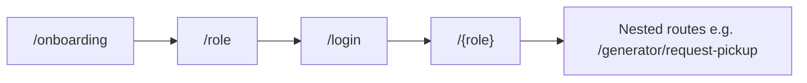

# Waste Bridge — UI Implementation Guide

This guide describes **how the Flutter UI is structured today**, **design conventions to follow when adding screens**, and **how UI ties to navigation and state**. It complements [DOCUMENTATION.md](../DOCUMENTATION.md) (product vision, full screen backlog) and the [Appendix](../DOCUMENTATION.md#appendix-current-flutter-codebase-implementation-snapshot) (implementation snapshot).

**Audience:** Flutter developers extending the app, designers aligning with Material 3 usage, and reviewers checking consistency.

---

## 1. Stack and principles

| Area | Choice | Notes |
|------|--------|--------|
| UI framework | **Flutter** with **Material 3** | `useMaterial3: true` in `AppTheme` |
| State | **Riverpod** | `ConsumerWidget` / `ConsumerStatefulWidget`, `StateNotifier`, `AsyncValue` |
| Routing | **go_router** | Declarative routes; `context.go`, `context.push` |
| Icons | **Material Icons** | `Icons.*` from `material.dart` — see [§9](#9-icons-and-visual-language) |

**Principles:**

1. **Theme first** — Prefer `Theme.of(context).colorScheme`, `textTheme`, and component themes over hard-coded colors except where the design system explicitly fixes a value (e.g. light scaffold background).
2. **Tokens second** — Prefer `AppSpacing` / `AppRadius` from `lib/core/theme/app_tokens.dart` over new magic numbers for padding and corners.
3. **Async UI** — Lists and dashboards driven by providers use `AsyncValue.when`: `data`, `loading`, `error` (prefer `CenterState` with an error icon).
4. **Shared building blocks** — Reuse `AppSectionCard` and `CenterState` from `lib/features/shared/app_widgets.dart` before adding one-off layouts.
5. **Navigation** — New screens get a `GoRoute` in `lib/routes/app_router.dart`; use path parameters for IDs (`/generator/track/:id`). Follow [§5.1](#51-navigation-ux-rules).

---

## 2. App shell and theme

**Entry:** `lib/main.dart` wraps the app in `ProviderScope`, uses `MaterialApp.router` with `theme`, `darkTheme`, and `themeMode: ThemeMode.system`.

**Theme definition:** `lib/core/theme/app_theme.dart` (card/input radii use `AppRadius` from `app_tokens.dart`).

| Element | Light theme | Dark theme |
|---------|-------------|------------|
| Seed / brand | `Color(0xFF2E7D32)` (green) | Same seed, `Brightness.dark` |
| Scaffold background | `0xFFF6F8F6` | Default from `ColorScheme` |
| App bar | Surface color, **elevation 0** | Same pattern |
| Cards | **`AppRadius.card`** (16), **elevation 0** | Same |
| Text fields | Filled, white fill (light), **`AppRadius.input`** (14) outline radius | Dark scheme defaults |

**Buttons:** Screens use Material 3 buttons as appropriate: `FilledButton`, `FilledButton.icon`, `FilledButton.tonal`, `TextButton`, `IconButton` in app bars.

**When changing the look:** Edit `AppTheme` and, if needed, extend `ThemeData` with `textTheme` or `elevatedButtonTheme` so changes propagate app-wide.

---

## 3. Design tokens

**Source file:** `lib/core/theme/app_tokens.dart`

| Token class | Purpose |
|-------------|---------|
| `AppSpacing` | `xs` 8, `sm` 12, `md` 16, `lg` 24, `xl` 32 — use for `EdgeInsets`, `SizedBox` height/width |
| `AppRadius` | `input` 14, `card` 16, `sheet` 20 — align with `AppTheme` |
| `AppTouchTarget` | `minSize` 48 — minimum hit area for custom tappable widgets |

**Rule:** New screens should use tokens for spacing and radius. Legacy screens may still use literal `16` / `24`; migrate when touching a file.

---

## 4. Project layout (UI-related)

```
lib/
  main.dart
  core/
    theme/app_theme.dart      # Light / dark ThemeData
    theme/app_tokens.dart     # Spacing, radius, touch target constants
    constants/app_constants.dart
  features/
    auth/auth_screens.dart    # Onboarding, role, login, register
    generator/…               # Generator (household) flows
    collector/…               # Collector flows (includes maps)
    recycler/…                # Recycler flows
    shared/
      app_widgets.dart        # AppSectionCard, CenterState
      notifications_screen.dart
  routes/app_router.dart      # All routes and auth redirect
```

New UI code should live under `features/<area>/` unless it is truly cross-cutting (then `shared/`).

---

## 5. Navigation

**Configuration:** `lib/routes/app_router.dart`

- **Initial route:** `/onboarding`.
- **Auth redirect:** If `authNotifierProvider` has no user, navigation to any route other than `/onboarding`, `/role`, `/login`, `/register` redirects to `/role`.

**Patterns:**

| Intent | API |
|--------|-----|
| Replace stack (e.g. after login) | `context.go('/generator')` |
| Push child route | `context.push('/generator/request-pickup')` |
| Path parameters | `context.push('/generator/track/${id}')`; read with `state.pathParameters['id']` in `GoRoute` |

**Role home paths:** After authentication, users land on `/${role}` where `role` is the enum segment (`generator`, `collector`, `recycler`) — see `LoginScreen` / `RegisterScreen` navigation.



### 5.1 Navigation UX rules

| Rule | Rationale |
|------|-----------|
| Use **`context.go()`** for auth transitions and any time the user should not “go back” to the previous route (e.g. after login, after logout). | Prevents back stack to login from home. |
| Use **`context.push()`** for detail flows (job details, tracking, forms) so **Back** returns to the list/dashboard. | Matches user mental model. |
| Avoid **more than ~3 consecutive pushes** of the same flow without a clear home; if depth grows, use `go()` to reset to a tab/home or show a modal. | Reduces disorientation and “lost in stack” issues. |
| **Deep links** (future): paths should match `GoRoute` definitions so web and mobile share the same structure. | See implementation plan for deep links. |

---

## 6. Reusable widgets

Defined in `lib/features/shared/app_widgets.dart`.

### `AppSectionCard`

- **Use for:** Grouping content on dashboards (title row + body).
- **API:** `title`, `child`, optional `trailing` (e.g. `TextButton` “View all”).
- **Layout:** Uses `Card` (theme card style), padding **14**, title uses `titleMedium`.

### `CenterState`

- **Use for:** Empty lists, benign errors, “not found” states.
- **API:** `title`, `subtitle`, optional `icon` (default `Icons.inbox_rounded`).
- **Layout:** Centered column, icon size **48**, primary color for icon.

### 6.1 Component states

Document **expected states** when implementing or extending components so behavior stays consistent.

**Buttons (Filled / Tonal / Text)**

| State | UI |
|-------|-----|
| Default | Full opacity, `onPressed` non-null. |
| Loading | Disable tap (`onPressed: null` or guard), show **small** `CircularProgressIndicator` inside the button (see `_AuthSubmitButton`). |
| Disabled | `onPressed: null`; do not show spinner. |
| Success (optional) | After destructive/success action, prefer **SnackBar** + navigation or list refresh; avoid permanent “success” styling on the same button unless the flow is a wizard step. |

**Cards / list rows**

| State | UI |
|-------|-----|
| Normal | Default `Card` / `ListTile`. |
| Selected (future) | `ColorScheme.primaryContainer` or outline border; use when multi-select or map picking is added. |
| Disabled | Reduced emphasis (`onSurface.withValues(alpha: 0.38)` for text) and no tap handler. |

---

## 7. Screen patterns

### Layout

- **Scaffold** with optional `AppBar` (`title: Text('…')`).
- **Body:** Prefer `EdgeInsets.all(AppSpacing.md)` or `AppSpacing.lg` for auth/onboarding — existing code may use `16` / `24`.
- **SafeArea:** Used on auth flows where content should avoid notches (`LoginScreen`).

### Dashboards (generator, collector, recycler)

- **App bar actions:** **Outlined** `IconButton`s for secondary entry (notifications, wallet) — see [§9](#9-icons-and-visual-language).
- **Primary CTA:** See [§10](#10-role-based-ui-primary-ctas-and-language).
- **Sections:** `AppSectionCard` + `ListTile` with `contentPadding: EdgeInsets.zero` for dense rows.

### Forms

- `TextField` / `DropdownButtonFormField` with `InputDecoration` (theme provides filled style).
- Submit: `FilledButton` + loading state (see `_AuthSubmitButton`).

### Async lists

```dart
requests.when(
  data: (items) { /* ListView or AppSectionCard + mapping */ },
  loading: () => const Center(child: CircularProgressIndicator()),
  error: (e, _) => CenterState(title: 'Error', subtitle: '$e', icon: Icons.error),
)
```

**Pull-to-refresh:** `NotificationsScreen` uses `RefreshIndicator` around `ListView.separated` — reuse for feeds that refetch.

### 7.1 Loading UX (tiers)

| Tier | When | Pattern |
|------|------|-----------|
| **Inline / center** | First load of a screen with little structure | `Center(child: CircularProgressIndicator())` — current default. |
| **Button** | Submit / confirm | Small indicator inside button, button disabled — already used on auth. |
| **Skeleton (future)** | Lists with known row shape (jobs, requests, transactions) | Prefer `shimmer`-style placeholders or `Card` grey boxes **before** adopting a new package; align row height with real `ListTile` / `Card` content. |
| **Full-screen blocking** | Rare: payment handoff, mandatory sync | Modal barrier + message; use sparingly to avoid trapping users on poor networks. |

**Perceived performance:** Prefer skeletons or staggered list animation over a blank spinner for feeds once the list layout is stable.

### Feedback

- **SnackBar** via `ScaffoldMessenger.of(context).showSnackBar` for short confirmations (e.g. job accepted).
- **Errors on submit:** SnackBar with `e.toString()` is acceptable for prototype; production UI should map to user-friendly copy.

---

## 8. Responsiveness and orientation

| Concern | Guidance |
|---------|----------|
| **Small / low-end phones** | Avoid fixed heights for critical actions; keep primary CTA visible without scrolling when possible. Test on **shortest logical height** (~560dp) and **narrow width** (~320dp). |
| **Tablets (future)** | Prefer **two-pane** layouts (master/detail) for lists + detail when `MediaQuery.sizeOf(context).width` exceeds ~600dp; single pane on phones. |
| **Landscape** | Scrollable body (`ListView` / `SingleChildScrollView`) so keyboards and short height do not clip forms; map screens may need `resizeToAvoidBottomInset` review. |
| **Text scaling** | Respect `MediaQuery.textScaler` / system font size; avoid clipping by using `maxLines` + `overflow` where needed. |

Many users run **mixed device tiers**; never assume flagship screen size only.

---

## 9. Icons and visual language

| Rule | Detail |
|------|--------|
| **App bar / navigation** | Prefer **outlined** variants (`Icons.notifications_outlined`, `Icons.receipt_long_outlined`) for secondary actions — matches current dashboards. |
| **Primary CTAs** | **Filled** buttons with optional **filled** leading icon (`FilledButton.icon`) for the main action on a screen. |
| **Icon + text** | Keep **gap** `AppSpacing.sm`–`md`; icon size **18–24** inline with button label. |
| **Status / feedback** | Do not rely on emoji in production UI; use **Material icons** + short copy: success `Icons.check_circle_outline`, warning `Icons.warning_amber_rounded`, error `Icons.error_outline`. Pair with `ColorScheme.error` / `primary` / `tertiary` as appropriate — never color alone ([§11](#11-strings-localization-and-accessibility)). |

---

## 10. Role-based UI: primary CTAs and language

Use **one obvious primary action** per role home screen to reduce confusion. Product copy can evolve; treat these as **defaults**.

| Role | Primary CTA (home) | Secondary emphasis |
|------|--------------------|--------------------|
| **Generator** | **Request Pickup** — creates demand | Recent requests, impact, categories |
| **Collector** | **Open** active job or **Accept** from available list — earning focus | Earnings today, wallet, map |
| **Recycler** | **Details** on incoming deliveries / **Browse** materials (when marketplace exists) | Transactions history |

Implementation today maps to `GeneratorHomeScreen` (“Request Pickup”), collector dashboard (earnings + active job + open jobs), and `RecyclerDashboardScreen` (deliveries + materials). When adding features, keep **role vocabulary** distinct (e.g. “job” vs “request” vs “delivery”) and document in copy.

---

## 11. Role-specific UI notes (files)

### Generator (`features/generator/`)

- Home: categories (`Chip` in a `Wrap`), recent requests, links to impact and tracking.
- Request pickup: templates dropdown, waste type, quantity, location, schedule pickers (`showDatePicker` / `showTimePicker`), optional photo via `image_picker`.
- Tracking / impact: read-only and summary layouts; use `AppSpacing.md` between sections.

### Collector (`features/collector/`)

- Dashboard: earnings summary, active job, open jobs list (`_JobRow`).
- Job detail / active job: linear detail + primary `FilledButton` (e.g. Accept); disabled state when status does not allow action (`onPressed: condition ? handler : null`).
- Map: `google_maps_flutter` — follow platform setup in Flutter/Google docs for API keys and permissions.

### Recycler (`features/recycler/`)

- Dashboard: incoming deliveries list, material chips.
- Transactions: `ListView.separated` with `Card` + `ListTile`, **12** px separator (`AppSpacing.sm`).

### Auth (`features/auth/`)

- **Onboarding:** `PageView`, page dots, Skip → `/role`, final CTA “Get Started”.
- **Role selection:** `FilledButton.tonal` per role.
- **Login / Register:** Form fields, role dropdown (`_RoleDropdown`), shared submit button pattern.

---

## 12. State management and UI

Providers live in `lib/providers/app_providers.dart`. UI typically:

- `ref.watch(...)` to rebuild when data changes.
- `ref.read(...notifier)` for actions (login, accept job, refresh).
- `ref.listen` for side effects (e.g. navigate after successful login) — guard with `mounted` before `context.go`.

Do not embed business rules in widgets when they belong in notifiers/services; widgets should reflect state and fire events.

---

## 13. Strings, localization, and accessibility

- **Today:** Strings are mostly **inline English** in widgets.
- **Target (see [DOCUMENTATION.md §42](../DOCUMENTATION.md)):** English and Kiswahili — plan to move user-visible strings to ARB / `AppLocalizations` when localization phase starts.
- **Accessibility:** Use `Semantics` where custom gestures or non-obvious icons need labels; ensure touch targets meet **`AppTouchTarget.minSize`**; don’t rely on color alone for status — pair with text or icons.

---

## 14. Offline and degraded connectivity

Aligned with **offline-first** direction in [DOCUMENTATION.md](../DOCUMENTATION.md) (e.g. offline support section). Until wired to real sync:

| Pattern | Behavior |
|---------|----------|
| **Banner** | When `Connectivity` / platform APIs report offline, show a **persistent slim banner** under the app bar: “You’re offline — actions will sync when connected.” |
| **Actions** | Disable mutations that require network (create request, accept job) or **queue** with clear copy — avoid silent failure. |
| **Sync indicator** | Optional trailing icon or subtitle “Last synced …” on data-heavy screens. |

Implement via a small `ConnectivityNotifier` (future) + `Banner` / `Material` strip; do not block the whole app unless security requires it.

---

## 15. Motion and animation

| Use | Guideline |
|-----|------------|
| **Page transitions** | Default platform transitions from `go_router` / `MaterialApp` are fine; avoid custom curves until flows stabilize. |
| **Micro-interactions** | `InkWell` / `FilledButton` already provide splash; optional **scale 0.98** on press for custom tiles — keep duration under **200 ms**. |
| **Success** | Prefer **SnackBar** + icon or short **AnimatedSwitcher** on a check step — avoid long celebratory animations on every action. |
| **Lists** | Optional `AnimatedList` or stagger when items appear — only if performance on low-end devices is verified. |

---

## 16. Adding a new screen (checklist)

1. **Widget:** Create screen under the correct `features/<role>/` or `shared/` file.
2. **Route:** Add `GoRoute` in `app_router.dart` (nested under the role branch if it is role-specific).
3. **Navigation:** Follow [§5.1](#51-navigation-ux-rules); use route path constants if paths repeat.
4. **State:** If the screen needs async data, extend or add a provider/notifier rather than storing API results only in `StatefulWidget` local state (unless truly ephemeral).
5. **Empty / error:** Use `CenterState` and spacing from `AppSpacing`.
6. **Theme:** Use `Theme.of(context)` and tokens; avoid new arbitrary colors without updating `AppTheme`.

---

## 17. Testing UI

| Layer | What to add |
|-------|-------------|
| **Widget tests** | `flutter test` — pump `ProviderScope` with overrides for `go_router` / auth; assert key widgets and taps. |
| **Golden tests** (optional, high value) | `flutter_test` + `matchesGoldenFile` for **stable** screens (login, empty list, error state) — run on CI with same device pixel ratio; update goldens in a dedicated PR when UI intentionally changes. |
| **Critical flows** | Prioritize: **login**, **create pickup request**, **accept job** — smoke widget tests or integration tests when tooling is added. |

After visual changes, smoke-test **light and dark** (`themeMode: system` or device setting).

---

## 18. Related documentation

| Document | Content |
|----------|---------|
| [DOCUMENTATION.md](../DOCUMENTATION.md) §4 | Full product screen breakdown (target) |
| [DOCUMENTATION.md](../DOCUMENTATION.md) Appendix | Current repo routes, stack, mock data |
| [IMPLEMENTATION_PLAN.md](../IMPLEMENTATION_PLAN.md) | Phased delivery; Flutter UI can parallelize backend per plan notes |

---

*Last aligned with repository layout, `app_router.dart`, and `app_tokens.dart`. When routes or theme change, update this file in the same PR.*
