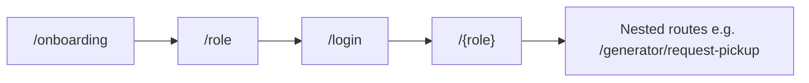

# Waste Bridge — UI Implementation Guide

This guide describes **how the Flutter UI is structured today**, **design conventions to follow when adding screens**, and **how UI ties to navigation and state**. It complements [DOCUMENTATION.md](../DOCUMENTATION.md) (product vision, full screen backlog) and the [Appendix](../DOCUMENTATION.md#appendix-current-flutter-codebase-implementation-snapshot) (implementation snapshot).

**Audience:** Flutter developers extending the app, designers aligning with Material 3 usage, and reviewers checking consistency.

---

## 1. Stack and principles

| Area | Choice | Notes |
|------|--------|--------|
| UI framework | **Flutter** with **Material 3** | `useMaterial3: true` in `AppTheme` |
| State | **Riverpod** | `ConsumerWidget` / `ConsumerStatefulWidget`, `StateNotifier`, `AsyncValue` |
| Routing | **go_router** | Declarative routes; `context.go`, `context.push` |
| Icons | **Material Icons** | `Icons.*` from `material.dart` — see [§14](#14-icons-and-visual-language) |

**Principles:**

1. **Theme first** — Prefer `Theme.of(context).colorScheme`, `textTheme`, and component themes over hard-coded colors except where the design system explicitly fixes a value (e.g. light scaffold background).
2. **Tokens second** — Prefer `AppSpacing` / `AppRadius` from `lib/core/theme/app_tokens.dart` over new magic numbers for padding and corners.
3. **Async UI** — Lists and dashboards driven by providers use `AsyncValue.when`: `data`, `loading`, `error` (prefer `CenterState` with an error icon).
4. **Shared building blocks** — Reuse `AppSectionCard` and `CenterState` from `lib/features/shared/app_widgets.dart` (barrel over `app_section_card.dart` + `center_state.dart`) before adding one-off layouts.
5. **Navigation** — New screens get a `GoRoute` in `lib/routes/app_router.dart`; use path parameters for IDs (`/generator/track/:id`). Follow [§7.1](#71-navigation-ux-rules).

---

## 2. App shell and theme

**Entry:** `lib/main.dart` wraps the app in `ProviderScope`, uses `MaterialApp.router` with `theme`, `darkTheme`, and `themeMode: ThemeMode.system`.

**Theme definition:** `lib/core/theme/app_theme.dart` (card/input radii use `AppRadius` from `app_tokens.dart`).

| Element | Light theme | Dark theme |
|---------|-------------|------------|
| Seed / brand | `Color(0xFF2E7D32)` (green) | Same seed, `Brightness.dark` |
| Scaffold background | `0xFFF6F8F6` | Default from `ColorScheme` |
| App bar | Surface color, **elevation 0** | Same pattern |
| Cards | **`AppRadius.card`** (16), **elevation 0** | Same |
| Text fields | Filled, white fill (light), **`AppRadius.input`** (14) outline radius | Dark scheme defaults |

**Buttons:** Screens use Material 3 buttons as appropriate: `FilledButton`, `FilledButton.icon`, `FilledButton.tonal`, `TextButton`, `IconButton` in app bars.

**When changing the look:** Edit `AppTheme` and, if needed, extend `ThemeData` with `textTheme` or `elevatedButtonTheme` so changes propagate app-wide.

---

## 3. Design system overview

This section is the **design identity** layer: why colors and type behave as they do. It sits above raw tokens ([§4](#4-design-tokens)) so designers and developers align before shipping screens.

### Brand personality

- **Clean** — Plenty of whitespace, clear hierarchy, no visual noise.
- **Eco-friendly** — Green-led palette; copy and imagery reinforce waste reduction and circular economy.
- **Trustworthy** — Predictable patterns, honest status (sync, errors), no dark patterns.
- **Community-focused** — Roles (generator, collector, recycler) feel distinct but part of one system.

### Core color meaning (semantic)

| Color role | Meaning in Waste Bridge | Typical use |
|------------|-------------------------|-------------|
| **Green** (`ColorScheme.primary`, seed-based greens) | Sustainability, success, forward progress | CTAs, positive status, brand emphasis |
| **Amber / warning tones** (`ColorScheme.tertiary` or explicit warning where used) | Caution, waste-handling issues, “needs attention” | Banners, non-blocking warnings |
| **Red** (`ColorScheme.error`) | Errors, destructive actions, blocking problems | Form errors, failed operations, delete/destructive confirms |

Always pair color with **icon + text** for accessibility — see [§18](#18-strings-localization-and-accessibility).

### Typography hierarchy

| Layer | Role | Flutter / Material mapping |
|-------|------|----------------------------|
| **Headings** | Screen titles, section titles | Bold emphasis; `textTheme.titleLarge` / `titleMedium` for app bar and card headers |
| **Body** | Primary reading content | `bodyLarge` / `bodyMedium` — default for descriptions and list subtitles |
| **Captions / labels** | Secondary metadata, hints, timestamps | `bodySmall`, `labelLarge`, `labelSmall` — lower contrast acceptable, not for primary facts only |

Prefer theme text styles over hard-coded `TextStyle` so light/dark and future theming stay consistent.

---

## 4. Design tokens

**Source file:** `lib/core/theme/app_tokens.dart`

| Token class | Purpose |
|-------------|---------|
| `AppSpacing` | `xs` 8, `sm` 12, `md` 16, `lg` 24, `xl` 32 — use for `EdgeInsets`, `SizedBox` height/width |
| `AppRadius` | `input` 14, `card` 16, `sheet` 20 — align with `AppTheme` |
| `AppTouchTarget` | `minSize` 48 — minimum hit area for custom tappable widgets |

**Rule:** New screens should use tokens for spacing and radius. Legacy screens may still use literal `16` / `24`; migrate when touching a file.

---

## 5. Visual consistency rules

Small rules that prevent **UI drift** as the codebase grows.

| Rule | Standard |
|------|----------|
| **Spacing between major sections** | Prefer **`AppSpacing.md`** (16) between stacked sections on a screen; use `lg` / `xl` when separating distinct “chunks” (e.g. auth vs footer). |
| **Card internals** | Match `AppSectionCard` padding (**14** in shared widget) and keep list rows inside cards visually aligned — do not mix arbitrary paddings on the same dashboard. |
| **Icon sizes** | **20** or **24** logical pixels for standard inline and list icons; **48** for empty/error hero icons in `CenterState`. |
| **Button height / touch** | Use Material 3 defaults; ensure custom tap targets respect **`AppTouchTarget.minSize`** (48). |
| **Horizontal screen padding** | **`AppSpacing.md`** body padding unless a full-bleed pattern is intentional (e.g. maps). |

---

## 6. Project layout (UI-related)

```
lib/
  main.dart
  core/
    theme/app_theme.dart      # Light / dark ThemeData
    theme/app_tokens.dart     # Spacing, radius, touch target constants
    constants/app_constants.dart
  features/
    auth/auth.dart            # Barrel; onboarding, role, login, register (+ widgets/)
    generator/…               # Generator (household) flows
    collector/…               # Collector flows (includes maps)
    recycler/…                # Recycler flows
    shared/
      app_widgets.dart        # Barrel: AppSectionCard, CenterState
      app_section_card.dart
      center_state.dart
      info_row.dart
      status_timeline_step.dart
      shared.dart             # Optional barrel: app_widgets + notifications_screen
      notifications_screen.dart
  routes/app_router.dart      # All routes and auth redirect
```

New UI code should live under `features/<area>/` unless it is truly cross-cutting (then `shared/`).

---

## 7. Navigation

**Configuration:** `lib/routes/app_router.dart`

- **Initial route:** `/onboarding`.
- **Auth redirect:** If `authNotifierProvider` has no user, navigation to any route other than `/onboarding`, `/role`, `/login`, `/register` redirects to `/role`.

**Patterns:**

| Intent | API |
|--------|-----|
| Replace stack (e.g. after login) | `context.go('/generator')` |
| Push child route | `context.push('/generator/request-pickup')` |
| Path parameters | `context.push('/generator/track/${id}')`; read with `state.pathParameters['id']` in `GoRoute` |

**Role home paths:** After authentication, users land on `/${role}` where `role` is the enum segment (`generator`, `collector`, `recycler`) — see `LoginScreen` / `RegisterScreen` navigation.



### 7.1 Navigation UX rules

| Rule | Rationale |
|------|-----------|
| Use **`context.go()`** for auth transitions and any time the user should not “go back” to the previous route (e.g. after login, after logout). | Prevents back stack to login from home. |
| Use **`context.push()`** for detail flows (job details, tracking, forms) so **Back** returns to the list/dashboard. | Matches user mental model. |
| Avoid **more than ~3 consecutive pushes** of the same flow without a clear home; if depth grows, use `go()` to reset to a tab/home or show a modal. | Reduces disorientation and “lost in stack” issues. |
| **Deep links** (future): paths should match `GoRoute` definitions so web and mobile share the same structure. | See implementation plan for deep links. |

---

## 8. UX structure

How users **move through the app** at a high level. Use this to avoid ad-hoc navigation and inconsistent entry points.

### Primary navigation

- **Role home** — After login, each user type lands on **`/{role}`** (`/generator`, `/collector`, `/recycler`). This is the **hub** for that persona.
- **Bottom navigation** — Not required today; if added later, keep **3–5 top-level destinations** and align tab roots with `GoRoute` branches so deep links and back stack stay predictable.

### Secondary navigation

- **Pushed screens** — Job detail, request pickup, tracking, wallet, notifications: use **`context.push`** so the system back gesture returns to the role dashboard or list.
- **Modals / sheets** — Short decisions (confirm, filter) — prefer **`showModalBottomSheet`** or dialog; dismiss returns to the same underlying route.

### Deep flows (mental model)

| Flow | Typical path | Notes |
|------|--------------|--------|
| **Generator: request → track → complete** | Home → Request pickup → (submit) → Track / history | User should always find the request again from home or history — avoid orphan screens. |
| **Collector: browse → accept → execute** | Dashboard → Open jobs / list → Job detail → Accept → Active job | Linear progression; **Back** from detail returns to list. |
| **Recycler: marketplace → purchase → pay** | Dashboard → Listing detail → Order screen → M-Pesa; **My purchases** for history | Pull-to-refresh on feed and purchase list; statuses on order + pickup + job |

Align new features with these arcs so onboarding and support documentation stay simple.

---

## 9. Reusable widgets

Defined in `lib/features/shared/app_section_card.dart` and `center_state.dart`, re-exported from `app_widgets.dart`.

### `AppSectionCard`

- **Use for:** Grouping content on dashboards (title row + body).
- **API:** `title`, `child`, optional `trailing` (e.g. `TextButton` “View all”).
- **Layout:** Uses `Card` (theme card style), padding **14**, title uses `titleMedium`.

### `CenterState`

- **Use for:** Empty lists, benign errors, “not found” states.
- **API:** `title`, `subtitle`, optional `icon` (default `Icons.inbox_rounded`).
- **Layout:** Centered column, icon size **48**, primary color for icon.

### 9.1 Component states

Document **expected states** when implementing or extending components so behavior stays consistent.

**Buttons (Filled / Tonal / Text)**

| State | UI |
|-------|-----|
| Default | Full opacity, `onPressed` non-null. |
| Loading | Disable tap (`onPressed: null` or guard), show **small** `CircularProgressIndicator` inside the button (see `_AuthSubmitButton`). |
| Disabled | `onPressed: null`; do not show spinner. |
| Success (optional) | After destructive/success action, prefer **SnackBar** + navigation or list refresh; avoid permanent “success” styling on the same button unless the flow is a wizard step. |

**Cards / list rows**

| State | UI |
|-------|-----|
| Normal | Default `Card` / `ListTile`. |
| Selected (future) | `ColorScheme.primaryContainer` or outline border; use when multi-select or map picking is added. |
| Disabled | Reduced emphasis (`onSurface.withValues(alpha: 0.38)` for text) and no tap handler. |

---

## 10. Component library

Standard **Material 3** mappings so developers do not invent one-off controls. Extend this table when adding a genuinely new pattern (and then document it here).

### Buttons

| Variant | Widget / pattern | When to use |
|---------|------------------|-------------|
| **Primary** | `FilledButton` / `FilledButton.icon` | Main action on a screen (one primary per view when possible). |
| **Secondary** | `FilledButton.tonal` | Alternate positive actions, less emphasis than primary. |
| **Tertiary / inline** | `TextButton` | “Cancel”, “Learn more”, low-emphasis actions in dialogs or footers. |
| **Danger** | `FilledButton` (or `TextButton`) with **`Theme.of(context).colorScheme.error`** foreground/background per M3 destructive pattern | Destructive confirm only — pair with dialog copy. |
| **Icon-only (app bar)** | `IconButton` with **outlined** icon set where applicable | Toolbar actions — see [§14](#14-icons-and-visual-language). |

### Surfaces

| Component | Widget / pattern |
|-----------|------------------|
| **Cards** | `Card` + theme `cardTheme` (`AppRadius.card`) |
| **Section group** | `AppSectionCard` for titled groups on dashboards |
| **Lists** | `ListView` / `ListView.separated`; rows as `ListTile` or custom row with same vertical rhythm |

### Inputs

| Component | Widget / pattern |
|-----------|------------------|
| **Text** | `TextField` / `TextFormField` with `InputDecoration` (theme) |
| **Dropdown** | `DropdownButtonFormField` |
| **Date / time** | `showDatePicker` / `showTimePicker` (theme-aware) |

### Chips & tags

| Component | Widget / pattern |
|-----------|------------------|
| **Filter / category** | `FilterChip`, `ChoiceChip`, or `Chip` in a **`Wrap`** for responsive wrapping |

### Overlays

| Component | Widget / pattern |
|-----------|------------------|
| **Modal** | `AlertDialog`, `showDialog` |
| **Bottom sheet** | `showModalBottomSheet` with themed shape (`AppRadius.sheet` for corners if custom) |
| **Persistent banner** | `Material` / `Banner` under app bar — e.g. offline ([§19](#19-network-states-and-offline-ux)) |

### Feedback

| Component | Widget / pattern |
|-----------|------------------|
| **Transient toast** | `ScaffoldMessenger.of(context).showSnackBar` |
| **Inline field error** | `InputDecoration.errorText` / `error` from `Form` validation |

---

## 11. Error and empty states

`CenterState` is the default building block; pair it with the **right copy and actions** per case.

| Case | UI | Notes |
|------|-----|--------|
| **No data** | `CenterState` with friendly title + short subtitle + neutral icon (`Icons.inbox_rounded` or domain icon) | Avoid “No data” alone — explain *what* is empty and what to do next. |
| **Network / server error** | `CenterState` or inline error + **Retry** (`TextButton` / `FilledButton.tonal`) | Do not show raw exception strings in production; log details, show user-safe text. |
| **Permission / auth error** | Clear explanation + single path (e.g. “Sign in again” → `context.go('/login')`) | No dead ends. |
| **Critical failure** | Blocking UI (dialog or full-screen message) + optional support contact | Use rarely — e.g. security or data corruption. |

**Do not** leave screens **blank** on error; **do not** expose stack traces to end users.

**Implementation:** Use `userVisibleError` from `lib/core/ui/user_safe_error.dart` for `AsyncValue` error UI and SnackBars after failed API calls (maps `DioException` timeouts / connection issues and server `message` when present).

---

## 12. Screen patterns

### Layout

- **Scaffold** with optional `AppBar` (`title: Text('…')`).
- **Body:** Prefer `EdgeInsets.all(AppSpacing.md)` or `AppSpacing.lg` for auth/onboarding — existing code may use `16` / `24`.
- **SafeArea:** Used on auth flows where content should avoid notches (`LoginScreen`).

### Dashboards (generator, collector, recycler)

- **App bar actions:** **Outlined** `IconButton`s for secondary entry (notifications, wallet) — see [§14](#14-icons-and-visual-language).
- **Primary CTA:** See [§15](#15-role-based-ui-primary-ctas-and-language).
- **Sections:** `AppSectionCard` + `ListTile` with `contentPadding: EdgeInsets.zero` for dense rows.

### Forms

- `TextField` / `DropdownButtonFormField` with `InputDecoration` (theme provides filled style).
- Submit: `FilledButton` + loading state (see `_AuthSubmitButton`).

### Async lists

```dart
requests.when(
  data: (items) { /* ListView or AppSectionCard + mapping */ },
  loading: () => const Center(child: CircularProgressIndicator()),
  error: (e, _) => CenterState(title: '…', subtitle: userVisibleError(e), icon: Icons.error_outline),
)
```

Prefer mapped, user-safe copy in `error` instead of `'$e'` in production — see [§11](#11-error-and-empty-states).

**Pull-to-refresh:** `NotificationsScreen` uses `RefreshIndicator` around `ListView.separated` — reuse for feeds that refetch.

### 12.1 Loading UX (tiers)

| Tier | When | Pattern |
|------|------|---------|
| **Inline / center** | First load of a screen with little structure | `Center(child: CircularProgressIndicator())` — current default. |
| **Button** | Submit / confirm | Small indicator inside button, button disabled — already used on auth. |
| **Skeleton (future)** | Lists with known row shape (jobs, requests, transactions) | Prefer `shimmer`-style placeholders or `Card` grey boxes **before** adopting a new package; align row height with real `ListTile` / `Card` content. |
| **Full-screen blocking** | Rare: payment handoff, mandatory sync | Modal barrier + message; use sparingly to avoid trapping users on poor networks. |

**Perceived performance:** Prefer skeletons or staggered list animation over a blank spinner for feeds once the list layout is stable.

### Feedback

- **SnackBar** via `ScaffoldMessenger.of(context).showSnackBar` for short confirmations (e.g. job accepted).
- **Errors on submit:** SnackBar with `e.toString()` is acceptable for prototype; production UI should map to user-friendly copy.

---

## 13. Responsiveness and orientation

| Concern | Guidance |
|---------|----------|
| **Small / low-end phones** | Avoid fixed heights for critical actions; keep primary CTA visible without scrolling when possible. Test on **shortest logical height** (~560dp) and **narrow width** (~320dp). |
| **Tablets (future)** | Prefer **two-pane** layouts (master/detail) for lists + detail when `MediaQuery.sizeOf(context).width` exceeds ~600dp; single pane on phones. |
| **Landscape** | Scrollable body (`ListView` / `SingleChildScrollView`) so keyboards and short height do not clip forms; map screens may need `resizeToAvoidBottomInset` review. |
| **Text scaling** | Respect `MediaQuery.textScaler` / system font size; avoid clipping by using `maxLines` + `overflow` where needed. |

Many users run **mixed device tiers**; never assume flagship screen size only.

---

## 14. Icons and visual language

| Rule | Detail |
|------|--------|
| **App bar / navigation** | Prefer **outlined** variants (`Icons.notifications_outlined`, `Icons.receipt_long_outlined`) for secondary actions — matches current dashboards. |
| **Primary CTAs** | **Filled** buttons with optional **filled** leading icon (`FilledButton.icon`) for the main action on a screen. |
| **Icon + text** | Keep **gap** `AppSpacing.sm`–`md`; icon size **18–24** inline with button label — default **20 or 24** for list and toolbar icons ([§5](#5-visual-consistency-rules)). |
| **Status / feedback** | Do not rely on emoji in production UI; use **Material icons** + short copy: success `Icons.check_circle_outline`, warning `Icons.warning_amber_rounded`, error `Icons.error_outline`. Pair with `ColorScheme.error` / `primary` / `tertiary` as appropriate — never color alone ([§18](#18-strings-localization-and-accessibility)). |

---

## 15. Role-based UI: primary CTAs and language

Use **one obvious primary action** per role home screen to reduce confusion. Product copy can evolve; treat these as **defaults**.

| Role | Primary CTA (home) | Secondary emphasis |
|------|--------------------|-------------------|
| **Generator** | **Request Pickup** — creates demand | Recent requests, impact, categories |
| **Collector** | **Open** active job or **Accept** from available list — earning focus | Earnings today, wallet, map |
| **Recycler** | **Browse** the **marketplace** feed (fixed-price listings) → open a listing → **purchase** → **pay** (M-Pesa) → track **order / pickup / job** on the order screen | **My purchases** (buyer orders), **transactions** (wallet) for other roles |

Implementation today maps to `GeneratorHomeScreen` (“Request Pickup” + “Post listing to marketplace”), collector dashboard (earnings + active job + open jobs), and `RecyclerDashboardScreen` (marketplace feed with pull-to-refresh, **My purchases** CTA, listing detail → order → payment). When adding features, keep **role vocabulary** distinct (e.g. “job” vs “request” vs “order”) and document in copy.

---

## 16. Role-specific UI notes (files)

### Generator (`features/generator/`)

- Home: categories (`Chip` in a `Wrap`), recent requests, links to impact and tracking.
- Request pickup: templates dropdown, waste type, quantity, location, schedule pickers (`showDatePicker` / `showTimePicker`), optional photo via `image_picker`.
- Tracking / impact: read-only and summary layouts; use `AppSpacing.md` between sections.

### Collector (`features/collector/`)

- Dashboard: earnings summary, active job, open jobs list (`_JobRow`).
- Job detail / active job: linear detail + primary `FilledButton` (e.g. Accept); disabled state when status does not allow action (`onPressed: condition ? handler : null`).
- Map: `google_maps_flutter` — follow platform setup in Flutter/Google docs for API keys and permissions.

### Recycler (`features/recycler/`)

- **Dashboard:** Marketplace feed (`marketplaceFeedProvider`) inside `AppSectionCard`; **pull-to-refresh** (`RefreshIndicator`); primary path = tap listing → **RecyclerListingDetailScreen** → create order → **PurchaseDetailScreen** (`/recycler/order/:orderId`) for status, M-Pesa pay, pickup/job context. **FilledButton** “My purchases” → buyer order list.
- **Listing detail / order:** `AppSpacing` tokens, themed `Text` / `InputDecoration` (no ad-hoc `OutlineInputBorder` overrides); errors via `userVisibleError` (`lib/core/ui/user_safe_error.dart`) + `CenterState` / SnackBar — not raw exceptions.
- **Transactions (recycler):** Buyer orders with `RefreshIndicator` + `ListView.separated`, **`AppSpacing.sm`** separators. Non-recyclers: wallet ledger list with the same spacing pattern.

### Auth (`features/auth/`)

- **Onboarding:** `PageView`, page dots, Skip → `/role`, final CTA “Get Started”.
- **Role selection:** `FilledButton.tonal` per role.
- **Login / Register:** Form fields, role dropdown (`_RoleDropdown`), shared submit button pattern.

---

## 17. State management and UI

Providers live in `lib/providers/app_providers.dart`. UI typically:

- `ref.watch(...)` to rebuild when data changes.
- `ref.read(...notifier)` for actions (login, accept job, refresh).
- `ref.listen` for side effects (e.g. navigate after successful login) — guard with `mounted` before `context.go`.

Do not embed business rules in widgets when they belong in notifiers/services; widgets should reflect state and fire events.

---

## 18. Strings, localization, and accessibility

- **Today:** Strings are mostly **inline English** in widgets.
- **Target (see [DOCUMENTATION.md §42](../DOCUMENTATION.md)):** English and Kiswahili — plan to move user-visible strings to ARB / `AppLocalizations` when localization phase starts.
- **Accessibility:** Use `Semantics` where custom gestures or non-obvious icons need labels; ensure touch targets meet **`AppTouchTarget.minSize`**; don’t rely on color alone for status — pair with text or icons.

### Localization UI rules (Kenya / East Africa)

| Topic | Rule |
|-------|------|
| **Long copy (Kiswahili)** | Strings often run longer than English — avoid **fixed-width buttons** and fixed one-line layouts; use **`Flexible`**, **`Expanded`**, **`Wrap`**, and **`FittedBox`** only where appropriate (not for body text). |
| **Layout** | Prefer **`Row`/`Column` with flexible children** over hard-coded widths; test with longest reasonable translation. |
| **Overflow** | Run the app with **large text** and **long locale strings**; fix `RenderFlex` overflows before shipping. |
| **Dates / numbers** | When localization lands, use `intl` / `AppLocalizations` for locale-aware formats — don’t concatenate raw strings. |

---

## 19. Network states and offline UX

Critical for **real-world connectivity** (including intermittent mobile data). Expands the offline-first direction in [DOCUMENTATION.md](../DOCUMENTATION.md).

| State | UX |
|-------|-----|
| **Offline** | **Persistent slim banner** under the app bar (“You’re offline — …”); **disable or queue** mutations that require network with clear copy — no silent failure. |
| **Slow / ambiguous** | Show **loading indicators** on the action or list; avoid duplicate spinners on the same surface; optional subtle “Still loading…” for long waits. |
| **Failed request** | User-safe message + **Retry** CTA ([§11](#11-error-and-empty-states)); log technical detail for support. |
| **Syncing / background sync** | Optional **“Syncing…”** subtitle, trailing icon, or linear progress — user should know data may not be latest yet. |

**Implementation notes:** Use a `ConnectivityNotifier` (or equivalent) + `Banner` / `Material` strip; **do not** block the whole app unless security requires it. Align with [§12.1](#121-loading-ux-tiers) for loading tiers.

---

## 20. Motion and animation

| Use | Guideline |
|-----|------------|
| **Page transitions** | Default platform transitions from `go_router` / `MaterialApp` are fine; avoid custom curves until flows stabilize. |
| **Micro-interactions** | `InkWell` / `FilledButton` already provide splash; optional **scale 0.98** on press for custom tiles — keep duration under **200 ms**. |
| **Success** | Prefer **SnackBar** + icon or short **AnimatedSwitcher** on a check step — avoid long celebratory animations on every action. |
| **Lists** | Optional `AnimatedList` or stagger when items appear — only if performance on low-end devices is verified. |

---

## 21. Adding a new screen (checklist)

1. **Widget:** Create screen under the correct `features/<role>/` or `shared/` file.
2. **Route:** Add `GoRoute` in `app_router.dart` (nested under the role branch if it is role-specific).
3. **Navigation:** Follow [§7.1](#71-navigation-ux-rules); use route path constants if paths repeat.
4. **State:** If the screen needs async data, extend or add a provider/notifier rather than storing API results only in `StatefulWidget` local state (unless truly ephemeral).
5. **Empty / error:** Use `CenterState` and spacing from `AppSpacing` — see [§11](#11-error-and-empty-states).
6. **Theme:** Use `Theme.of(context)` and tokens; avoid new arbitrary colors without updating `AppTheme`.

---

## 22. Testing UI

| Layer | What to add |
|-------|-------------|
| **Widget tests** | `flutter test` — pump `ProviderScope` with overrides for `go_router` / auth; assert key widgets and taps. |
| **Golden tests** (optional, high value) | `flutter_test` + `matchesGoldenFile` for **stable** screens (login, empty list, error state) — run on CI with same device pixel ratio; update goldens in a dedicated PR when UI intentionally changes. |
| **Critical flows** | Prioritize: **login**, **create pickup request**, **accept job** — smoke widget tests or integration tests when tooling is added. |

After visual changes, smoke-test **light and dark** (`themeMode: system` or device setting).

---

## 23. Performance UX (Flutter)

Technical performance choices that **show up as smooth UI**:

| Practice | Why |
|----------|-----|
| **Prefer `const` constructors** | Reduces rebuild work for static subtrees. |
| **Avoid unnecessary `ref.watch` scope** | Watch only providers the widget needs; split widgets so large trees don’t rebuild on every tick. |
| **List performance** | Use **`ListView.builder`** / **`.separated`** for long lists; avoid unbounded work in `itemBuilder`. |
| **Images** | Use appropriate resolution and caching; avoid huge decoded images on low-end GPUs. |
| **Animations** | Keep durations short; avoid stacking multiple heavy animations; test on a low-end device or emulator with **profile mode**. |

If the UI **janks**, profile with Flutter DevTools before adding complexity.

---

## 24. Security UX

Product trust and safety — align with backend auth rules when they land.

| Topic | Guidance |
|-------|----------|
| **Sensitive data** | Mask or truncate **phone numbers**, **wallet balances**, and **IDs** in screenshots-friendly ways where full precision is not needed (e.g. show last 4 digits). |
| **Destructive actions** | Always **confirm** (dialog or sheet) with clear consequences; use **error color** and explicit verbs (“Delete”, “Remove”). |
| **Session timeout** | When implemented, prefer **clear message** (“Session expired — sign in again”) over a raw error. |
| **Trust** | Reserve **badges or copy** (“Verified”, “Completed pickup”) for data backed by server truth — don’t imply verification without a source. |

---

## 25. Do and don’t

| Do | Don’t |
|----|--------|
| Use **`AppSpacing` / `AppRadius`** for new layout | Hardcode arbitrary **colors** outside `Theme` / semantic exceptions |
| Use **`Theme.of(context)`** for colors and text styles | Invent **new button styles** — use [§10](#10-component-library) mappings |
| Reuse **`AppSectionCard`**, **`CenterState`**, Material components | Nest **multiple independent scroll views** without a clear reason (causes gesture conflicts) |
| Follow [§11](#11-error-and-empty-states) for empty and errors | Show **blank screens** or **raw exceptions** to users |
| Respect [§18](#18-strings-localization-and-accessibility) and flexible layouts for localization | Use **fixed-width** buttons for translated strings |
| Honor [§19](#19-network-states-and-offline-ux) when connectivity matters | Assume **always-online** behavior for mutations |

---

## 26. Related documentation

| Document | Content |
|----------|---------|
| [DOCUMENTATION.md](../DOCUMENTATION.md) §4 | Full product screen breakdown (target) |
| [DOCUMENTATION.md](../DOCUMENTATION.md) Appendix | Current repo routes, stack, mock data |
| [IMPLEMENTATION_PLAN.md](../IMPLEMENTATION_PLAN.md) | Phased delivery; Flutter UI can parallelize backend per plan notes |

---

*Last aligned with repository layout, `app_router.dart`, and `app_tokens.dart`. When routes or theme change, update this file in the same PR.*
