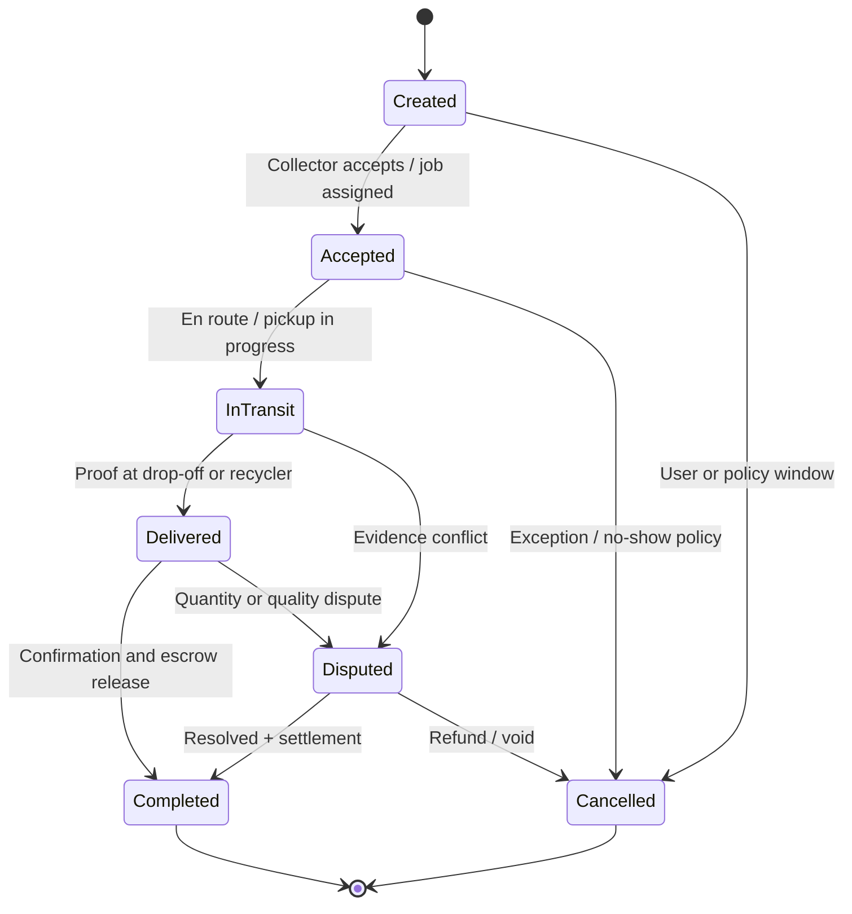
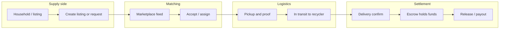

# Waste Bridge Application — Full Developer & Enterprise Documentation

This document describes the **product vision, platform architecture, and enterprise concerns** for Waste Bridge (Sections 1–19), **strategic platform expansion** (Sections 20–39), **order flow, risk, and localization** (Sections 40–42), **app & product roadmap** (Sections 43–47: concrete backlog items), and an **implementation snapshot** of the Flutter app in this repository (Appendix).

---

## Table of Contents

### Product & platform

1. [System Overview](#1-system-overview)
2. [User Roles & Permissions](#2-user-roles--permissions)
3. [Full Marketplace System (Core)](#3-full-marketplace-system-core)
4. [Complete Screen Breakdown (Flutter)](#4-complete-screen-breakdown-flutter)
5. [Dedicated Dashboards](#5-dedicated-dashboards)
6. [User Flows](#6-user-flows)
7. [API Design (Laravel)](#7-api-design-laravel)
8. [Database Schema (Detailed)](#8-database-schema-detailed)
9. [Real-Time System](#9-real-time-system)
10. [Security Architecture](#10-security-architecture)
11. [Payments & Wallet](#11-payments--wallet)
12. [Logistics & Tracking](#12-logistics--tracking)
13. [Analytics](#13-analytics)
14. [Notifications](#14-notifications)
15. [Smart Features](#15-smart-features)
16. [Testing Strategy](#16-testing-strategy)
17. [DevOps & Deployment](#17-devops--deployment)
18. [Legal & Compliance](#18-legal--compliance)
19. [Gamification](#19-gamification)

### Platform expansion (investor- & scale-ready)

20. [Super Admin & Multi-Tenant Architecture](#20-super-admin--multi-tenant-architecture)
21. [Offline-First Mobile Support](#21-offline-first-mobile-support)
22. [Inventory & Storage System](#22-inventory--storage-system)
23. [Subscription System](#23-subscription-system)
24. [Community & Social Features](#24-community--social-features)
25. [Dispute & Support System](#25-dispute--support-system)
26. [Automation Engine (Rule-Based)](#26-automation-engine-rule-based)
27. [IoT & Smart Bin Integration](#27-iot--smart-bin-integration)
28. [Carbon Credit & ESG Tracking](#28-carbon-credit--esg-tracking)
29. [Enterprise & B2B Module](#29-enterprise--b2b-module)
30. [Machine Learning Pipeline](#30-machine-learning-pipeline)
31. [Public API & Integration Platform](#31-public-api--integration-platform)
32. [Geo-Fencing & Location Intelligence](#32-geo-fencing--location-intelligence)
33. [Advanced Security (Enterprise)](#33-advanced-security-enterprise)
34. [Data Warehouse & Big Data](#34-data-warehouse--big-data)
35. [Performance Optimization Strategy](#35-performance-optimization-strategy)
36. [Modular Architecture (Future Features)](#36-modular-architecture-future-features)
37. [Admin Mobile App](#37-admin-mobile-app)
38. [User Onboarding Strategy](#38-user-onboarding-strategy)
39. [Business Model (Investor-Ready)](#39-business-model-investor-ready)

### Order flow, risk & localization

40. [Order Flow (Diagrams)](#40-order-flow-diagrams)
41. [Risk Register](#41-risk-register)
42. [Localization (English & Kiswahili)](#42-localization-english--kiswahili)

### App & product roadmap (feature backlog)

43. [Mobile Near-Term Roadmap (Flutter)](#43-mobile-near-term-roadmap-flutter)
44. [Trust, Payments & Engagement](#44-trust-payments--engagement)
45. [Operations & Quality](#45-operations--quality)
46. [Strategic Backlog (Documentation vs Current App)](#46-strategic-backlog-documentation-vs-current-app)
47. [Differentiators & Community](#47-differentiators--community)

### Implementation

- [Appendix: Current Flutter codebase (implementation snapshot)](#appendix-current-flutter-codebase-implementation-snapshot)

---

## 1. System Overview

Waste Bridge is a **smart waste marketplace and logistics platform** connecting **households**, **collectors**, **recyclers**, and **administrators**.

| Layer | Technology |
|-------|------------|
| **Frontend** | Flutter (mobile apps) |
| **Backend** | Laravel (REST API) |

**Architecture:** Scalable, modular, **API-driven** system designed so clients and services evolve independently.

---

## 2. User Roles & Permissions

| Role | Capabilities |
|------|----------------|
| **Household** | Create listings, request pickups, earn rewards. |
| **Collector** | Accept jobs, navigate routes, confirm pickups. |
| **Recycler** | Browse marketplace, buy waste, track deliveries. |
| **Admin** | Manage users, analytics, financials, disputes. |

Each role has **RBAC (role-based access control)** permissions enforced via **middleware** on the API.

---

## 3. Full Marketplace System (Core)

- **Global shared dashboard** accessible by all users (within their permissions).
- **Filters:** waste type, price, distance, quantity.
- **Sorting:** nearest, newest, highest price.
- **Listing types:** fixed price, auction, bulk contracts.
- **Escrow:** funds held until delivery confirmation.
- **Order lifecycle:** `created` → `accepted` → `in transit` → `delivered` → `completed`.

---

## 4. Complete Screen Breakdown (Flutter)

| Screen | Purpose |
|--------|---------|
| **Splash Screen** | App loading. |
| **Onboarding** | Intro slides. |
| **Auth Screens** | Login, register, OTP verification. |
| **Role Selection Screen** | Choose household / collector / recycler / admin context. |
| **Home Dashboard (Marketplace Feed)** | Primary discovery and entry point. |
| **Waste Listing Screen** | Form inputs, upload images. |
| **Waste Details Screen** | Full listing view. |
| **Create Listing Screen** | Seller/household creates supply. |
| **Pickup Request Screen** | Schedule and request collection. |
| **Collector Map Screen** | Live tracking during pickup. |
| **Wallet Screen** | Balance and ledger entry. |
| **Payments Screen** | Initiate and review payments. |
| **Notifications Screen** | In-app notification center. |
| **Profile Screen** | User identity and preferences. |
| **Settings Screen** | App and account settings. |

*Note: The current repository implements a subset of these screens; see [Appendix](#appendix-current-flutter-codebase-implementation-snapshot).*

---

## 5. Dedicated Dashboards

| Dashboard | Focus |
|-----------|--------|
| **Household** | Listings, rewards, requests. |
| **Collector** | Jobs, map, earnings. |
| **Recycler** | Marketplace, purchases, analytics. |
| **Admin** | Users, analytics, reports. |

---

## 6. User Flows

1. **Registration** → **Role selection** → **Dashboard** access.
2. **Household** creates listing → appears in **marketplace** → **collector** accepts → **pickup** → **payment**.
3. **Recycler** browses → **purchases** → **escrow** → **delivery** → **confirmation** → **release** of funds.

---

## 7. API Design (Laravel)

Representative REST endpoints:

| Method | Endpoint | Purpose |
|--------|----------|---------|
| `POST` | `/api/auth/register` | User registration. |
| `POST` | `/api/auth/login` | Authentication. |
| `GET` | `/api/marketplace` | Marketplace feed / listings. |
| `POST` | `/api/waste/create` | Create waste listing. |
| `POST` | `/api/pickup/request` | Request pickup. |
| `POST` | `/api/pickup/accept` | Collector accepts job. |
| `POST` | `/api/payment/initiate` | Start payment / escrow flow. |
| `GET` | `/api/user/wallet` | Wallet balance and related data. |

---

## 8. Database Schema (Detailed)

Conceptual tables and key fields:

| Table | Key fields |
|-------|------------|
| **users** | `id`, `name`, `email`, `phone`, `role`, `wallet_balance`, `created_at` |
| **waste_listings** | `id`, `user_id`, `type`, `quantity`, `price`, `location`, `status` |
| **pickup_requests** | `id`, `listing_id`, `collector_id`, `status`, `scheduled_time` |
| **transactions** | `id`, `user_id`, `amount`, `status`, `type` |
| **wallets** | `id`, `user_id`, `balance` |
| **notifications** | `id`, `user_id`, `message`, `status` |

Indexes, foreign keys, and soft deletes should be defined in Laravel migrations according to query patterns and compliance needs.

---

## 9. Real-Time System

- **WebSockets** and/or **Firebase** for live tracking and presence.
- **Real-time updates:** location, order status, notifications.

---

## 10. Security Architecture

- **JWT** authentication.
- **RBAC middleware** on protected routes.
- **HTTPS** encryption end-to-end for API traffic.
- **Rate limiting** on public and sensitive endpoints.
- **Audit logs** for admin and financial actions.
- **Secure file upload** validation (type, size, scanning as required).

---

## 11. Payments & Wallet

- **M-Pesa** integration (and/or other regional providers as required).
- **Wallet** with balance tracking.
- **Escrow** holding funds until delivery confirmation.
- **Withdrawals** and **platform commissions** (configurable rules).

---

## 12. Logistics & Tracking

- **Collector availability** toggle.
- **Auto assignment** of jobs (rules-based or optimization-driven).
- **Route optimization** for multi-stop collection.
- **Proof of delivery** (e.g. image upload, GPS verification).

---

## 13. Analytics

- Waste **volumes** over time.
- **Revenue** and margin views (admin / finance).
- **Environmental impact** (e.g. diversion, CO₂ estimates).
- **Collector performance** metrics.

---

## 14. Notifications

- **Push notifications** (e.g. Firebase Cloud Messaging).
- **SMS** integration for critical events.
- **Email** notifications for summaries and receipts.
- **Event-based triggers** tied to order lifecycle and wallet events.

---

## 15. Smart Features

- **AI waste classification** (image or sensor-assisted where applicable).
- **Smart pricing** (market and distance signals).
- **Route optimization** (see [Logistics & Tracking](#12-logistics--tracking)).

---

## 16. Testing Strategy

- **Unit tests** (domain and services).
- **API testing** (Laravel: PHPUnit, contract tests).
- **UI testing** (Flutter integration/widget tests).
- **Load testing** on critical API paths before scale events.

---

## 17. DevOps & Deployment

- **Docker** containers for app and workers.
- **CI/CD** pipelines (build, test, deploy).
- **Cloud hosting** (AWS, VPS, or managed Laravel platforms).
- **Backups** and **monitoring** (uptime, errors, queues).

---

## 18. Legal & Compliance

- **Data protection** (e.g. GDPR-style or local privacy law alignment).
- **Payment** and **financial** regulations for the operating region.
- **Environmental** reporting compliance where mandated.

---

## 19. Gamification

- **Points** system for sustainable actions.
- **Leaderboards** (households, collectors, regions).
- **Badges** and milestones for engagement.

---

Sections **20–39** extend the baseline platform (1–19) toward **government sales, unreliable connectivity, recurring revenue, integrations, and investor narrative**. They are roadmap and architecture guidance—not all are implemented in the Flutter prototype; see the [Appendix](#appendix-current-flutter-codebase-implementation-snapshot).

---

## 20. Super Admin & Multi-Tenant Architecture

Move from a single deployment to **multi-tenant** operations so the same product can serve many jurisdictions.

- **Tenancy model:** Each county, city, or operator can run as a **tenant** (separate data boundary, shared or dedicated infrastructure per contract).
- **Super Admin dashboard:** Create and oversee tenants; examples: Mombasa, Nairobi, Kisumu (or any region).
- **Per-tenant configuration:**
  - Pricing rules and surcharges
  - Waste categories and sorting rules
  - Local regulations and compliance checklists

This pattern supports **government and municipal** procurement: one platform, many regions.

---

## 21. Offline-First Mobile Support

Critical where connectivity is intermittent (including many parts of Kenya and rural Africa).

- **Offline creation** of waste listings and draft pickup requests; **queue locally**.
- **Background sync** when the device is back online (conflict resolution and server authority rules required).
- **Cached marketplace** slices (last-known listings, user’s own data) for read-mostly use offline.

Competitive advantage: the app remains usable in low-bandwidth and flaky-network environments.

---

## 22. Inventory & Storage System

Logistics rarely moves instantly from curb to buyer.

- **Collector inventory:** Stock of collected material **before** sale or handoff; status (in vehicle, at hub).
- **Recycler warehouse:** **Stock levels** by material, grade, and location.
- **Storage locations:** Mini-depots, transfer stations, partner yards—linked to inventory movements.

Supports accurate **fulfillment, pricing, and disputes** tied to physical stock.

---

## 23. Subscription System

Predictable revenue for the platform and convenience for users.

- **Households:** Recurring **weekly/monthly pickup** subscriptions.
- **Businesses:** **Premium** tiers (priority pickup, SLA windows, reporting).
- **Recyclers:** **Marketplace access** or listing-volume subscriptions.

Integrate with payments (see [Payments & Wallet](#11-payments--wallet)) and billing webhooks.

---

## 24. Community & Social Features

Engagement beyond one-off transactions.

- **Community recycling groups** (neighborhoods, schools, corporates).
- **Challenges and campaigns** (e.g. city-wide clean-up weeks) with measurable participation.
- **Social sharing** of achievements, certificates, and impact stats (privacy-controlled).

Amplifies retention and word-of-mouth; pairs well with [Gamification](#19-gamification).

---

## 25. Dispute & Support System

Production platforms need structured resolution, not only ad-hoc messaging.

- **Raise dispute** with categories: e.g. collector no-show, wrong material, quantity mismatch, payment disagreement.
- **Admin resolution panel:** Timeline, evidence (photos, GPS, chat), decisions.
- **Refund and escrow release** workflows aligned with marketplace rules (see [Full Marketplace System](#3-full-marketplace-system-core)).

Complements in-app dispute hooks in the prototype; enterprise version adds **SLAs, ticketing, and audit trail**.

---

## 26. Automation Engine (Rule-Based)

Reduce manual operations as volume grows.

- **Auto-assign collectors** using distance, capacity, rating, and **availability**.
- **Auto-price suggestions** from distance, material, and historical clears.
- **Auto-notifications** on state transitions (accepted, delayed, delivered).

Rules should be **configurable per tenant** (see [section 20](#20-super-admin--multi-tenant-architecture)).

---

## 27. IoT & Smart Bin Integration

Future-ready and attractive for **smart-city and infrastructure** funding.

- **Smart bins** with fill-level sensors (and optionally weight).
- **Automatic pickup triggers** when thresholds are met (with rate limits and false-positive handling).
- **Integration APIs** for device vendors and municipal systems.

---

## 28. Carbon Credit & ESG Tracking

Strong narrative for **climate-aligned investors and partners**.

- **CO₂ and environmental equivalents** from diverted waste (methodology documented and auditable).
- **Carbon credit** or offset **attribution** per kg or per program (subject to scheme rules and verification).
- **Reports** for NGOs, enterprises, and investors (exportable, time-bounded).

Aligns with impact metrics already useful in household/recycler reporting; formalize **methodology and third-party verification** for credibility.

---

## 29. Enterprise & B2B Module

Dedicated **organizational** experience.

- **Bulk waste contracts** and negotiated pricing.
- **Scheduled pickups** at scale (sites, branches).
- **Company dashboards:** volumes, costs, ESG exports, invoicing.

Maps to municipal and corporate buyers; extends [Dedicated Dashboards](#5-dedicated-dashboards).

---

## 30. Machine Learning Pipeline

Beyond simple heuristics and “AI” labels.

- **Demand prediction** by area and season.
- **Waste generation trends** from historical pickups and listings.
- **Dynamic pricing** informed by supply, demand, and distance (with guardrails and explainability where required).

Typically: feature store or batch ETL + model serving; see also [Data Warehouse](#34-data-warehouse--big-data).

---

## 31. Public API & Integration Platform

Let **ecosystem partners** build on Waste Bridge.

- **Documented REST (and optionally GraphQL)** for approved partners: NGOs, recyclers’ ERPs, smart-city stacks.
- **Webhooks** for order, payment, and dispute events.
- **API keys, scopes, and rate limits** per integration.

Supports regional innovation without every feature living in your core app.

---

## 32. Geo-Fencing & Location Intelligence

Richer than raw GPS points.

- **Zones:** Collector territories, service areas, no-pickup or special-handling regions.
- **Location-gated actions:** e.g. accept job only inside allowed polygon; pricing by zone.
- **Heatmaps** for ops and **admin** (density, delays, hotspots).

Works with [Logistics & Tracking](#12-logistics--tracking) and tenant config.

---

## 33. Advanced Security (Enterprise)

Layer on top of [Security Architecture](#10-security-architecture).

- **Device fingerprinting** and session risk signals.
- **Fraud detection** (velocity, collusion patterns, refund abuse).
- **Suspicious activity alerts** to admin and automated holds where policy allows.

Balance friction vs. risk; document data minimization for privacy compliance.

---

## 34. Data Warehouse & Big Data

Scale **analytics** without overloading the transactional database.

- **Analytics store** (warehouse or lake) fed by **ETL/ELT** from Laravel and events.
- **Historical reporting** and cohort analysis for product, finance, and ESG.
- Optional **BI tools** (Metabase, Looker, etc.) on top.

---

## 35. Performance Optimization Strategy

Operational checklist for growth.

- **API caching** (e.g. Redis) for hot read paths and config.
- **Image optimization** (resize, CDN, modern formats) for listings and proofs.
- **Queues** (Laravel queues) for notifications, payouts, heavy reports, and sync jobs.

---

## 36. Modular Architecture (Future Features)

Keep the monolith **or** evolve toward services without a big-bang rewrite.

- **Bounded contexts:** Payments, marketplace, logistics, analytics as **clear modules** in code and APIs.
- **Microservices-ready:** Event boundaries, idempotent workers, shared contracts—so teams can split services later.

Reduces coupling as [Public API](#31-public-api--integration-platform) and [IoT](#27-iot--smart-bin-integration) expand.

---

## 37. Admin Mobile App

Admins are not always at a desk.

- **Flutter admin app** (or responsive PWA): live operations view, approvals (KYC, disputes), activity feeds.
- **Read-heavy** first; sensitive actions behind step-up auth.

Complements web admin and [Super Admin](#20-super-admin--multi-tenant-architecture) tooling.

---

## 38. User Onboarding Strategy

Product and growth, not only engineering.

- **Guided onboarding** per role (household vs. collector vs. recycler).
- **Short tutorials** and contextual **tooltips** for marketplace, wallet, and first pickup.
- **Success metrics:** activation (first listing, first completed pickup), time-to-value.

Improves conversion and support load; pairs with [Complete Screen Breakdown](#4-complete-screen-breakdown-flutter).

---

## 39. Business Model (Investor-Ready)

Explicit **economics** for pitch decks and internal planning.

| Stream | Examples |
|--------|-----------|
| **Take rate / commission** | Per transaction on marketplace and escrow release. |
| **Subscriptions** | Household recurring pickup; recycler marketplace access; B2B tiers ([section 23](#23-subscription-system)). |
| **B2B contracts** | Enterprise waste and reporting ([section 29](#29-enterprise--b2b-module)). |
| **Optional ads / sponsorships** | Local green brands, municipal campaigns (policy-dependent). |

Also document **cost structure** (ops, payments fees, cloud, support), **unit economics** assumptions, and **growth strategy** (cities, segments, partnerships). Tie **impact metrics** ([Carbon & ESG](#28-carbon-credit--esg-tracking)) to the same narrative.

---

## 40. Order Flow (Diagrams)

Canonical **marketplace order** states align with [Full Marketplace System (Core)](#3-full-marketplace-system-core). Diagrams below are for **architecture and investor** communication; exact enum names in code may differ (e.g. `in_transit` vs `pickedUp`).

### 40.1 Order state machine (marketplace / escrow)



### 40.2 End-to-end flow (household → collector → recycler)



### 40.3 Collector job alignment (client app)

The Flutter prototype maps a **job** pipeline to request status updates. Target platform should keep **order** (commercial) and **job** (operational) IDs linked in the API.


See [User Flows](#6-user-flows), [Logistics & Tracking](#12-logistics--tracking), and [Dispute & Support](#25-dispute--support-system).

---

## 41. Risk Register

Living document: review **quarterly** or after major releases; assign an **owner** per risk.

| ID | Risk | Category | Likelihood | Impact | Mitigation | Owner |
|----|------|----------|------------|--------|------------|--------|
| R1 | **Payment provider outage** (e.g. M-Pesa API) | Operational / Financial | M | H | Retry queues, user messaging, fallback rails where legal, SLA with provider | Platform / Finance |
| R2 | **Poor connectivity** degrades UX | Product / Tech | H | M | [Offline-first](#21-offline-first-mobile-support), sync strategy, optimistic UI with rollback | Mobile / Backend |
| R3 | **Fraud** (fake listings, collusion, refund abuse) | Security / Financial | M | H | [Advanced security](#33-advanced-security-enterprise), velocity limits, manual review queues | Security / Ops |
| R4 | **Data breach** or credential leak | Security / Legal | L | H | Encryption, secrets management, audits, incident runbooks, [Legal & Compliance](#18-legal--compliance) | Security |
| R5 | **Regulatory change** (waste transport, payments, data) | Legal / Strategic | M | M | Legal monitoring, tenant config for rules, contract flexibility | Legal / Product |
| R6 | **Escrow / settlement disputes** erode trust | Product / Legal | M | H | Clear policies, evidence capture, [Dispute & Support](#25-dispute--support-system), SLAs | Ops / Legal |
| R7 | **Key person / vendor dependency** (single dev, single host) | Operational | M | M | Documentation, [DevOps](#17-devops--deployment), bus factor reduction | Leadership |
| R8 | **Incorrect environmental claims** (CO₂, credits) | Reputation / Legal | M | H | Documented methodology, third-party verification where claimed ([ESG](#28-carbon-credit--esg-tracking)) | Product / Science advisor |
| R9 | **Scaling bottlenecks** on core API | Technical | M | H | [Performance](#35-performance-optimization-strategy), caching, queues, load tests | Backend |
| R10 | **Localization errors** causing mispriced fees or wrong legal text | Product / Legal | M | M | Professional **Kiswahili** review, glossary, QA on `sw` builds ([section 42](#42-localization-english--kiswahili)) | Product / L10n |

*Likelihood / Impact: L = Low, M = Medium, H = High (qualitative).*

---

## 42. Localization (English & Kiswahili)

Primary languages: **English (`en`)** and **Kiswahili (`sw`)**—serving Kenya and broader East African use cases where Swahili is widely understood.

### 42.1 Principles

- **User-facing copy** in both languages for core journeys (auth, marketplace, wallet, disputes, notifications).
- **Right-to-left (RTL)** layout not required for Kiswahili; still follow [Flutter accessibility](https://docs.flutter.dev/development/accessibility-and-localization) for font scaling and contrast.
- **Regional formats:** dates, times, currency (KES), and number separators—use `intl` / `Locale`, not hard-coded strings.
- **Legal and financial** strings: reviewed by qualified translators; avoid machine-only translation for terms and conditions and payment consent.

### 42.2 Flutter client

- Use Flutter’s **`flutter_localizations`** and **`intl`**; store strings in **ARB** files (e.g. `app_en.arb`, `app_sw.arb`).
- **Locale resolution:** device locale → supported list → fallback `en`.
- **Testing:** golden or widget tests for critical screens in both locales; spot-check long Kiswahili strings for overflow.
- **Assets:** alt text and any embedded copy localized where shown in UI.

### 42.3 Laravel API & content

- Validation messages and user-visible errors: **`lang/en`**, **`lang/sw`** (or JSON translation files per Laravel version).
- **Notifications** (email/SMS/push templates): separate templates or translation keys per locale; respect user preference stored on `users`.
- **Admin-generated content** (announcements): optional CMS fields per language.

### 42.4 Glossaries & consistency

Maintain a **term glossary** (e.g. *escrow*, *pickup*, *recycler*, *waste type*) so **English and Kiswahili** terms stay consistent across app, API messages, and support docs.

---

Sections **43–47** capture a **prioritized feature backlog** (product + mobile) that extends the current Flutter prototype. Items cross-reference earlier architecture sections where relevant.

---

## 43. Mobile Near-Term Roadmap (Flutter)

High-impact work on the **client** with reasonable effort; pairs with a real Laravel API.

| Item | Description | Notes / links |
|------|-------------|----------------|
| **Real backend integration** | Replace or bypass the Dio **mock interceptor** with live calls to the Laravel REST API; environment-based **base URL** (dev/staging/prod); attach **JWT** or session tokens to requests. | [API Design](#7-api-design-laravel), [Security](#10-security-architecture) |
| **Push notifications** | **Firebase Cloud Messaging** (or equivalent) for job updates, pickup reminders, escrow/payment events, dispute updates—not only in-app notification lists. | [Notifications](#14-notifications), [Real-Time System](#9-real-time-system) |
| **Deep links** | **App links / universal links** so SMS, email, or web can open a specific route (e.g. `/collector/job/:id`, `/generator/track/:id`). | [go_router](https://pub.dev/packages/go_router) configuration |
| **KYC / verification UI** | Screens and upload flows for identity or business verification; surface `KycStatus` and documents already implied by `AppUser`. | [User Roles](#2-user-roles--permissions), [Admin Mobile App](#37-admin-mobile-app) |
| **In-app chat or support** | Threaded messages **per job or order** between household and collector (and optionally support); start simple (REST + polling) before full WebSocket chat. | [Dispute & Support](#25-dispute--support-system) |
| **Accessibility** | **Semantic labels**, scalable text, contrast, focus order; test with TalkBack/VoiceOver—supports [Localization](#42-localization-english--kiswahili) and inclusion. | [Flutter accessibility](https://docs.flutter.dev/ui/accessibility) |

---

## 44. Trust, Payments & Engagement

Strengthen **confidence**, **money trails**, and **retention**.

| Item | Description | Notes / links |
|------|-------------|----------------|
| **Receipts & invoices** | Generate or display **PDF/shareable receipts** after completed pickups; align with `receiptId`, `receiptIssuedAt` on requests where present. | [Payments & Wallet](#11-payments--wallet) |
| **Payout history** | Clear **statement-style history** for collectors and recyclers (settlements, fees, failed payouts)—extends wallet and earnings screens. | [Payments & Wallet](#11-payments--wallet) |
| **Referral program UI** | Expose **referral codes** (e.g. on `AppUser`), sharing, and lightweight tracking of redemptions. | [Gamification](#19-gamification), [Business Model](#39-business-model-investor-ready) |
| **Rating prompts** | Post-job **prompts** and a summary of **trust score** or rating history for generators/collectors. | [Full Marketplace System](#3-full-marketplace-system-core) |

---

## 45. Operations & Quality

Run the network reliably and **scale support**.

| Item | Description | Notes / links |
|------|-------------|----------------|
| **Admin / ops web** | **Laravel admin** (e.g. Filament, Nova, or custom): users, disputes, KYC review, flags—mobile-only is not enough for operations. | [Dedicated Dashboards](#5-dedicated-dashboards), [Super Admin](#20-super-admin--multi-tenant-architecture) |
| **Service areas** | **“We don’t serve this area yet”** using geocoding + eventual **polygons** per tenant; honest UX beats failed pickups. | [Geo-Fencing](#32-geo-fencing--location-intelligence) |

---

## 46. Strategic Backlog (Documentation vs Current App)

These are **called out in this document** but are **not** fully represented in the current Flutter repository; treat as **major** epics.

| Item | Description | Notes / links |
|------|-------------|----------------|
| **Marketplace listing types** | **Auctions**, **bulk contracts**, and richer listing models beyond a single pickup request flow. | [Full Marketplace System](#3-full-marketplace-system-core) |
| **True offline-first** | **Local queue**, conflict rules, and **sync** when online—not only optimistic UI. | [Offline-First Mobile](#21-offline-first-mobile-support) |
| **Multi-tenant / regional config** | **Per-region** pricing, categories, and rules for **government or city** deployments. | [Super Admin & Multi-Tenant](#20-super-admin--multi-tenant-architecture) |

---

## 47. Differentiators & Community

Product touches that improve **habit**, **trust**, and **resilience** beyond core transactions.

| Item | Description | Notes / links |
|------|-------------|----------------|
| **Education tab** | **Local guidance**: how to sort waste, what is recyclable in-region, contamination tips—reduces bad pickups and supports impact story. | [Analytics](#13-analytics), [Carbon & ESG](#28-carbon-credit--esg-tracking) |
| **Partner map** | Map or list of **drop-off points**, recycler yards, partner hubs—even **static** data at first. | [Recycler](#2-user-roles--permissions), [Logistics](#12-logistics--tracking) |
| **Weather / flood mode** | **Defer pickups** or show **safety tips** during severe weather or floods (policy and liability defined per region). | [Notifications](#14-notifications), [Risk Register](#41-risk-register) |

---

## Appendix: Current Flutter codebase (implementation snapshot)

The repository under `c:\WASTE_BRIDGE` is a **Flutter client** that models **generator**, **collector**, and **recycler** flows (aligned with household/collector/recycler concepts above) using **in-memory mock data** and a **Dio mock interceptor**—not the full Laravel marketplace yet.

**Waste Bridge (this repo)** connects three roles in a waste workflow: **generators** (pickup requests), **collectors** (jobs), and **recyclers** (transactions)—with scheduling, tracking, proofs, ratings, disputes, earnings, and notifications.

### A.1 Tech stack (repository)

| Area | Choice |
|------|--------|
| Framework | Flutter (Dart SDK `^3.8.1`) |
| State | [Riverpod](https://pub.dev/packages/flutter_riverpod) (`StateNotifier`, `FutureProvider`, `StateProvider`) |
| Routing | [go_router](https://pub.dev/packages/go_router) |
| HTTP | [Dio](https://pub.dev/packages/dio) (custom interceptor returning mock JSON) |
| Persistence | [shared_preferences](https://pub.dev/packages/shared_preferences) (auth: email + role) |
| Serialization | `json_annotation` + `build_runner` / `json_serializable` |
| Media / maps | `file_picker`, `image_picker`, `google_maps_flutter` |

### A.2 Project layout

```
lib/
  main.dart                 # App entry, ProviderScope, MaterialApp.router
  core/
    constants/              # App name, API base URL
    network/                # ApiClient (Dio + mock interceptor)
    theme/                  # Light/dark themes
  features/
    auth/                   # Onboarding, role selection, login, register
    generator/              # Generator home, requests, pickup, impact, tracking
    collector/              # Dashboard, jobs, map, earnings, wallet
    recycler/               # Dashboard, deliveries, transactions
    shared/                 # Notifications, shared widgets
  models/                   # Entities + generated *.g.dart
  providers/                # Riverpod providers & notifiers
  routes/                   # GoRouter configuration
  services/                 # Auth, jobs, requests, notifications, transactions, mock data
test/                       # Widget + service tests
```

### A.3 Implemented roles & flows (generator / collector / recycler)

**Generator:** Create pickup requests; my requests; impact; track by ID; proofs; ratings; disputes (`WasteRequestService`, `RequestNotifier`).

**Collector:** Jobs; accept open jobs; status pipeline `open` → `accepted` → `arrived` → `picked` → `delivered` (`JobNotifier`); map, active job, earnings, wallet.

**Recycler:** Dashboard; delivery details; transactions from mock data.

**Shared:** Notifications appended on key actions.

### A.4 Navigation & routes (`lib/routes/app_router.dart`)

`initialLocation: '/onboarding'`.

| Path | Screen |
|------|--------|
| `/onboarding` | Onboarding |
| `/role` | Role selection |
| `/login` | Login |
| `/register` | Register |
| `/generator` | Generator home |
| `/generator/request-pickup` | Request pickup |
| `/generator/requests` | My requests |
| `/generator/impact` | Impact dashboard |
| `/generator/track/:id` | Request tracking |
| `/collector` | Collector dashboard |
| `/collector/job/:id` | Job details |
| `/collector/active/:id` | Active job |
| `/collector/map/:id` | Pickup map |
| `/collector/earnings` | Earnings |
| `/collector/wallet` | Wallet ledger |
| `/recycler` | Recycler dashboard |
| `/recycler/delivery/:id` | Delivery details |
| `/recycler/transactions` | Transactions |
| `/notifications` | Notifications |

**Auth redirect:** Unauthenticated users (except onboarding, role, login, register) redirect to `/role`.

### A.5 State management (Riverpod)

| Provider | Responsibility |
|----------|----------------|
| `apiClientProvider` | `ApiClient` (Dio) |
| `authServiceProvider`, `wasteRequestServiceProvider`, `jobServiceProvider`, … | Services |
| `authNotifierProvider` | `AsyncValue<AppUser?>` — login, register, logout, restore |
| `selectedRoleProvider` | `UserRole` |
| `requestNotifierProvider` | `WasteRequest` list |
| `jobNotifierProvider` | `Job` list; syncs request status |
| `notificationsProvider` | `AppNotification` list |
| `transactionsProvider` | Recycler transactions |

### A.6 Data & backend behavior (this repo)

- `AppConstants.apiBaseUrl`: `https://mock-api.wastebridge.test` (placeholder).
- `ApiClient` interceptor returns canned JSON without real network calls.
- Data lives in **`MockData`** (`lib/services/mock_data.dart`); auth uses **SharedPreferences** + mock users.

### A.7 Domain models (`lib/models/`)

`AppUser`, `WasteRequest`, `Job`, `AppNotification`, `AppTransaction`; enums in `app_enums.dart` (`UserRole`, `RequestStatus`, `JobStatus`, etc.).

### A.8 Configuration

| Constant | Location | Current value |
|----------|----------|----------------|
| App name | `AppConstants.appName` | `Waste Bridge` |
| API base URL | `AppConstants.apiBaseUrl` | `https://mock-api.wastebridge.test` |

Endpoints: `lib/services/api_endpoints.dart`.

### A.9 Build & run

```bash
cd c:\WASTE_BRIDGE
flutter pub get
flutter run
```

Release: `flutter build apk` / `ios`, etc. per [Flutter deployment](https://docs.flutter.dev/deployment).

### A.10 Code generation

```bash
dart run build_runner build --delete-conflicting-outputs
```

### A.11 Tests

`test/widget_test.dart`, `auth_service_test.dart`, `waste_request_service_test.dart` — run `flutter test`.

### A.12 Version

`pubspec.yaml`: **1.0.0+1**.

---

*Sections 1–19 describe the core target platform; sections 20–39 describe expansion and investor-grade capabilities; sections 40–42 cover order-flow diagrams, risk register, and English/Kiswahili localization; sections 43–47 list the app and product roadmap backlog. The appendix reflects the Flutter repository as implemented. For Flutter framework help, see the [official Flutter documentation](https://docs.flutter.dev/).*
