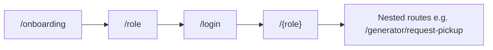

# Waste Bridge — UI Implementation Guide

This guide describes **how the Flutter UI is structured today**, **design conventions to follow when adding screens**, and **how UI ties to navigation and state**. It complements [DOCUMENTATION.md](./DOCUMENTATION.md) (product vision, full screen backlog) and the [Appendix](./DOCUMENTATION.md#appendix-current-flutter-codebase-implementation-snapshot) (implementation snapshot).

**Audience:** Flutter developers extending the app, designers aligning with Material 3 usage, and reviewers checking consistency.

---

## 1. Stack and principles

| Area | Choice | Notes |
|------|--------|--------|
| UI framework | **Flutter** with **Material 3** | `useMaterial3: true` in `AppTheme` |
| State | **Riverpod** | `ConsumerWidget` / `ConsumerStatefulWidget`, `StateNotifier`, `AsyncValue` |
| Routing | **go_router** | Declarative routes; `context.go`, `context.push` |
| Icons | **Material Icons** | `Icons.*` from `material.dart` |

**Principles:**

1. **Theme first** — Prefer `Theme.of(context).colorScheme`, `textTheme`, and component themes over hard-coded colors except where the design system explicitly fixes a value (e.g. light scaffold background).
2. **Async UI** — Lists and dashboards driven by providers use `AsyncValue.when`: `data`, `loading` (often `CircularProgressIndicator`), `error` (prefer `CenterState` with an error icon).
3. **Shared building blocks** — Reuse `AppSectionCard` and `CenterState` from `lib/features/shared/app_widgets.dart` before adding one-off layouts.
4. **Navigation** — New screens get a `GoRoute` in `lib/routes/app_router.dart`; use path parameters for IDs (`/generator/track/:id`).

---

## 2. App shell and theme

**Entry:** `lib/main.dart` wraps the app in `ProviderScope`, uses `MaterialApp.router` with `theme`, `darkTheme`, and `themeMode: ThemeMode.system`.

**Theme definition:** `lib/core/theme/app_theme.dart`

| Element | Light theme | Dark theme |
|---------|-------------|------------|
| Seed / brand | `Color(0xFF2E7D32)` (green) | Same seed, `Brightness.dark` |
| Scaffold background | `0xFFF6F8F6` | Default from `ColorScheme` |
| App bar | Surface color, **elevation 0** | Same pattern |
| Cards | **16px** corner radius, **elevation 0** | Same |
| Text fields | Filled, white fill (light), **14px** outline radius | Dark scheme defaults |

**Buttons:** Screens use Material 3 buttons as appropriate: `FilledButton`, `FilledButton.icon`, `FilledButton.tonal`, `TextButton`, `IconButton` in app bars.

**When changing the look:** Edit `AppTheme` and, if needed, extend `ThemeData` with `textTheme` or `elevatedButtonTheme` so changes propagate app-wide.

---

## 3. Project layout (UI-related)

```
lib/
  main.dart
  core/
    theme/app_theme.dart      # Light / dark ThemeData
    constants/app_constants.dart
  features/
    auth/auth_screens.dart    # Onboarding, role, login, register
    generator/…               # Generator (household) flows
    collector/…               # Collector flows (includes maps)
    recycler/…                # Recycler flows
    shared/
      app_widgets.dart        # AppSectionCard, CenterState
      notifications_screen.dart
  routes/app_router.dart      # All routes and auth redirect
```

New UI code should live under `features/<area>/` unless it is truly cross-cutting (then `shared/`).

---

## 4. Navigation

**Configuration:** `lib/routes/app_router.dart`

- **Initial route:** `/onboarding`.
- **Auth redirect:** If `authNotifierProvider` has no user, navigation to any route other than `/onboarding`, `/role`, `/login`, `/register` redirects to `/role`.

**Patterns:**

| Intent | API |
|--------|-----|
| Replace stack (e.g. after login) | `context.go('/generator')` |
| Push child route | `context.push('/generator/request-pickup')` |
| Path parameters | `context.push('/generator/track/${id}')`; read with `state.pathParameters['id']` in `GoRoute` |

**Role home paths:** After authentication, users land on `/${role}` where `role` is the enum segment (`generator`, `collector`, `recycler`) — see `LoginScreen` / `RegisterScreen` navigation.



---

## 5. Reusable widgets

Defined in `lib/features/shared/app_widgets.dart`.

### `AppSectionCard`

- **Use for:** Grouping content on dashboards (title row + body).
- **API:** `title`, `child`, optional `trailing` (e.g. `TextButton` “View all”).
- **Layout:** Uses `Card` (theme card style), padding **14**, title uses `titleMedium`.

### `CenterState`

- **Use for:** Empty lists, benign errors, “not found” states.
- **API:** `title`, `subtitle`, optional `icon` (default `Icons.inbox_rounded`).
- **Layout:** Centered column, icon size **48**, primary color for icon.

---

## 6. Screen patterns

### Layout

- **Scaffold** with optional `AppBar` (`title: Text('…')`).
- **Body:** Often `ListView` with `padding: EdgeInsets.all(16)` or **24** for auth/onboarding.
- **SafeArea:** Used on auth flows where content should avoid notches (`LoginScreen`).

### Dashboards (generator, collector, recycler)

- **App bar actions:** `IconButton`s for secondary entry points (notifications, requests, wallet, etc.).
- **Primary CTA:** Often a `FilledButton.icon` near the top (e.g. “Request Pickup”).
- **Sections:** `AppSectionCard` + `ListTile` with `contentPadding: EdgeInsets.zero` for dense rows.

### Forms

- `TextField` / `DropdownButtonFormField` with `InputDecoration` (theme provides filled style).
- Submit: `FilledButton` + loading state (see `_AuthSubmitButton`: disable when loading, small `CircularProgressIndicator` inside button).

### Async lists

```dart
requests.when(
  data: (items) { /* ListView or AppSectionCard + mapping */ },
  loading: () => const Center(child: CircularProgressIndicator()),
  error: (e, _) => CenterState(title: 'Error', subtitle: '$e', icon: Icons.error),
)
```

**Pull-to-refresh:** `NotificationsScreen` uses `RefreshIndicator` around `ListView.separated` — reuse this pattern for feeds that refetch from a notifier.

### Feedback

- **SnackBar** via `ScaffoldMessenger.of(context).showSnackBar` for short confirmations (e.g. job accepted).
- **Errors on submit:** SnackBar with `e.toString()` is acceptable for prototype; production UI should map to user-friendly copy.

---

## 7. Role-specific UI notes

### Generator (`features/generator/`)

- Home: categories (`Chip` in a `Wrap`), recent requests, links to impact and tracking.
- Request pickup: templates dropdown, waste type, quantity, location, schedule pickers (`showDatePicker` / `showTimePicker`), optional photo via `image_picker`.
- Tracking / impact: read-only and summary layouts; keep consistent card spacing (**16** between sections).

### Collector (`features/collector/`)

- Dashboard: earnings summary, active job, open jobs list (`_JobRow`).
- Job detail / active job: linear detail + primary `FilledButton` (e.g. Accept); disabled state when status does not allow action (`onPressed: condition ? handler : null`).
- Map: `google_maps_flutter` — follow platform setup in Flutter/Google docs for API keys and permissions.

### Recycler (`features/recycler/`)

- Dashboard: incoming deliveries list, material chips.
- Transactions: `ListView.separated` with `Card` + `ListTile`, **12** px separator.

### Auth (`features/auth/`)

- **Onboarding:** `PageView`, page dots, Skip → `/role`, final CTA “Get Started”.
- **Role selection:** `FilledButton.tonal` per role.
- **Login / Register:** Form fields, role dropdown (`_RoleDropdown`), shared submit button pattern.

---

## 8. State management and UI

Providers live in `lib/providers/app_providers.dart`. UI typically:

- `ref.watch(...)` to rebuild when data changes.
- `ref.read(...notifier)` for actions (login, accept job, refresh).
- `ref.listen` for side effects (e.g. navigate after successful login) — guard with `mounted` before `context.go`.

Do not embed business rules in widgets when they belong in notifiers/services; widgets should reflect state and fire events.

---

## 9. Strings, localization, and accessibility

- **Today:** Strings are mostly **inline English** in widgets.
- **Target (see [DOCUMENTATION.md §42](./DOCUMENTATION.md)):** English and Kiswahili — plan to move user-visible strings to ARB / `AppLocalizations` when localization phase starts.
- **Accessibility:** Use `Semantics` where custom gestures or non-obvious icons need labels; ensure touch targets meet Material minimums (**48** logical pixels); don’t rely on color alone for status — pair with text or icons.

---

## 10. Adding a new screen (checklist)

1. **Widget:** Create screen under the correct `features/<role>/` or `shared/` file.
2. **Route:** Add `GoRoute` in `app_router.dart` (nested under the role branch if it is role-specific).
3. **Navigation:** Use `context.push` or `context.go` from an existing screen; avoid hard-coded strings for routes — prefer constants if paths are reused.
4. **State:** If the screen needs async data, extend or add a provider/notifier rather than storing API results only in `StatefulWidget` local state (unless truly ephemeral).
5. **Empty / error:** Use `CenterState` and the same padding conventions as sibling screens.
6. **Theme:** Use `Theme.of(context)`; avoid new arbitrary colors without updating `AppTheme`.

---

## 11. Testing UI

- `flutter test` — widget tests can pump `ProviderScope` with overrides for `go_router` / auth.
- After visual changes, smoke-test **light and dark** (`themeMode: system` or device setting).

---

## 12. Related documentation

| Document | Content |
|----------|---------|
| [DOCUMENTATION.md](./DOCUMENTATION.md) §4 | Full product screen breakdown (target) |
| [DOCUMENTATION.md](./DOCUMENTATION.md) Appendix | Current repo routes, stack, mock data |
| [IMPLEMENTATION_PLAN.md](./IMPLEMENTATION_PLAN.md) | Phased delivery; Flutter UI can parallelize backend per plan notes |

---

*Last aligned with repository layout and `app_router.dart` as of the guide’s creation. When routes or theme change, update this file in the same PR.*
